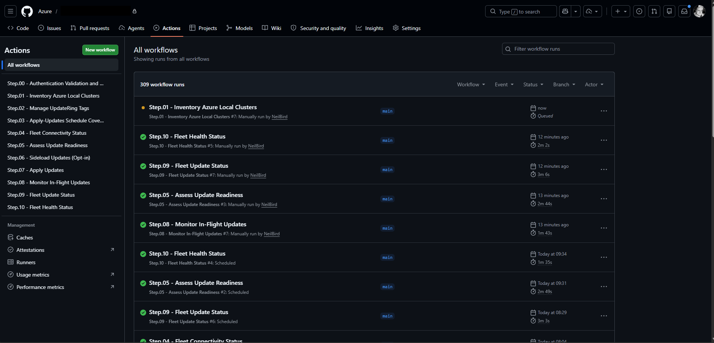
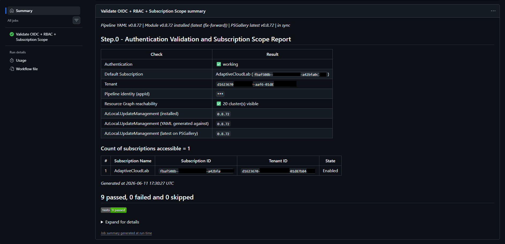
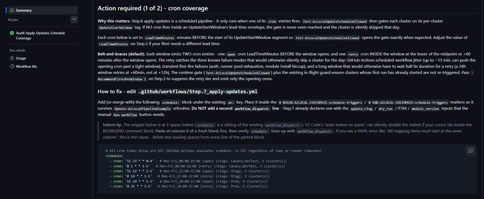
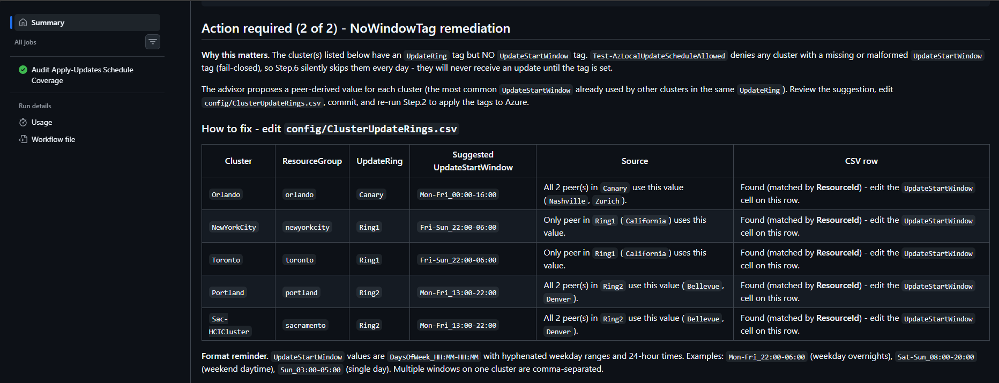
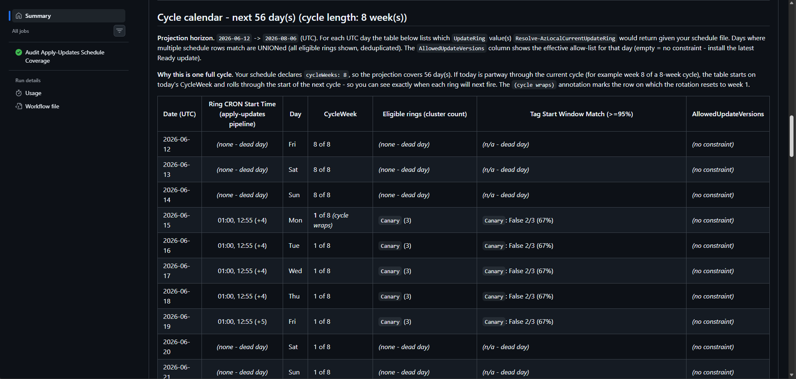

# CI/CD Pipeline Examples for Azure Local Cluster Update Management

> **Disclaimer**: This module is **NOT** a Microsoft supported service offering or product. It is provided as example code only, with no warranty or official support. Refer to the [MIT license](https://github.com/NeilBird/Azure-Local/blob/main/LICENSE) for further information.

This folder is the setup-and-configure landing page for the example GitHub Actions and Azure DevOps pipelines that ship with the `AzLocal.UpdateManagement` PowerShell module. It walks an operator from "nothing wired" to "a staged-rollout update programme runs itself, with optional ServiceNow ticketing on failures".

It is written in the same step-by-step style as [`ITSM/README.md`](../ITSM/README.md). If something here is unclear, that file is a good cross-reference for the connector portion.

---

## Table of contents

0. [Quick start checklist (zero to automated)](#0-quick-start-checklist-zero-to-automated)
1. [What you'll have when you're done](#1-what-youll-have-when-youre-done)
   - [1.1 Why the pipelines are named `Config: N`, `Monitor: N`, `Update: N`](#11-why-the-pipelines-are-named-config-n-monitor-n-and-update-n)
   - [1.2 How to control which updates are installed, and when](#12-how-to-control-which-updates-are-installed-and-when)
2. [Prerequisites](#2-prerequisites)
3. [Required Azure permissions](#3-required-azure-permissions)
   - [3.1 Custom role: `Azure Stack HCI Update Operator (custom)`](#31-custom-role-azure-stack-hci-update-operator-custom)
   - [3.2 Recommended: assign at scale via Azure Policy DINE on a management group](#32-recommended-assign-at-scale-via-azure-policy-dine-on-a-management-group)
   - [3.3 Manual / per-subscription alternative (legacy)](#33-manual--per-subscription-alternative-legacy)
4. [Choose your CI/CD platform and authentication](#4-choose-your-cicd-platform-and-authentication)
   - [4.1 GitHub Actions with OpenID Connect (recommended)](#41-github-actions-with-openid-connect-recommended)
   - [4.2 Azure DevOps with Workload Identity Federation (recommended)](#42-azure-devops-with-workload-identity-federation-recommended)
   - [4.3 Self-hosted runners with Managed Identity](#43-self-hosted-runners-with-managed-identity)
   - [4.4 Service Principal + client secret (legacy fallback)](#44-service-principal--client-secret-legacy-fallback)
5. [Wire the pipeline files into your repo](#5-wire-the-pipeline-files-into-your-repo)
   - [5.1 GitHub Actions](#51-github-actions)
   - [5.2 Azure DevOps](#52-azure-devops)
     - [5.2.1 The `AzureLocal-Pipeline-Settings` variable group (shared settings, set once)](#521-the-azurelocal-pipeline-settings-variable-group-shared-settings-set-once)
   - [5.3 Optional configuration (not recommended): pin the module version](#53-optional-configuration-not-recommended-pin-the-module-version)
   - [5.4 Azure DevOps onboarding checklist](#54-azure-devops-onboarding-checklist)
   - [5.5 Stay current: one-command refresh with `Update-Module-And-Pipelines.ps1`](#55-stay-current-one-command-refresh-with-update-module-and-pipelinesps1)
6. [End-to-end runbook: bring an estate online](#6-end-to-end-runbook-bring-an-estate-online)
   - [6.1 Inventory the estate](#61-inventory-the-estate)
     - [6.1.1 (Optional) Exclude whole subscriptions from every fleet scan](#611-optional-exclude-whole-subscriptions-from-every-fleet-scan)
   - [6.2 Plan update rings, windows, and exclusions](#62-plan-update-rings-windows-and-exclusions)
   - [6.3 Apply tags](#63-apply-tags)
   - [6.4 Pre-flight readiness assessment](#64-pre-flight-readiness-assessment)
   - [6.5 Generate `apply-updates-schedule.yml` from your live fleet](#65-generate-apply-updates-scheduleyml-from-your-live-fleet)
   - [6.6 Apply updates - one wave at a time](#66-apply-updates---one-wave-at-a-time)
   - [6.7 Continuous fleet monitoring](#67-continuous-fleet-monitoring)
7. [Optional: open ITSM tickets for clusters needing operator action](#7-optional-open-itsm-tickets-for-clusters-needing-operator-action)
8. [Scheduling, maintenance windows, and change-freeze periods](#8-scheduling-maintenance-windows-and-change-freeze-periods)
   - [8.1 Schedule windows, exclusions, and cron triggers](#81-schedule-windows-exclusions-and-cron-triggers)
     - [8.1.1 Recommended Update: 1 (Assess Update Readiness) pre-flight schedule](#811-recommended-update-1-assess-update-readiness-pre-flight-schedule-per-ring)
   - [8.2 Multi-stage rollouts with approval gates](#82-multi-stage-rollouts-with-approval-gates)
   - [8.3 End-to-end runbook: Apply-Updates Schedule Coverage Audit](#83-end-to-end-runbook-apply-updates-schedule-coverage-audit)
   - [8.4 Restrict which updates each ring installs (`allowedUpdateVersions`, schema v2)](#84-restrict-which-updates-each-ring-installs-allowedupdateversions-schema-v2)
   - [8.5 Opt-in: single-retry of failed updates (`FAILED_UPDATES_SINGLE_RETRY`)](#85-opt-in-single-retry-of-failed-updates-failed_updates_single_retry)
9. [Tuning throughput (`-ThrottleLimit`)](#9-tuning-throughput--throttlelimit)
10. [Standalone HTML report (no pipeline)](#10-standalone-html-report-no-pipeline)
11. [Security model](#11-security-model)
12. [Troubleshooting](#12-troubleshooting)
13. [File layout](#13-file-layout)
14. [Pipeline reference](#14-pipeline-reference) (moved to [docs/appendix-pipelines.md](docs/appendix-pipelines.md))
15. [Appendix B: Release history](#appendix-b-release-history) (moved to [docs/appendix-release-history.md](docs/appendix-release-history.md))
16. [Related documentation](#16-related-documentation)

---

## 0. Quick start checklist (zero to automated)

This is the whole journey - from an empty repo to a self-running, ring-based update programme - as a single linear checklist. Each step links to the detailed section; **follow them top to bottom without jumping around**. The one-time setup (steps 1-8) is done once per CI/CD platform; the operating loop (steps 9-14) is what you repeat each update cycle.

**One-time setup (do once):**

- [ ] **1. Create a Git repo** to host the pipeline files (a GitHub repo for GitHub Actions, or an Azure DevOps repo/project for Azure Pipelines). This repo holds *only* the workflow YAML and config - it does **not** contain the module source. See [section 2](#2-prerequisites).
- [ ] **2. Install the module on your admin workstation:** `Install-Module AzLocal.UpdateManagement -Scope CurrentUser`. See [section 2](#2-prerequisites).
- [ ] **3. Copy the example pipelines into your repo** with `Copy-AzLocalPipelineExample` (you do **not** git-clone this repository). For GitHub: `Copy-AzLocalPipelineExample -Platform GitHub -Destination .\.github\workflows`. See [section 5](#5-wire-the-pipeline-files-into-your-repo).
- [ ] **4. Create the custom role** `Azure Stack HCI Update Operator (custom)` with a management-group `AssignableScopes`. See [section 3.1](#31-custom-role-azure-stack-hci-update-operator-custom).
- [ ] **5. Create an Entra security group and let Azure Policy assign the role to it** across the management group (DINE). New subscriptions are then covered automatically. See [section 3.2](#32-recommended-assign-at-scale-via-azure-policy-dine-on-a-management-group).
- [ ] **6. Wire CI/CD authentication** (GitHub OIDC federated credential or Azure DevOps Workload Identity Federation - no client secrets) and note the app's object ID. See [section 4](#4-choose-your-cicd-platform-and-authentication).
- [ ] **7. Add the CI/CD service principal to the security group** from step 5 - this single membership grants it update rights across the whole estate. See [section 3.2](#32-recommended-assign-at-scale-via-azure-policy-dine-on-a-management-group).
- [ ] **8. Commit the pipeline files and set the required secrets/variables** (tenant, subscription, client IDs). See [section 5](#5-wire-the-pipeline-files-into-your-repo).

**Operating loop (repeat each update cycle):**

- [ ] **9. Inventory the estate:** run **Config: 1 - Validate Auth and Inventory Clusters**. See [section 6.1](#61-inventory-the-estate). *(Optional: carve out decommissioned / lab / out-of-scope subscriptions from every fleet scan with a subscription-exclusion list - see [section 6.1.1](#611-optional-exclude-whole-subscriptions-from-every-fleet-scan).)*
- [ ] **10. Plan rings and apply tags:** decide Pilot/Wave2/Production rings and `UpdateStartWindow`s, then bulk-apply them with **Config: 2 - Manage UpdateRing Tags**. See [section 6.2](#62-plan-update-rings-windows-and-exclusions) and [6.3](#63-apply-tags).
- [ ] **11. Pre-flight readiness:** run **Update: 1 - Assess Update Readiness** to surface blockers before scheduling. See [section 6.4](#64-pre-flight-readiness-assessment).
- [ ] **12. Generate `apply-updates-schedule.yml`** from the live fleet with `New-AzLocalApplyUpdatesScheduleConfig`. See [section 6.5](#65-generate-apply-updates-scheduleyml-from-your-live-fleet).
- [ ] **13. Run Config: 3 - Apply-Updates Schedule Coverage Audit**, then paste its **apply cron** into `apply-updates.yml`. *(v0.8.90: the **monitor cron** it also recommends is now optional - `monitor-updates.yml` self-drives via an every-6h `-SkipWhenIdle` heartbeat plus an event-driven trigger from Apply; paste the recommended monitor cron only to tighten in-wave polling.)* See [section 1.2](#12-how-to-control-which-updates-are-installed-and-when) and [section 8.3](#83-end-to-end-runbook-apply-updates-schedule-coverage-audit).
- [ ] **14. Go live:** apply updates one wave at a time with **Update: 3 - Apply Updates**. Continuous monitoring (**Monitor: 1-3** + **Update: 4**) is already active by default - *(v0.8.90)* **Update: 4** auto-runs every 6h with a cheap `-SkipWhenIdle` heartbeat and is fired event-driven by Apply the moment an update starts, so there is nothing to turn on. See [section 6.6](#66-apply-updates---one-wave-at-a-time) and [6.7](#67-continuous-fleet-monitoring).

> **The detailed walkthrough below mirrors this checklist exactly.** Sections 2-5 cover the one-time setup (steps 1-8); [section 6](#6-end-to-end-runbook-bring-an-estate-online) is the canonical end-to-end runbook for the operating loop (steps 9-14). If you only read one section in depth, read [section 6](#6-end-to-end-runbook-bring-an-estate-online).

> **Staying current (after each module release):** from your locally-cloned repo, run the turnkey **`.\Update-Module-And-Pipelines.ps1`** that `Copy-AzLocalPipelineExample` dropped into the repo root. One command upgrades the module on your workstation, refreshes the pipeline YAMLs (keeping your customisations), and commits + pushes the changes. Requires the repo cloned locally and `git` installed. See [section 5.5](#55-stay-current-one-command-refresh-with-update-module-and-pipelinesps1).

---

## 1. What you'll have when you're done

By the end of this guide you will have:

- A federated identity (no client secrets) wired into your CI/CD platform with the **minimum** Azure RBAC needed for cluster update management.
- Config/Monitor/Update workflows committed to your repo and visible in the Actions / Pipelines UI:
  - **Config: 1 - Validate Auth and Inventory Clusters** (GitHub) - merged auth + inventory flow with a clear setup-first summary (including collapsible subscription details) and cluster inventory export.
  - **Config: 2 - Manage UpdateRing Tags** - bulk-apply `UpdateRing`, `UpdateStartWindow`, `UpdateExclusionsWindow`, `UpdateExcluded` tags from CSV.
  - **Config: 3 - Apply-Updates Schedule Coverage Audit** - read-only audit that validates your schedule against `UpdateStartWindow` tags and auto-generates the ready-to-paste apply (and monitor) cron from `apply-updates-schedule.yml` + those tags - you never hand-write the cron (see [section 1.2](#12-how-to-control-which-updates-are-installed-and-when)).
  - **Monitor: 1 - Fleet Connectivity Status** - Arc connectivity, NIC health, and ARB status snapshot.
  - **Monitor: 2 - Fleet Health Status** - daily 24-hour health-failure summary.
  - **Monitor: 3 - Fleet Update Status** - daily fleet-wide update-state summary.
  - **Update: 1 - Assess Update Readiness** - pre-flight readiness + blocking-health gate report.
  - **Update: 2 - Sideload Updates (opt-in)** - on-prem media pre-stage workflow for disconnected environments.
  - **Update: 3 - Apply Updates** - ring-scoped update execution with WhatIf support; *which days* it targets is driven by `apply-updates-schedule.yml` + its cron cadence (not just the ring parameter), gated by per-cluster `UpdateStartWindow` (see [section 1.2](#12-how-to-control-which-updates-are-installed-and-when)).
  - **Update: 4 - Monitor In-Flight Updates** - active-run progress and stuck-run diagnostics.
- An end-to-end "ring-based" rollout pattern: Pilot -> Wave2 -> Production, with each ring gated on the previous wave's success.
- **Optional**: a ServiceNow integration that opens deduped incidents for clusters whose run status indicates the module's own retries cannot recover (failures, blocking health checks, sideloaded payload missing) - see [section 7](#7-optional-open-itsm-tickets-for-clusters-needing-operator-action).
- **Optional** (v0.9.1): a fleet-wide **subscription-exclusion list** that filters decommissioned, lab, or out-of-scope subscriptions out of *every* Azure Resource Graph query (inventory, readiness, fleet status, update runs, connectivity) without touching any pipeline logic - see [section 6.1.1](#611-optional-exclude-whole-subscriptions-from-every-fleet-scan).
- **New in v0.9.12**: every bundled workflow now runs two fail-fast **pipeline preflight guards** so a mis-scoped identity or a silently-empty report fails *at the guard* with an actionable message instead of cascading into a confusing downstream error - a **subscription-access gate** (`Assert-AzLocalAzureSubscriptionAccess`, immediately after Azure login) in all 10 pipelines, and a **report-presence guard** (`Assert-AzLocalPipelineReport`, after the collect step) in 8 of 10 (all except Config: 2 and Update: 3). The JUnit publish steps are also now gated on upstream success (`if: success()` / `condition: succeeded()`) so a real failure is never masked by a phantom "No test report files were found" message. Re-run `Update-AzLocalPipelineExample` after upgrading so existing copies pick up the new steps. Per-pipeline detail is in [appendix-pipelines.md](docs/appendix-pipelines.md).

The pipelines are **fully opt-in additive layers** over the module. The PowerShell functions also work without any pipeline at all - see [section 10](#10-standalone-html-report-no-pipeline) for the ad-hoc / desktop story.

### 1.1 Why the pipelines are named `Config: N`, `Monitor: N`, and `Update: N`

The active workflow model uses three clear groups:

- `Config: 1-3` for onboarding and configuration.
- `Monitor: 1-3` for day-2 fleet monitoring (connectivity, update status, health).
- `Update: 1-4` for the update lifecycle (readiness, sideload, apply, in-flight monitor).

| Group | Workflow name | GH Actions | Azure DevOps |
|---|---|---|---|
| Config | Config: 1 - Validate Auth and Inventory Clusters | `setup-validate-and-inventory.yml` | `authentication-test.yml` + `inventory-clusters.yml` |
| Config | Config: 2 - Manage UpdateRing Tags | `manage-updatering-tags.yml` | `manage-updatering-tags.yml` |
| Config | Config: 3 - Apply-Updates Schedule Coverage Audit | `apply-updates-schedule-audit.yml` | `apply-updates-schedule-audit.yml` |
| Monitor | Monitor: 1 - Fleet Connectivity Status | `fleet-connectivity-status.yml` | `fleet-connectivity-status.yml` |
| Monitor | Monitor: 2 - Fleet Health Status | `fleet-health-status.yml` | `fleet-health-status.yml` |
| Monitor | Monitor: 3 - Fleet Update Status | `fleet-update-status.yml` | `fleet-update-status.yml` |
| Update | Update: 1 - Assess Update Readiness | `assess-update-readiness.yml` | `assess-update-readiness.yml` |
| Update | Update: 2 - Sideload Updates (Opt-in) | `sideload-updates.yml` | `sideload-updates.yml` |
| Update | Update: 3 - Apply Updates | `apply-updates.yml` | `apply-updates.yml` |
| Update | Update: 4 - Monitor In-Flight Updates | `monitor-updates.yml` | `monitor-updates.yml` |

- **GitHub Actions**: the Actions sidebar sorts workflows alphabetically by the `name:` field. Prefixing names with `Config: N`, `Monitor: N`, and `Update: N` keeps the sidebar grouped (the `Config:` onboarding group sorts first, then `Monitor:` day-2 reporting, then the `Update:` lifecycle pipelines).

  

  *The Config/Monitor/Update numeric prefixes keep the GitHub Actions sidebar grouped by purpose rather than a purely alphabetical scatter.*

- **Azure DevOps**: the Pipelines list sorts by the pipeline **definition name** chosen at import time (not by filename). Use the same `Config: N` / `Monitor: N` / `Update: N` naming when you import so the list stays grouped by purpose.

If you prefer a different naming scheme (e.g. `00 - Auth`, `01 - Inventory`, ...), just change the `name:` field in each GH Actions YAML and / or pick a different prefix at ADO import time. Nothing else in the module depends on these display names.

### 1.2 How to control which updates are installed, and when

Three independent layers decide **what** installs and **when**. Each answers a different question, and they compose cleanly once set up in order:

| Layer | File / source | Configured via | Grain | Answers |
|---|---|---|---|---|
| 1 | `apply-updates-schedule.yml` | `New-AzLocalApplyUpdatesScheduleConfig` (section 6.5) | day | **WHICH `UpdateRing`(s) are eligible on a given UTC date** - the cycle calendar (`cycleWeeks` + ISO-week anchor + day-of-week -> ring eligibility) |
| 2 | `apply-updates.yml` `schedule:` cron | **Config: 3** output, pasted in (see below) | intra-day | **HOW OFTEN the "Update: 3 - Apply Updates" job wakes up** to check whether today is an eligible day |
| 3 | per-cluster `UpdateStartWindow` tag | **Config: 2 - Manage UpdateRing Tags** | minute | **WHEN, during an eligible day, an update is allowed to start** (`<days>_<HH:MM>-<HH:MM>`, UTC) |

How the layers work together:

- **Layer 1 (`apply-updates-schedule.yml`)** is the single source of truth for *which days* each ring may update. A cron firing that lands on a day with no matching schedule row is logged and exits 0 - no update runs.
- **Layer 2 (the cron in `apply-updates.yml`)** only controls *wake frequency*. It must fire on the eligible days that layer 1 defines; on every other day it is a harmless no-op.
- **Layer 3 (`UpdateStartWindow`)** gates the *time of day* an update is actually allowed to begin on an eligible day. Outside the window the cluster returns `ScheduleBlocked`.

In one sentence: **`apply-updates-schedule.yml` picks the days, the cron picks the wake cadence, and `UpdateStartWindow` picks the time-of-day.** You never hand-write the layer-2 cron - **Config: 3** computes it for you from layers 1 and 3.

#### Step-by-step: from tags to a live schedule

1. **Tag the clusters (ring + layer 3).** Run **Config: 2 - Manage UpdateRing Tags** to bulk-apply `UpdateRing` and `UpdateStartWindow` (and optional `UpdateExclusionsWindow` / `UpdateExcluded`) from CSV. See [section 6.3](#63-apply-tags).
2. **Generate / update `apply-updates-schedule.yml` (layer 1).** Produce the ring-eligibility calendar from your live fleet - see [section 6.5](#65-generate-apply-updates-scheduleyml-from-your-live-fleet) (`New-AzLocalApplyUpdatesScheduleConfig`). Commit it.
3. **Run Config: 3 - Apply-Updates Schedule Coverage Audit.** This read-only pipeline diffs the live `UpdateRing` / `UpdateStartWindow` tags against `apply-updates-schedule.yml`, reports any coverage gaps, and **outputs two ready-to-paste cron snippets** in its step summary:
   - a **recommended apply cron** for **Update: 3 - Apply Updates** (`apply-updates.yml`), and
   - a **recommended in-flight monitor cron** for **Update: 4 - Monitor In-Flight Updates** (`monitor-updates.yml`).
4. **Paste the apply cron into `apply-updates.yml`.** Copy the recommended apply cron from the Config: 3 summary into the `schedule:` block (GitHub Actions) / `schedules:` block (Azure DevOps) of `apply-updates.yml`, inside the `BEGIN/END-AZLOCAL-CUSTOMIZE:schedule-triggers` marker. Commit. Update: 3 now wakes on exactly the eligible days.
5. **(Optional, v0.8.90+) Tighten the monitor poll cadence.** `monitor-updates.yml` already self-drives - it ships an active every-6h `0 */6 * * *` cron that runs a cheap `-SkipWhenIdle` heartbeat, and Apply fires it event-driven the moment an update starts (see [section 6.7](#67-continuous-fleet-monitoring)), so you **no longer need to paste a monitor cron** for the monitor to run. If you want tighter in-wave polling than every 6h, copy the recommended monitor cron from the Config: 3 summary into the `schedule:` block of `monitor-updates.yml` to override the default.
6. **Re-run Config: 3 whenever tags or the schedule change** to catch drift and regenerate the crons. The weekly `apply-updates-schedule-audit.yml` does this automatically (see [section 8.3](#83-end-to-end-runbook-apply-updates-schedule-coverage-audit)).

> **Config: 3 is the glue.** Once layers 1 and 3 are in place, it derives the layer-2 apply cron (and an optional tighter monitor cron) - so you never hand-craft cron expressions, and Update: 3 and Update: 4 stay aligned to your rings and maintenance windows.

---

## 2. Prerequisites

| Requirement | Notes |
|---|---|
| Azure subscription(s) containing Azure Local clusters | One or many; multi-subscription is supported and is the common state at >~500 clusters because the per-subscription storage-account quota caps how many witness accounts (and therefore clusters) fit in one subscription. |
| Permissions to create app registrations in Microsoft Entra ID, or an existing one | Required so you can either set up Workload Identity Federation (recommended) or, as a fallback, a Service Principal + client secret. |
| GitHub repository **or** Azure DevOps project | The pipeline YAMLs are checked in to one of these and run on the platform's hosted Windows agents (or your self-hosted runners). |
| PowerShell 5.1 or later | Used by every pipeline step. Microsoft-hosted `windows-latest` agents ship with PowerShell 5.1 and PowerShell 7+ already installed - no extra install needed there. |
| `Az.Accounts` + `Az.KeyVault` modules | `Az.Accounts` is required by all pipelines. `Az.KeyVault` is required only if you opt in to the ITSM connector with Key Vault-sourced secrets (recommended). The pipelines install these on the agent as needed. |
| `powershell-yaml` module | Required only if you opt in to the ITSM connector and your matrix config is YAML (default). JSON config works on stock PowerShell. The pipeline installs this on the agent only when the ITSM step runs. |

You do **not** need any cluster-side prerequisites for the inventory, tag-management, readiness, or fleet-status pipelines. The Apply Updates pipeline does require the clusters be in a healthy ARM state for the update API to accept the request - that is what the readiness pre-flight in section 6.4 measures.

---

## 3. Required Azure permissions

The identity created in section 4 needs the following permissions on every subscription that contains clusters in scope. The **`Azure Stack HCI Update Operator (custom)`** custom role in [section 3.1](#31-custom-role-azure-stack-hci-update-operator-custom) below grants exactly these actions and nothing else - **this is the recommended grant for every environment, including labs and PoCs**. Once the role exists, assign it at scale via the recommended [Azure Policy DINE on a management group](#32-recommended-assign-at-scale-via-azure-policy-dine-on-a-management-group) (auto-onboards every present and future subscription under the MG) or, for small / static estates, via the [manual per-subscription alternative](#33-manual--per-subscription-alternative-legacy). The built-in **Azure Stack HCI Administrator** role is a permissive fallback that also covers all of these actions, but it over-grants well beyond what the pipelines exercise; use it only when your account cannot create a custom role in the tenant (see the fallback notes in section 4).

| Permission | Used by |
|---|---|
| `Microsoft.AzureStackHCI/clusters/read` | All pipelines (inventory + readiness + apply + status). |
| `Microsoft.AzureStackHCI/clusters/updates/read` | Apply Updates, Fleet Update Status. |
| `Microsoft.AzureStackHCI/clusters/updates/apply/action` | Apply Updates. |
| `Microsoft.AzureStackHCI/clusters/updateSummaries/*` | Apply Updates, Fleet Update Status (`updateSummaries/read`); the wildcard also grants the preview `checkUpdates/action` - see note below. |
| `Microsoft.AzureStackHCI/clusters/updateSummaries/checkUpdates/action` (preview - granted via the `updateSummaries/*` wildcard; see note below) | Assess Update Readiness ("Check for updates" auto-refresh of stale assessments); `Sync-AzLocalClusterUpdateSummary`. |
| `Microsoft.AzureStackHCI/clusters/updates/updateRuns/read` | Apply Updates, Fleet Update Status. |
| `Microsoft.AzureStackHCI/edgeDevices/read` | Fleet Connectivity Status (physical NIC inventory). |
| `Microsoft.HybridCompute/machines/read` | Fleet Connectivity Status (Arc agent inventory). |
| `Microsoft.HybridCompute/machines/extensions/read` | Reserved for future Arc-machine extension reporting (no current cmdlet queries this, but bundled to avoid a follow-up role update). |
| `Microsoft.ResourceConnector/appliances/read` | Fleet Connectivity Status (Azure Resource Bridges). |
| `Microsoft.ResourceGraph/resources/read` | All pipelines (Resource Graph lookups). |
| `Microsoft.Resources/subscriptions/resourceGroups/read` | All pipelines (resolve cluster scopes). |
| `Microsoft.Resources/tags/read` | Manage UpdateRing Tags, sideloaded workflow. |
| `Microsoft.Resources/tags/write` | Manage UpdateRing Tags, sideloaded workflow (`UpdateSideloaded` + `UpdateVersionInProgress`). |

If you opt in to the ITSM connector with Key Vault-sourced secrets, the identity additionally needs **Key Vault Secrets User** on the configured vault. No other new RBAC.

> **RBAC - "Check for updates" (checkUpdates) auto-refresh (preview):** Since v0.8.88, `Sync-AzLocalClusterUpdateSummary` and the opt-out stale-assessment auto-scan in `Export-AzLocalClusterUpdateReadinessReport` POST the `Microsoft.AzureStackHCI/clusters/updateSummaries/default/checkUpdates` ARM action (the programmatic "Check for updates" button) on the `2026-03-01-preview` API. The RBAC action Azure enforces for it is `Microsoft.AzureStackHCI/clusters/updateSummaries/checkUpdates/action` (confirmed verbatim from a live `403 AuthorizationFailed` body). **As of v0.8.92 the bundled custom role grants this via the `Microsoft.AzureStackHCI/clusters/updateSummaries/*` wildcard** (which also covers `updateSummaries/read`). A provider-operations-catalog check on 2026-06-18 (`az provider operation show --namespace Microsoft.AzureStackHCI`) confirms the explicit `checkUpdates/action` leaf is still NOT published in the catalog, and `az role definition create` / `update` rejects an *explicit* unregistered action - but it **accepts a wildcard** whose prefix (`updateSummaries/`) resolves to registered operations, and Azure's authorization engine then matches the enforced `checkUpdates/action` against that wildcard at request time. The role therefore authorizes the refresh today, with no fallback to a broad built-in role required. **Who exercises it:** only the **Update: 1 - Assess Update Readiness** pipeline (`assess-update-readiness.yml`, GitHub Actions + Azure DevOps) - via the auto-scan inside `Export-AzLocalClusterUpdateReadinessReport` - and the ad-hoc `Sync-AzLocalClusterUpdateSummary` cmdlet (no bundled pipeline). The wildcard also sweeps in any future control-plane sub-operation Microsoft adds under `clusters/updateSummaries/`; if you prefer to enumerate leaves, replace it with `updateSummaries/read` (and accept that the `checkUpdates` refresh then returns a non-fatal `403 AuthorizationFailed` - logged, execution continues; the readiness report still completes - or pass `-SkipStaleAssessmentScan`). **When checkUpdates GAs into the catalog**, you may optionally swap the wildcard for the two explicit leaves (`updateSummaries/read` + `updateSummaries/checkUpdates/action`) for a marginally tighter grant.

> **Tag-management identity (Manage UpdateRing Tags pipeline)** can use the built-in **Tag Contributor** role on its own - it grants exactly `Microsoft.Resources/tags/*` and nothing else. Since v0.7.65, `Set-AzLocalClusterUpdateRingTag` writes tags via the dedicated `Microsoft.Resources/tags/default` PATCH endpoint, so the broader `microsoft.azurestackhci/clusters/write` action (full cluster Contributor) is **not** required for tag changes.

### 3.1 Custom role: `Azure Stack HCI Update Operator (custom)`

This is the least-privilege role that supports every pipeline in this folder. The same definition is documented in the module-level [`AzLocal.UpdateManagement/README.md`](../README.md#permissions-required-for-update-operations) and is reproduced here so this folder is self-contained.

The custom role itself is the **foundation for both assignment paths** and is created the same way for either:

- **Recommended ([section 3.2](#32-recommended-assign-at-scale-via-azure-policy-dine-on-a-management-group))**: define the role with a management-group `AssignableScopes`, then let an Azure Policy `deployIfNotExists` (DINE) assignment auto-create the per-subscription role assignment on every child sub - present and future. Standard Azure Landing Zones pattern.
- **Legacy manual ([section 3.3](#33-manual--per-subscription-alternative-legacy))**: define the role with one or more subscription `AssignableScopes` entries and create the role assignment per sub yourself.

The recommended MG default is shown in the JSON below. Whichever path you pick, **create the role once first**, then jump to 3.2 or 3.3 to assign it.

> **The role definition JSON is bundled with the module** at [`./azlocal-update-management-custom-role.json`](./azlocal-update-management-custom-role.json). Download it directly from the repo with `curl` / `Invoke-WebRequest` against the [raw URL](https://raw.githubusercontent.com/NeilBird/Azure-Local/main/AzLocal.UpdateManagement/Automation-Pipeline-Examples/azlocal-update-management-custom-role.json), or run `Copy-AzLocalPipelineExample -Destination <path>` to copy the entire pipeline-examples folder (including this file) into your target repo. Then jump straight to **Create the role** below to substitute the management-group ID (or, for the legacy path, a subscription ID) and create. The inline JSON block immediately below is the same content for readers who prefer copy-paste.

> **JSON format - CLI/PowerShell vs Portal "JSON tab":** The bundled file is in the **CLI / PowerShell format** (top-level `Name`, `IsCustom`, `Actions`, `AssignableScopes`) - the shape consumed by `az role definition create` / `update` and `New-AzRoleDefinition`. The Azure portal's **Edit a custom role -> JSON tab** uses a different shape (the ARM resource representation, wrapped in `properties` with lowercase camelCase and `actions` nested under `permissions[0]`). Pasting the bundled file into the portal JSON tab will fail with `Malformed JSON: "properties" property not present or value is null`. To update a role from the portal, use the **Permissions** tab (add the action there) instead of the JSON tab, or run `az role definition update --role-definition ./azlocal-update-management-custom-role.json` from a shell.

> **UTF-8 BOM gotcha (`az` CLI):** `az role definition create` / `update` uses Python's `json` parser, which rejects files that start with a UTF-8 BOM and fails with `Failed to parse string as JSON ... Expecting value: line 1 column 1 (char 0)`. The shipped file is BOM-free; if you re-save it (e.g. with Windows PowerShell `Out-File` / `Set-Content` / `>` redirection, or Notepad `Save As -> UTF-8`) you may inadvertently add a BOM. Verify with `'{0:X2}' -f [IO.File]::ReadAllBytes($f)[0]` (expect `7B` for `{`, not `EF`). To strip a BOM in place: `[IO.File]::WriteAllText($f, [IO.File]::ReadAllText($f, [Text.UTF8Encoding]::new($false)), [Text.UTF8Encoding]::new($false))`. To download the raw file without re-encoding: `[IO.File]::WriteAllBytes($dst, (Invoke-WebRequest -Uri $rawUrl -UseBasicParsing).Content)`.

**Role definition (`azlocal-update-management-custom-role.json`):**

```json
{
  "Name": "Azure Stack HCI Update Operator (custom)",
  "IsCustom": true,
  "Description": "Customer-managed custom role - reference by roleDefinitionId (GUID) in automation rather than by name to remain stable if Microsoft later ships a built-in role with a similar display name. Can read and apply Azure Local cluster updates, manage UpdateRing tags, and read the fleet-connectivity inventory (Arc-enabled machines, edge-device NICs, Azure Resource Bridges) needed to assess pre-update connectivity.",
  "Actions": [
    "Microsoft.AzureStackHCI/clusters/read",
    "Microsoft.AzureStackHCI/clusters/updateSummaries/*",
    "Microsoft.AzureStackHCI/clusters/updates/read",
    "Microsoft.AzureStackHCI/clusters/updates/apply/action",
    "Microsoft.AzureStackHCI/clusters/updates/updateRuns/read",
    "Microsoft.AzureStackHCI/edgeDevices/read",
    "Microsoft.HybridCompute/machines/read",
    "Microsoft.HybridCompute/machines/extensions/read",
    "Microsoft.ResourceConnector/appliances/read",
    "Microsoft.Resources/subscriptions/resourceGroups/read",
    "Microsoft.ResourceGraph/resources/read",
    "Microsoft.Resources/tags/read",
    "Microsoft.Resources/tags/write"
  ],
  "NotActions": [],
  "DataActions": [],
  "NotDataActions": [],
  "AssignableScopes": [
    "/providers/Microsoft.Management/managementGroups/<your-mg-id>"
  ]
}
```

`AssignableScopes` defaults to **one management-group scope** so the recommended MG + Azure Policy DINE path in [section 3.2](#32-recommended-assign-at-scale-via-azure-policy-dine-on-a-management-group) works out of the box (Azure custom roles can be assigned at or below any scope listed here). If you're following the legacy per-subscription path in [section 3.3](#33-manual--per-subscription-alternative-legacy), replace the entry with one or more `/subscriptions/<sub-id>` scopes instead - the hard cap is 2000 entries per role definition.

> **Preview action `checkUpdates` - granted via the `updateSummaries/*` wildcard (not an explicit leaf):** the `Actions[]` array above grants `Microsoft.AzureStackHCI/clusters/updateSummaries/*`, which covers both `updateSummaries/read` and the preview `Microsoft.AzureStackHCI/clusters/updateSummaries/checkUpdates/action` that the "Check for updates" auto-refresh (`Sync-AzLocalClusterUpdateSummary` and the stale-assessment auto-scan used by the **Update: 1 - Assess Update Readiness** pipeline) needs. The array deliberately does **not** list the explicit `checkUpdates/action` leaf: a catalog check on 2026-06-18 confirms it is not yet in the `Microsoft.AzureStackHCI` provider operations catalog, and `az role definition create` / `update` rejects an explicit unregistered action - whereas the `updateSummaries/*` wildcard is accepted (its prefix resolves to the registered `updateSummaries/read`) and matches the enforced action at authorization time. See the **RBAC - "Check for updates"** note under the permissions table above.

**Who can run these commands?**

Creating a custom role definition and assigning it are **separate, privileged Azure RBAC operations** - they are not granted by the new custom role itself. The user (or automation identity) running the commands needs the underlying RBAC actions in the table below at the scope listed in `AssignableScopes`.

| Operation | Required action | Built-in Azure RBAC roles that grant it |
|---|---|---|
| `az role definition create` / `update` | `Microsoft.Authorization/roleDefinitions/write` | **Owner**, **User Access Administrator**, **Role Based Access Control Administrator** |
| `az role assignment create` / `delete` | `Microsoft.Authorization/roleAssignments/write` | **Owner**, **User Access Administrator**, **Role Based Access Control Administrator** |

> **Note**: The Entra ID **Global Administrator** directory role is **not** by itself an Azure RBAC role and does not grant `Microsoft.Authorization/*` actions. A Global Administrator can, however, [elevate access](https://learn.microsoft.com/azure/role-based-access-control/elevate-access-global-admin) once to gain **User Access Administrator** at the tenant root (`/`) scope, then perform these operations or delegate them. For day-to-day work, grant **Role Based Access Control Administrator** on the target scope (the management group for the MG path; the subscription for the per-sub path) to the operator instead.

If you don't hold one of those roles, ask whoever does (typically the platform team or an MG / subscription Owner) to either run the commands for you or grant you **Role Based Access Control Administrator** scoped to the target. [`Microsoft.Authorization/roleDefinitions/write`](https://learn.microsoft.com/azure/role-based-access-control/role-definitions) is the smallest action you actually need.

**Create the role (one time per tenant):**

`AssignableScopes` must contain a real scope - the literal `<your-mg-id>` placeholder will be rejected by `az role definition create`. Capture the target management-group ID first (recommended path) or a subscription ID (legacy path):

```powershell
# Recommended (section 3.2): the management-group ID the policy DINE assignment will target
$mgId = "<your-mg-id>"      # e.g. "azurelocal-prod"

# Legacy alternative (section 3.3): use the current az CLI subscription instead
# $subId = az account show --query id -o tsv
# For multiple subscriptions, build an array of scope strings:
# $scopes = @("/subscriptions/00000000-0000-0000-0000-000000000000",
#             "/subscriptions/11111111-1111-1111-1111-111111111111")
```

```powershell
# Option 1 - JSON file already on disk: substitute the placeholder, then create
(Get-Content ./azlocal-update-management-custom-role.json -Raw) `
    -replace '<your-mg-id>', $mgId |
    Set-Content ./azlocal-update-management-custom-role.json -Encoding UTF8

az role definition create --role-definition ./azlocal-update-management-custom-role.json
```

> **Single source of truth for the role JSON.** The runnable definition lives in **one** file - the bundled [`./azlocal-update-management-custom-role.json`](./azlocal-update-management-custom-role.json). The block shown above is for reading; Option 1 substitutes the placeholder in the bundled file and creates the role from it. If you prefer to create the file and role in a single step from an expanding PowerShell here-string (Option 2), that variant is in [`docs/rbac.md`](../docs/rbac.md#custom-azure-stack-hci-update-operator-custom-role-definition-least-privilege). For the legacy per-subscription path, replace `$mgId` with a subscription ID and the `AssignableScopes` entry with `"/subscriptions/$subId"`.

**Common errors and how to fix them**

| Error | Cause | Fix |
|---|---|---|
| `(AuthorizationFailed) ... does not have authorization to perform action 'Microsoft.Authorization/roleDefinitions/write'` | The signed-in identity is not **Owner**, **User Access Administrator**, or **Role Based Access Control Administrator** at the scope in `AssignableScopes` (the management group for the MG path, or the subscription for the per-sub path). | Have an MG / subscription Owner grant you **Role Based Access Control Administrator** at that scope (least privilege), or ask them to run the command for you. See "Who can run these commands?" above. |
| `RoleDefinitionWithSameNameExists` | A role definition with `Name = "Azure Stack HCI Update Operator (custom)"` already exists in the tenant. | Use `az role definition update --role-definition ./azlocal-update-management-custom-role.json` instead of `create`, or pick a unique `Name`. |
| `Readonly attribute type will be ignored in class ... RoleDefinition` (warning, not an error) | Cosmetic Azure CLI warning emitted by the Python SDK when it sees a read-only field in the JSON; the command still succeeds. | Safe to ignore. |

Assignment-time errors (`(AuthorizationFailed) ... 'Microsoft.Authorization/roleAssignments/write'`, `AssignableScopeNotUnderRoleDefinitionScope`) are covered in [section 3.3](#33-manual--per-subscription-alternative-legacy) - the MG + DINE path in [section 3.2](#32-recommended-assign-at-scale-via-azure-policy-dine-on-a-management-group) sidesteps both because Azure Policy's managed identity creates the assignments.

> **Migration tip - upgrading from a pre-v0.8.4 role name (no downtime, GUID preserved):** Earlier module versions shipped the role with `"Name": "Azure Stack HCI Update Operator"` (no `(custom)` suffix). v0.8.4 renamed it to `"Azure Stack HCI Update Operator (custom)"` so the role's customer-managed status is obvious in the Azure portal **Custom roles** blade and never collides with a future Microsoft built-in of the same name. **Rename in place** with `az role definition update --role-definition ./azlocal-update-management-custom-role.json` (the role is identified by its GUID, not its display name, so the same definition with a new `Name` updates the existing role rather than creating a duplicate). The role's GUID and every existing role assignment - users, security groups, service principals, managed identities, at any scope - are preserved unchanged; only the display name shown in Azure portal / `az role definition list` / `Get-AzRoleDefinition` changes. **Pipelines see zero downtime.** Do NOT use `az role assignment create --role "Azure Stack HCI Update Operator (custom)"` to assign by display name in automation - reference roles by `roleDefinitionId` (the GUID) instead, which is stable across renames and avoids collision risk if Microsoft ever ships a built-in with the same display name (built-ins always take precedence in display-name lookups).

**Example: AuthorizationFailed when creating the role**

The command and message look like this (tenant / user identifiers obfuscated). The failed scope in the message will be `/providers/Microsoft.Management/managementGroups/<mg-id>/...` for the MG path or `/subscriptions/<sub-id>/...` for the per-sub path - the example below is from the per-sub path but the remediation is identical for both:

```text
az role definition create --role-definition "C:\Users\joe.bloggs\azlocal-update-management-custom-role.json"
Readonly attribute type will be ignored in class <class 'azure.mgmt.authorization.models._models_py3.RoleDefinition'>
(AuthorizationFailed) The client 'joe.bloggs@contoso.com' with object id 'xxxxxxxx-xxxx-xxxx-xxxx-xxxxxxxxxxxx'
does not have authorization to perform action 'Microsoft.Authorization/roleDefinitions/write' over scope
'/subscriptions/xxxxxxxx-xxxx-xxxx-xxxx-xxxxxxxxxxxx/providers/Microsoft.Authorization/roleDefinitions/xxxxxxxx-xxxx-xxxx-xxxx-xxxxxxxxxxxx'
or the scope is invalid. If access was recently granted, please refresh your credentials.
Code: AuthorizationFailed
```

The fix is **not** to escalate to Global Administrator (an Entra ID role, see note above). The fix is to temporarily give the identity running this command an Azure RBAC role that grants `Microsoft.Authorization/roleDefinitions/write` at the target scope - **Role Based Access Control Administrator** is the most narrowly-scoped built-in option. Alternatively, ask another person / administrator who has the permissions in your tenant to run this one-time setup command on your behalf.

### 3.2 Recommended: assign at scale via Azure Policy DINE on a management group

**This is the default assignment path** for any estate larger than ~5-10 subscriptions, or any estate where subscriptions are added regularly. You grant the role definition **once** at a management group, via an Azure Policy `deployIfNotExists` (DINE) assignment, to an **Entra security group** - and every subscription under the MG (present and future) gets the per-subscription role assignment created automatically. Onboarding or rotating a pipeline identity is then just a group-membership change.

**Why this is the default**

- **Grant target is a security group, not the SP directly.** The DINE policy assigns the role to a security group. Adding the CI/CD service principal (or a break-glass operator) to that group grants it the full estate-wide reach with **zero RBAC privilege** and no policy change - a single `az ad group member add`.
- **Onboarding a new subscription** = move it under the MG. No `az role definition update`. No `az role assignment create`. The policy DINE creates the assignment within minutes of the subscription appearing.
- **Drift detection** = automatic via Azure Policy compliance. Non-compliant subs (e.g. one where the assignment was deleted out-of-band) are visible in the Policy compliance blade and re-remediable on demand.
- **Standing privilege required** = `Owner` / `User Access Administrator` at the MG **once** for setup, then nothing. The policy's managed identity creates role assignments thereafter.
- **Scale cap** = effectively unbounded (the per-sub `AssignableScopes` path caps at 2000 entries per role definition).
- **Audit surface** = Azure Policy compliance dashboard + Activity Log per subscription.

**Sequence at a glance** (full copy-paste recipe in [`docs/rbac.md` -> Scaling AssignableScopes with management groups + Azure Policy](../docs/rbac.md#scaling-assignablescopes-with-management-groups--azure-policy-recommended-for-large-or-growing-estates)):

1. **Create the role** with the management-group `AssignableScopes` shown in [section 3.1](#31-custom-role-azure-stack-hci-update-operator-custom) above (the JSON's default). This is the **prerequisite** for step 4 - the policy definition references the role by ID.
2. Capture `$roleId` (`az role definition list --custom-role-only true --name "Azure Stack HCI Update Operator (custom)" --query "[0].name" -o tsv`).
3. **Create an Entra security group** (a standard security group - not Microsoft 365, not role-assignable) and capture its object ID: `$groupId = az ad group create --display-name "AzureLocal-UpdateAutomation-Operators" --mail-nickname "az-local-upd-ops" --query id -o tsv`.
4. Create the DINE policy definition at the MG (`az policy definition create --management-group <mg-id> --rules ./assign-azlocal-update-operator-policy.json --mode All`) - full `deployIfNotExists` JSON in the rbac.md recipe. The policy grants the role to the **group** (`principalType: Group`).
5. Assign the policy at the MG with a system-assigned managed identity (passing `$groupId` as the principal), and grant the MI `User Access Administrator` at the MG (`az policy assignment create --mi-system-assigned ...` + `az role assignment create --role "User Access Administrator" --scope "/providers/Microsoft.Management/managementGroups/<mg-id>"`).
6. One-time remediation of existing subscriptions (`az policy remediation create --policy-assignment <...> --resource-discovery-mode ReEvaluateCompliance`).
7. **Add the CI/CD service principal (and any break-glass operators) to the group** - the only step you repeat per identity: `az ad group member add --group $groupId --member-id (az ad sp show --id <appId> --query id -o tsv)`. For an Enterprise Application, `--member-id` is the SP **object** ID, not the appId.

After step 6, the security group holds the custom role on every subscription under the MG; after step 7, every member of that group (the pipeline identity plus any operators) inherits it. New subscriptions are auto-remediated as they are created (the DINE effect runs on subscription create). **No further role-assignment or role-definition operations are needed for new subscriptions or new identities.**

> **Required permissions for the one-time setup**: `Owner` or `User Access Administrator` (or `Role Based Access Control Administrator`) at the management-group scope. Day-to-day onboarding of new subscriptions and new pipeline identities then requires no Azure RBAC privilege at all - only group-membership management.

> **Smaller estates / no group**: you can point the DINE policy directly at the pipeline SP instead of a group (set `principalType: ServicePrincipal` and pass the SP object ID in steps 4-5, and skip step 7). The rbac.md recipe documents both. The group is recommended because it decouples identity onboarding from RBAC entirely.

> **When NOT to use MG + DINE**: you don't have access to a management group covering the in-scope subscriptions; the estate is small (1-5 subscriptions) and isn't expected to grow; you explicitly want each role grant to be a deliberate manual operation (e.g. for regulatory reasons). In any of those cases, follow the [per-subscription path in section 3.3](#33-manual--per-subscription-alternative-legacy) instead.

### 3.3 Manual / per-subscription alternative (legacy)

The per-subscription assignment path retained for small / static estates and for operators without `Owner` / `User Access Administrator` on a management group. For any estate larger than ~5-10 subscriptions, use the MG + DINE recipe in [section 3.2](#32-recommended-assign-at-scale-via-azure-policy-dine-on-a-management-group) instead.

**Re-scope the role definition to subscriptions** (one time, only if you skipped 3.2's MG default):

Replace the `AssignableScopes` value in [`./azlocal-update-management-custom-role.json`](./azlocal-update-management-custom-role.json) with one or more `/subscriptions/<sub-id>` entries (hard cap 2000), then create the role with `az role definition create` per [section 3.1](#31-custom-role-azure-stack-hci-update-operator-custom). The `$subId` capture comment in section 3.1's "Create the role" snippet shows the per-sub variant of Options 1 and 2.

**Assign the custom role to the pipeline identity (per subscription):**

```bash
az role assignment create `
    --assignee <appId-or-principalId> `
    --role    "Azure Stack HCI Update Operator (custom)" `
    --scope   "/subscriptions/<your-subscription-id>"
```

To extend the custom role to additional subscriptions on this manual path, first update `AssignableScopes` with `az role definition update`, then run the `az role assignment create` command above against each new subscription scope. (This is the per-sub onboarding overhead the MG + DINE recipe in 3.2 removes.)

**Common errors specific to the assignment step**

| Error | Cause | Fix |
|---|---|---|
| `(AuthorizationFailed) ... 'Microsoft.Authorization/roleAssignments/write'` | The signed-in identity is not **Owner**, **User Access Administrator**, or **Role Based Access Control Administrator** at the subscription scope. | Have a subscription Owner grant you **Role Based Access Control Administrator** on that subscription (least privilege - covers both `roleDefinitions/write` and `roleAssignments/write`), or have that admin run the `az role assignment create` step on your behalf. |
| `AssignableScopeNotUnderRoleDefinitionScope` | The scope you are assigning to is not listed in the role definition's `AssignableScopes`. | Update `AssignableScopes` with `az role definition update` before re-running the assignment. |

**Example: AuthorizationFailed when assigning the role**

The role definition can be created successfully (often by a platform / RBAC admin) but the **assignment** step then fails for a less-privileged operator. The two operations require different RBAC actions, so passing the `create` step in 3.1 does **not** guarantee `assignment create` will work:

```text
az role assignment create `
    --assignee xxxxxxxx-xxxx-xxxx-xxxx-xxxxxxxxxxxx `
    --role    "Azure Stack HCI Update Operator (custom)" `
    --scope   "/subscriptions/xxxxxxxx-xxxx-xxxx-xxxx-xxxxxxxxxxxx"
(AuthorizationFailed) The client 'joe.bloggs@contoso.com' with object id 'xxxxxxxx-xxxx-xxxx-xxxx-xxxxxxxxxxxx'
does not have authorization to perform action 'Microsoft.Authorization/roleAssignments/write' over scope
'/subscriptions/xxxxxxxx-xxxx-xxxx-xxxx-xxxxxxxxxxxx/providers/Microsoft.Authorization/roleAssignments/xxxxxxxx-xxxx-xxxx-xxxx-xxxxxxxxxxxx'
or the scope is invalid. If access was recently granted, please refresh your credentials.
Code: AuthorizationFailed
```

Same remediation as the create case in 3.1: have a subscription Owner grant the operator **Role Based Access Control Administrator** on the target subscription (least privilege - covers both `roleDefinitions/write` and `roleAssignments/write`), or have that admin run the `az role assignment create` step on the operator's behalf. **Role Based Access Control Administrator** can additionally be scoped with [conditions](https://learn.microsoft.com/azure/role-based-access-control/role-assignments-conditions-overview) that restrict which roles the holder can assign (e.g. "only `Azure Stack HCI Update Operator (custom)`"), which is the cleanest way to delegate this single role grant without handing out broader RBAC powers.

**Tip - delegate via a security group (recommended for >1 identity)**

For larger environments on this manual path, instead of running `az role assignment create` once per identity, assign the custom role to an Entra ID **security group** (a standard one - not Microsoft 365, not role-assignable), then add the pipeline's service principal (the Enterprise Application in Entra ID) plus any other user / SP that needs the same access as members. This shifts ongoing grants from an Azure RBAC operation to a group-membership operation, which is much easier to delegate and audit:

- The expensive RBAC operation (`Microsoft.Authorization/roleAssignments/write`) runs **once per subscription**, against the group.
- Subsequent grants become **group membership changes** - delegated to the group's owner (or to your Identity Governance / access-package workflow), with no Azure RBAC role required on the operator.
- Compatible with [PIM for Groups](https://learn.microsoft.com/entra/id-governance/privileged-identity-management/concept-pim-for-groups) if you want just-in-time activation of update-operator access.

```bash
# 1. Create the security group (once per tenant)
$groupId = az ad group create `
    --display-name  "AzureLocal-UpdateAutomation-Operators" `
    --mail-nickname "az-local-upd-ops" `
    --query id -o tsv

# 2. Assign the custom role to the GROUP (once per subscription, requires RBAC Admin)
az role assignment create `
    --assignee-object-id      $groupId `
    --assignee-principal-type Group `
    --role  "Azure Stack HCI Update Operator (custom)" `
    --scope "/subscriptions/$subId"

# 3. Add the pipeline's SP (and any other identities) to the group - the only ongoing op.
# For an Enterprise Application, --member-id is the SP object ID, NOT the appId.
$spObjectId = az ad sp show --id <appId> --query id -o tsv
az ad group member add --group $groupId --member-id $spObjectId
```

> **Note**: only **security groups** can have service principals as members - Microsoft 365 groups cannot. Avoid setting `isAssignableToRole = true` on the group unless you actually need it for Entra ID directory-role assignment; it is a stricter group type with extra constraints on who can manage membership and is not required for assigning Azure RBAC roles.

**Verify the grant**

Two independent probes - run them both. The first one works even if your interactive sign-in lacks `Microsoft.Authorization/roleAssignments/read` (common when your RBAC Admin / Owner role is held just-in-time via PIM and the activation window has expired - see note below):

```powershell
# Resolve the SP's OBJECT id from its APP id (clientId). They are different GUIDs.
# Use the appId you noted from "az ad app create" in section 4.1, step 1.
$spObjectId = az ad sp show --id <appId> --query id -o tsv

# 1. Is the SP a member of the operators group?
#    Returns { "value": true } if membership is in place.
az ad group member check `
    --group     $groupId `
    --member-id $spObjectId

# 2. Does the group hold the custom role at the subscription scope?
#    Lists every role assignment scoped to the subscription where the group is the principal.
az role assignment list `
    --scope "/subscriptions/$subId" `
    --query "[?principalId=='$groupId'].{Role:roleDefinitionName, PrincipalType:principalType, Scope:scope}" `
    -o table
```

If (1) returns `true` and (2) shows one row with `Azure Stack HCI Update Operator (custom)` / `Group` / your subscription scope, the chain is wired correctly and the pipeline SP has the role via the group.

> **PIM gotcha - empty list output**: `az role assignment list` requires `Microsoft.Authorization/roleAssignments/read` on the scope. If you originally received `Owner` / `User Access Administrator` / `Role Based Access Control Administrator` via PIM and the activation window has lapsed, the `list` calls **return nothing silently** (no 403) - and the (1) `group member check` call still works because it goes through Microsoft Graph, not Azure RBAC. If (1) is `true` but (2) is empty, you have **not** lost the grant - you have lost your own read permission. Re-activate the PIM role (Portal: **Entra ID -> Identity Governance -> Privileged Identity Management -> My roles -> Azure resources -> Activate** against the subscription) and the list calls will repopulate. The pipeline SP is unaffected either way - the first workflow run is the real end-to-end test.

> **Migration tip (built-in -> custom role, no downtime)**: If you started with the built-in `Azure Stack HCI Administrator` role from the section 4 fallback and have since obtained the rights to create custom roles, migrate by (1) creating the `Azure Stack HCI Update Operator (custom)` custom role per [section 3.1](#31-custom-role-azure-stack-hci-update-operator-custom), (2) assigning the custom role at the same scope as the built-in assignment, (3) running a pipeline to verify the custom role works, and (4) removing the built-in assignment with `az role assignment delete --assignee <appId> --role "Azure Stack HCI Administrator" --scope "/subscriptions/<your-subscription-id>"`. The pipelines see no downtime because the custom role is active before the built-in one is removed.

<details><summary>Built-in role fallback - only if you assigned the built-in role in section 4 because you could not create a custom role</summary>

Extend the built-in role to additional subscriptions with:

```bash
az role assignment create `
    --assignee <appId-or-principalId> `
    --role    "Azure Stack HCI Administrator" `
    --scope   "/subscriptions/<additional-subscription-id>"
```

Once the rights to create custom roles become available in the tenant, follow the migration tip immediately above to swap each subscription assignment to the least-privilege custom role.

</details>

---

## 4. Choose your CI/CD platform and authentication

There are three supported authentication patterns, listed from **most to least secure**. Pick one - you do not need all three.

| Method | Security | Secret to manage | Best for |
|---|---|---|---|
| **OpenID Connect (OIDC) / Workload Identity Federation** | Strongest | None (secretless) | GitHub Actions and Azure DevOps. **Recommended for all new setups.** |
| **Managed Identity** | Strong | None | Self-hosted runners on Azure VMs. |
| **Service Principal + client secret** | Weak | Client secret (expires, leaks, must rotate) | Legacy environments where OIDC / federation is not available. |

> **Microsoft strongly recommends OIDC / Workload Identity Federation** over client secrets. Tokens are short-lived, scoped, and never stored anywhere you have to rotate.

### 4.1 GitHub Actions with OpenID Connect (recommended)

OIDC has the workflow request a short-lived token from Azure at runtime, with no stored secret. Subject claim binding ensures only **your** repository's workflows can mint the token.

> **Before you start - you need a GitHub repository**: the federated credential subjects below reference `<owner>/<repo>` (case-sensitive) and must match the exact path of the repo that will host the workflows. If you don't have one, create it first at **github.com -> New repository**; for Azure Local fleet-update automation a **private** repository is strongly recommended so the cluster inventory CSV, tag metadata, and any pipeline state are not publicly readable. An empty repo is fine - the workflow files are added later in [section 5.1](#51-github-actions). Note: `az ad app federated-credential create` does **not** validate `<owner>/<repo>` against GitHub - a typo here surfaces only at workflow run time as `AADSTS70021: No matching federated identity record found`.

**Step 1 - create the App Registration**

```bash
# Create App Registration (no client secret needed)
az ad app create --display-name "AzureLocal-UpdateAutomation-OIDC"
# Note the appId from the output - this becomes AZURE_CLIENT_ID.
```

**Step 2 - create the Service Principal and assign a role**

First create the Service Principal:

```bash
az ad sp create --id <appId-from-step-1>
```

Assign the least-privilege **`Azure Stack HCI Update Operator (custom)`** custom role. This grants the Service Principal only the actions the ten pipelines need (read clusters, read/apply updates, read update runs, read/write tags, Resource Graph queries, plus the Arc / edgeDevice / Resource Bridge reads that Monitor: 1 Fleet Connectivity Status calls). The full JSON role definition and `az role definition create` command live in [section 3 above](#3-required-azure-permissions) - run that block once per tenant first, then assign:

```bash
az role assignment create `
    --assignee <appId-from-step-1> `
    --role    "Azure Stack HCI Update Operator (custom)" `
    --scope   "/subscriptions/<your-subscription-id>"
```

For multi-subscription estates, run the `role assignment create` step once per subscription. The custom role definition itself is created once per tenant, then assigned at each subscription scope.

<details><summary>Fallback - only if your account cannot create custom roles in this tenant</summary>

Creating a custom role requires `Microsoft.Authorization/roleDefinitions/write` (granted by **Owner**, **User Access Administrator**, or **Role Based Access Control Administrator** - see [section 3.1](#31-custom-role-azure-stack-hci-update-operator-custom)). If you cannot get one of those granted at the target subscription scope - even via a one-time delegation from a subscription Owner - assign the built-in **`Azure Stack HCI Administrator`** role as a temporary fallback. It over-grants for pipeline use (broad cluster-management operations far beyond what the pipelines exercise), so plan to migrate to the custom role as soon as the rights are available (see the migration tip at the end of [section 3.1](#31-custom-role-azure-stack-hci-update-operator-custom)):

```bash
az role assignment create `
    --assignee <appId-from-step-1> `
    --role    "Azure Stack HCI Administrator" `
    --scope   "/subscriptions/<your-subscription-id>"
```

</details>

**Step 3 - federate the workflow**

> **GitHub environments are optional - skip them for now.** The pipelines authenticate with the **branch-scoped** federated credential below (`...:ref:refs/heads/main`). That single credential is all OIDC needs: leave the `environment` input **blank** and every workflow runs under the branch-scoped subject claim. GitHub environments are a *governance* wrapper (approval gates, per-ring identities, branch/wait-timer protections), **not** an OIDC requirement, and you can add them later without redoing anything. If you want them, see **[Appendix: GitHub environments](docs/appendix-github-environments.md)** - it covers the suggested environment layout, the environment-scoped federated credentials, and the `gh` CLI to create them. The happy path below uses only the one required branch-scoped credential.

```bash
# REQUIRED - branch-scoped credential (for default-branch / scheduled runs).
# This single credential is enough to run every pipeline with the `environment`
# input left blank. For environment-scoped credentials, see the appendix linked above.
az ad app federated-credential create `
    --id <appId-from-step-1> `
    --parameters '{
        "name": "GitHubActions-main",
        "issuer": "https://token.actions.githubusercontent.com",
        "subject": "repo:<owner>/<repo>:ref:refs/heads/main",
        "audiences": ["api://AzureADTokenExchange"]
    }'
```

Subject-claim patterns for other trigger types:

| Trigger | Subject claim |
|---|---|
| Push to a branch | `repo:<owner>/<repo>:ref:refs/heads/<branch>` |
| Pull request | `repo:<owner>/<repo>:pull_request` |
| Environment *(optional)* | `repo:<owner>/<repo>:environment:<env>` |
| Tag | `repo:<owner>/<repo>:ref:refs/tags/<tag>` |

> **PowerShell on Windows**: passing the `--parameters` JSON as an inline string (as shown above) fails on Windows PowerShell - and on PowerShell 7+ on Windows - with `Failed to parse string as JSON: ... Expecting property name enclosed in double quotes`. The `az` CLI on Windows is a `.cmd` shim, and cmd.exe strips the inner double quotes from the JSON before `az` ever sees them. Microsoft's [quoting guidance](https://learn.microsoft.com/cli/azure/use-azure-cli-successfully-quoting#json-strings) recommends bypassing the shell entirely by writing the JSON to a file and passing it with the `@<filepath>` prefix - this is the universally safe pattern and works on Linux/macOS too:
>
> ```powershell
> # Reusable temp file for all federated-credential payloads in this section
> $paramsFile = Join-Path $env:TEMP 'fed-cred.json'
>
> # Branch-scoped credential (for default-branch / scheduled runs)
> @{
>     name      = 'GitHubActions-main'
>     issuer    = 'https://token.actions.githubusercontent.com'
>     subject   = 'repo:<owner>/<repo>:ref:refs/heads/main'
>     audiences = @('api://AzureADTokenExchange')
> } | ConvertTo-Json | Out-File -FilePath $paramsFile -Encoding utf8 -Force
>
> az ad app federated-credential create `
>     --id <appId-from-step-1> `
>     --parameters "@$paramsFile"
>
> Remove-Item $paramsFile
> ```
>
> The `@` in `"@$paramsFile"` is the **az CLI's** "read from file" prefix (not PowerShell splatting). The surrounding double quotes ensure PowerShell expands `$paramsFile` and passes `az` a single literal string like `@C:\Users\...\Temp\fed-cred.json`. Repeat the same build-file-then-pass pattern for any other subject claims you need (`pull_request`, tag, additional branches). For **environment-scoped** credentials, see **[Appendix: GitHub environments](docs/appendix-github-environments.md)**.

**Step 4 - add the one GitHub Secret and two GitHub Variables**

| Name | Kind | Value |
|---|---|---|
| `AZURE_CLIENT_ID` | Secret | The App Registration `appId` from step 1. |
| `AZURE_TENANT_ID` | **Variable** (not a Secret) | Your Entra ID tenant ID. A tenant id is a public ARM/AAD identifier (it is logged on every `azure/login@v3` run and rendered in workflow telemetry), not a credential. |
| `AZURE_SUBSCRIPTION_ID` | **Variable** (not a Secret) | Any subscription the federated identity can read - it is used to set the runner's default `az account` context, nothing more. The bundled cmdlets query Azure Resource Graph fleet-wide and never scope to this id. |

> **Why are `AZURE_TENANT_ID` and `AZURE_SUBSCRIPTION_ID` repository Variables, not Secrets?** Both values are public ARM/AAD identifiers - they appear in workflow logs on every `azure/login@v3` run, in the OIDC token issuer URL, and in portal deep-links built from per-row ARG data - not credentials. They are each consumed in exactly one place: the `tenant-id:` and `subscription-id:` inputs to `azure/login@v3`, which exchanges the OIDC token for an Azure AD token in the tenant and then runs `az account set --subscription <id>` so the runner has a default `az account` context. Neither value is used to scope Azure Resource Graph queries (the bundled cmdlets omit `--subscriptions` and therefore enumerate every cluster the federated identity can read across the tenant) and neither is interpolated into portal deep-link URLs (those are built from the per-row `subscriptionId` that ARG returns alongside each cluster). A Variable is preferred over a Secret because (a) the values are public identifiers rather than credentials, and (b) `gh variable list` returns the value, which is useful for setup verification. The OIDC `client-id` is the only remaining Secret (legacy path: `client-secret` is also a Secret).

No `AZURE_CLIENT_SECRET` is needed.

> **Optional extra Variable (v0.8.90):** `MONITOR_TRIGGER_DELAY_MINUTES` lets you delay the in-flight monitor when it is fired automatically by Apply Updates, so its first snapshot lands after the new `updateRun` registers as `InProgress`. It is opt-in (unset/0 = no delay), non-sensitive (a plain integer, so a Variable not a Secret), and honoured in the `15`-`240` range. See [6.7 Continuous fleet monitoring -> Event-driven monitor trigger](#67-continuous-fleet-monitoring) for the full end-to-end behaviour.

For public repositories, prefer [environment secrets with required reviewers](https://docs.github.com/en/actions/deployment/targeting-different-environments/using-environments-for-deployment#environment-secrets) over repository-level secrets - they restrict who can run the workflow against production identities.

You can add the secrets via the **GitHub UI** (**Settings -> Secrets and variables -> Actions -> New repository secret**, then **Settings -> Environments -> `<env>` -> Add secret** for environment-scoped values), or scripted via the **GitHub CLI** (`gh`) - expand the section below.

<details>
<summary><b>Show GitHub CLI (<code>gh</code>) scripted setup</b></summary>

> **Install the GitHub CLI (`gh`)** - one-time setup. Pick whichever applies on your workstation; all options give you the same `gh` binary:
>
> ```powershell
> # Windows - winget (recommended on Windows 10/11)
> winget install --id GitHub.cli
>
> # Windows - Chocolatey alternative
> choco install gh
>
> # macOS - Homebrew
> brew install gh
>
> # Linux - see https://github.com/cli/cli/blob/trunk/docs/install_linux.md
> ```
>
> Then authenticate once (opens a browser, asks you to sign in to GitHub and grant the CLI permission):
>
> ```powershell
> gh auth login
> # Choose: GitHub.com -> HTTPS -> Login with a web browser
> # Confirm with: gh auth status
> ```
>
> `gh` reuses the credentials of the signed-in account, so it can write secrets to any repo that account can write to. No personal access token needed for interactive use.

**Script the secret and variables** - writes the one repo-level Secret (`AZURE_CLIENT_ID`) and two repo-level Variables (`AZURE_TENANT_ID`, `AZURE_SUBSCRIPTION_ID`) that every workflow run needs. (Creating GitHub environments and pinning per-environment secrets is **optional** and covered in [Appendix: GitHub environments](docs/appendix-github-environments.md).) Substitute `<owner>/<repo>` for your target repo:

```powershell
# Inputs - reuse the variables from the federation step where you can
$repo     = '<owner>/<repo>'                                 # e.g. contoso/azlocal-update-automation (your GitHub repo)
$clientId = '<appId-from-step-1>'                            # GUID printed by az ad app create (from step 1)
$subId    = (az account show --query id       -o tsv)        # current az subscription
$tenantId = (az account show --query tenantId -o tsv)        # current az tenant

# 0. Preflight - confirm gh is signed in as the right account and can write to $repo.
#    Skipping this is the most common cause of opaque HTTP 404s.
gh auth status                                              # check signed-in account + token scopes
gh repo view $repo                                          # must print repo details, confirm as you expect
gh api "/repos/$repo" --jq '.permissions'                   # must show "admin": true - 'gh secret set' requires admin
#    If gh repo view returns 404 or shows a "Repository setup required" prompt:
#      - the repo path is wrong (typo in $repo), OR
#      - your gh account doesn't have access at all (org owner / repo admin only), OR
#      - the org enforces SAML SSO and your OAuth grant is not yet authorised.
#    Fix before proceeding:
#      gh auth refresh -h github.com -s admin:org,repo,workflow
#    Then visit https://github.com/$repo in a browser to accept any pending
#    invitation / SSO consent. Re-run 'gh repo view $repo' until it succeeds.
#
#    If gh repo view succeeds but '.permissions' shows '"admin": false':
#      - you have read/push but NOT admin on the repo.
#      - 'gh secret set' requires admin.
#      - Ask a repo admin to either run this block, or grant your account the
#        Admin role under repo Settings -> Collaborators and teams.

# 1. Repository-level secret and variables (REQUIRED - visible to every workflow run in the repo).
#    AZURE_CLIENT_ID identifies the app registration for OIDC and is the only Secret.
#    AZURE_TENANT_ID and AZURE_SUBSCRIPTION_ID are *Variables* (not Secrets) because they are
#    public ARM/AAD identifiers, not credentials. Each is consumed only by the corresponding
#    `azure/login@v3` input (`tenant-id:` / `subscription-id:`) - the bundled cmdlets run
#    ARG queries fleet-wide (no --subscriptions scoping) and build portal URLs from per-row
#    ARG data.
gh secret   set AZURE_CLIENT_ID       --body $clientId  --repo $repo
gh variable set AZURE_TENANT_ID       --body $tenantId  --repo $repo
gh variable set AZURE_SUBSCRIPTION_ID --body $subId     --repo $repo

# 2. Verify (lists names only, never the values - secret values are write-only in GitHub).
# Variable values ARE returned by 'gh variable list' (variables are not masked, by design).
gh secret   list --repo $repo
gh variable list --repo $repo
```

**What success looks like.** Expect output along these lines (timestamps and order may vary):

```text
# gh secret set AZURE_CLIENT_ID ...
[OK] Set Actions secret AZURE_CLIENT_ID for <owner>/<repo>
# gh variable set AZURE_TENANT_ID ...
[OK] Set Actions variable AZURE_TENANT_ID for <owner>/<repo>
# gh variable set AZURE_SUBSCRIPTION_ID ...
[OK] Set Actions variable AZURE_SUBSCRIPTION_ID for <owner>/<repo>

# gh secret list --repo $repo
NAME                   UPDATED
AZURE_CLIENT_ID        about 1 minute ago

# gh variable list --repo $repo
NAME                   VALUE                                  UPDATED
AZURE_TENANT_ID        00000000-0000-0000-0000-000000000000   about 1 minute ago
AZURE_SUBSCRIPTION_ID  00000000-0000-0000-0000-000000000000   about 1 minute ago
```

The key signals are: one repo-level secret (`AZURE_CLIENT_ID`) and two repo-level variables (`AZURE_TENANT_ID`, `AZURE_SUBSCRIPTION_ID`) with their values visible. With OIDC + federated credentials there is **no** `AZURE_CLIENT_SECRET` - the federated-credential `subject` claim is what restricts who can mint a token.

> **Note**: `gh secret list` shows only the secret **names** and last-updated timestamps - GitHub never returns the secret values back, even to admins. If you need to confirm what's there, the names + dates are the only signal; to verify a value you must overwrite with the same `gh secret set` command.

</details>

Microsoft Learn reference: [Use GitHub Actions with OpenID Connect](https://learn.microsoft.com/azure/developer/github/connect-from-azure-openid-connect).

### 4.2 Azure DevOps with Workload Identity Federation (recommended)

Workload Identity Federation is the Azure DevOps equivalent of OIDC. ADO creates the App Registration and federated credential for you, and unlike GitHub Actions there are **no `AZURE_*` secrets to manage** - the service connection itself is the auth wiring (`clientId`, `tenantId`, `subscriptionId`, and the federated identity are all stored on the connection). Pipeline tasks like `AzureCLI@2` just reference it by name (`azureSubscription: 'AzureLocal-ServiceConnection'`).

**UI flow (one-off setup)**:

1. Open your Azure DevOps project.
2. **Project Settings -> Service connections -> New service connection**.
3. Pick **Azure Resource Manager**.
4. Pick **Workload Identity federation (automatic)**.
5. Select your subscription and scope.
6. Name the connection **`AzureLocal-ServiceConnection`** so the example YAMLs work without edits. If you pick a different name, update the `azureSubscription:` value in each ADO YAML.
7. **Save**.

**Scripted alternative (optional)** - use the `azure-devops` extension for the Azure CLI. There is no Azure DevOps equivalent of the GitHub CLI; ADO scripting is done through `az devops` and `az pipelines`. Expand the section below.

<details>
<summary><b>Show Azure DevOps CLI (<code>az devops</code>) scripted setup</b></summary>

> **Install the `azure-devops` `az` extension** - one-time:
>
> ```powershell
> # Adds the 'az devops' / 'az pipelines' / 'az repos' / 'az boards' command groups
> az extension add --name azure-devops
>
> # Cache org + project defaults so later commands don't repeat them
> az devops configure --defaults `
>     organization=https://dev.azure.com/<your-org> `
>     project='<your-project>'
> ```
>
> No separate auth step is needed - the extension reuses your existing `az login` token.

```powershell
# Inputs - reuse variables from the federation steps where you can
$subId    = (az account show --query id           -o tsv)
$tenantId = (az account show --query tenantId     -o tsv)
$subName  = (az account show --query name         -o tsv)

# 1. Create the service connection with automatic workload identity federation.
#    ADO creates the App Registration + federated credential for you.
az devops service-endpoint azurerm create `
    --name                        'AzureLocal-ServiceConnection' `
    --azure-rm-service-principal-id '' `                                # auto-create the SP
    --azure-rm-subscription-id     $subId `
    --azure-rm-subscription-name   $subName `
    --azure-rm-tenant-id           $tenantId `
    --service-principal-tenantid   $tenantId `
    --workload-identity-federation-issuer ''                            # auto

# 2. Verify the connection was created and is workload-identity-federated.
az devops service-endpoint list `
    --query "[?name=='AzureLocal-ServiceConnection'].{name:name, authorizationScheme:authorization.scheme, isReady:isReady}" `
    -o table

# 3. Grab the auto-created App Registration's appId so you can grant it the role.
#    The App Registration display name will match the connection name.
$adoSpAppId = az ad sp list `
    --display-name 'AzureLocal-ServiceConnection' `
    --query '[0].appId' -o tsv
```

Then grant the **`Azure Stack HCI Update Operator (custom)`** custom role from [section 3.1](#31-custom-role-azure-stack-hci-update-operator-custom) on the same scope you selected in step 5. If your account cannot create custom roles in this tenant, see the fallback note under [section 4.1, Step 2](#41-github-actions-with-openid-connect-recommended) for the built-in `Azure Stack HCI Administrator` fallback. Re-use the security-group pattern from 3.1 if you prefer:

```powershell
# Direct assignment to the auto-created SP
az role assignment create `
    --assignee $adoSpAppId `
    --role    "Azure Stack HCI Update Operator (custom)" `
    --scope   "/subscriptions/$subId"

# OR (recommended): add it to the operators security group so the group's role is inherited
$spObjectId = az ad sp show --id $adoSpAppId --query id -o tsv
az ad group member add --group <operators-group-objectId> --member-id $spObjectId
```

> **ADO variable groups**: there are **no `AZURE_*` secrets to manage** - the service connection holds `clientId` / `tenantId` / `subscriptionId` and the federated identity, so there's no `AZURE_CLIENT_SECRET` to protect. The example pipelines do, however, source their **shared non-secret settings** (exclusion path, schedule path, sideload + monitor toggles) from a required variable group named **`AzureLocal-Pipeline-Settings`** - the ADO equivalent of GitHub repo Variables. Create it once as described in [section 5.2.1](#521-the-azurelocal-pipeline-settings-variable-group-shared-settings-set-once). Do **not** put `AZURE_*` auth values in it - they belong on the service connection.

</details>

### 4.3 Self-hosted runners with Managed Identity

If your GitHub Actions runner or Azure DevOps agent is a VM in Azure, Managed Identity is the cleanest option - no secret, no federation config.

```bash
# System-assigned managed identity on the agent VM
az vm identity assign --name runner-vm --resource-group runners-rg

# Grant the custom role from section 3.1 to that identity
$principalId = az vm show -n runner-vm -g runners-rg --query identity.principalId -o tsv
az role assignment create `
    --assignee $principalId `
    --role    "Azure Stack HCI Update Operator (custom)" `
    --scope   "/subscriptions/<your-subscription-id>"

# Fallback - ONLY if your account cannot create custom roles in this tenant (over-grants for pipeline use):
# az role assignment create `
#     --assignee $principalId `
#     --role    "Azure Stack HCI Administrator" `
#     --scope   "/subscriptions/<your-subscription-id>"
```

In GitHub Actions, log in with:

```yaml
- name: Azure CLI Login (Managed Identity)
  uses: azure/login@v2
  with:
    auth-type: IDENTITY
    client-id: ${{ secrets.AZURE_CLIENT_ID }}  # only required for user-assigned identity
```

In the PowerShell module directly:

```powershell
Connect-AzLocalServicePrincipal -UseManagedIdentity
```

### 4.4 Service Principal + client secret (legacy fallback)

Use this **only** if OIDC and Workload Identity Federation are unavailable.

Create the SP first, then assign the custom role from [section 3.1](#31-custom-role-azure-stack-hci-update-operator-custom) so the legacy client-secret identity is still least-privilege:

```bash
# Create SP without assigning any role yet
az ad sp create-for-rbac --name "AzureLocal-UpdateAutomation" --skip-assignment

# Assign the custom role (after running the role-definition create from section 3.1)
az role assignment create `
    --assignee <appId-from-create-for-rbac> `
    --role    "Azure Stack HCI Update Operator (custom)" `
    --scope   "/subscriptions/<your-subscription-id>"

# Fallback - ONLY if your account cannot create custom roles in this tenant (over-grants for pipeline use):
# az ad sp create-for-rbac `
#     --name   "AzureLocal-UpdateAutomation" `
#     --role   "Azure Stack HCI Administrator" `
#     --scopes "/subscriptions/<your-subscription-id>"
```

Save the `appId`, `password`, and `tenant` from the output - they go into two Secrets and two Variables:

| Name | Kind | Value |
|---|---|---|
| `AZURE_CLIENT_ID` | Secret | `appId` from the command output. |
| `AZURE_CLIENT_SECRET` | Secret | `password` from the command output. **Expires - rotate every 90 days.** |
| `AZURE_TENANT_ID` | **Variable** (not a Secret) | `tenant` from the command output. A tenant id is a public ARM/AAD identifier; see the OIDC section above for why this is a Variable, not a Secret. |
| `AZURE_SUBSCRIPTION_ID` | **Variable** (not a Secret) | Your subscription ID. See the OIDC section above for why this is a Variable, not a Secret. |

In the example GitHub Actions YAMLs, the OIDC step is active by default and the client-secret variant is left commented out. Switch the comments around (and remove the OIDC `permissions:` block) to flip to client-secret auth.

If you must use client secrets:

1. **Expire fast** - 90 days or less.
2. **Rotate on a schedule** - automate it; do not rely on humans.
3. **Use environment-level secrets** with required reviewers for public repos.
4. **Audit** - enable Activity Log monitoring for the Service Principal's sign-ins.

---

## 5. Wire the pipeline files into your repo

Both platforms expect the YAML files inside this folder to land in a platform-specific location in your **consumer** repo.

> **Already wired and just want to upgrade after a new module release?** Don't repeat the steps below. `Copy-AzLocalPipelineExample` drops a **turnkey `Update-Module-And-Pipelines.ps1`** into your repo root - run that one command from your locally-cloned repo and it upgrades the module on your workstation **and** refreshes the pipeline YAMLs (preserving your customisations) **and** commits + pushes the result. See [section 5.5](#55-stay-current-one-command-refresh-with-update-module-and-pipelinesps1).

> **Shortcut**: install the module first and use `Copy-AzLocalPipelineExample` to copy this entire folder out of the module install location into a working folder, instead of cloning the repo or hunting through `$module.ModuleBase`:
>
> ```powershell
> Install-Module -Name AzLocal.UpdateManagement -Scope CurrentUser
> Import-Module AzLocal.UpdateManagement
>
> # IMPORTANT: cd into the root of YOUR consumer repo first - all paths below
> # are relative to the current working directory.
> Set-Location 'C:\path\to\your\repo'
>
> # OPTIONAL - copy EVERYTHING (both platforms + shared README + .itsm/) into
> # .\Automation-Pipeline-Examples\ in the current folder. Useful for browsing
> # before you commit to a layout. Skip this if you already know which platform
> # you're targeting and just want the YAMLs in their final location.
> # Copy-AzLocalPipelineExample
>
> # For a GitHub Actions repo: copy ONLY the GitHub workflow YAML files straight
> # into .github\workflows\ - relative to the repo root you cd'd into above.
> New-Item -ItemType Directory .\.github\workflows -Force | Out-Null
> Copy-AzLocalPipelineExample -Destination .\.github\workflows -Platform GitHub
>
> # For an Azure DevOps repo: copy ONLY the ADO pipeline YAML files into a
> # pipelines folder of your choice (ADO has no fixed-path convention like
> # .github\workflows\).
> New-Item -ItemType Directory .\pipelines -Force | Out-Null
> Copy-AzLocalPipelineExample -Destination .\pipelines -Platform AzureDevOps
> ```
>
> The function prints a short "next steps" summary pointing at the copied YAML location with the recommended workflow / pipeline to run first (GitHub: **Config: 1 - Validate Auth and Inventory Clusters**, Azure DevOps: auth validation + inventory onboarding). Supports `-Platform GitHub | AzureDevOps | All`, `-PassThru`, `-WhatIf`, `-Confirm`.
>
> **Refusing to overwrite**: the function will refuse to overwrite any file that already exists in `-Destination`, listing the conflicts in the error message. To refresh after a module upgrade, delete the existing copies first (`Remove-Item .\.github\workflows\*.yml`) and re-run.

### 5.1 GitHub Actions

1. **Run Config: 1 first (strongly recommended).** Before exercising the Update and Monitor workflows, validate that the App Registration, federated credentials, GitHub secrets, environments, and RBAC role assignment all line up - and capture the count + per-subscription detail of subscriptions visible to the pipeline identity - by running **`Config: 1 - Validate Auth and Inventory Clusters`**. This narrows any failure to one onboarding workflow instead of debugging multiple operational workflows simultaneously. **Re-run periodically** (recommended monthly, or after any RBAC change in the tenant) to confirm the pipeline identity's subscription scope has not silently widened or narrowed.

  The onboarding workflow ships with the module at [`github-actions/setup-validate-and-inventory.yml`](./github-actions/setup-validate-and-inventory.yml). It emits the auth validation JUnit report (Authentication / Subscription Scope / Resource Graph Reachability), writes a setup-focused markdown summary (including a collapsible subscription-details section), and exports both auth and inventory artifacts for downstream workflows.

   - **If you used the `Copy-AzLocalPipelineExample` shortcut above**: the file is already in `.github/workflows/` alongside the other nine workflow YAMLs - those will ride along on the commit but stay dormant until you trigger them manually (`gh workflow run`) or their schedules fire. Commit and push to the default branch, then run the trigger commands below.
   - **If you didn't use the shortcut**: copy just that one file into your repo's `.github/workflows/`, commit, and push to the default branch.

  Then trigger it twice - once branch-scoped, once environment-scoped - to prove both federated credential types work end-to-end:

   ```powershell
   # 1. Branch-scoped run - exercises the 'GitHubActions-main' federated credential.
  gh workflow run setup-validate-and-inventory.yml --repo $repo

   # 2. Environment-scoped run - exercises the 'GitHubActions-DevTest' federated credential.
  gh workflow run setup-validate-and-inventory.yml --repo $repo -f environment=DevTest

   # Watch the most recent run live (Ctrl+C to stop watching, run continues).
   gh run watch --repo $repo
   ```

   **What success looks like.** Two layers of output, both should be green.

   At the `gh` CLI level, `gh run watch` shows the run summary as the steps complete (`gh` actually renders these as Unicode check marks; reproduced here in ASCII):

   ```text
  ? Select a workflow run * Config: 1 - Validate Auth and Inventory Clusters, Config: 1 - Validate Auth and Inventory Clusters [main] 12s ago
  [OK] main Config: 1 - Validate Auth and Inventory Clusters - <run-id>
   Triggered via workflow_dispatch less than a minute ago

   JOBS
   [OK] Validate OIDC + RBAC + Subscription Scope in 32s (ID <job-id>)
     [OK] Set up job
     [OK] Azure login (OIDC)
     [OK] Collect Authentication and Subscription Scope Report
     [OK] Upload auth report artifact
     [OK] Publish Test Results
     [OK] Post Azure login (OIDC)
     [OK] Complete job

  [OK] Run Config: 1 - Validate Auth and Inventory Clusters (<run-id>) completed with 'success'
   ```

   Inside the `Collect Authentication and Subscription Scope Report` step, the run log shows:

   ```text
   Login successful.
   --- az account show ---
   Name                     SubscriptionId    TenantId         User
   -----------------------  ----------------  ---------------  ------------------------------------
   <your-subscription>      <sub-guid>        <tenant-guid>    <appId>@<tenant-domain>
   --- role assignments for AZURE_CLIENT_ID ---
   Principal              Role                              Scope
   ---------------------  --------------------------------  -------------------------------------
   <appId>                Azure Stack HCI Update Operator (custom)   /subscriptions/<sub-guid>
   --- can the SP list Azure Local clusters? ---
   Name           ResourceGroup           SubscriptionId
   -------------  ----------------------  ----------------
   <cluster-1>    <rg-1>                  <sub-guid>
   ```

  

   You may see one informational `windows-latest` -> `windows-2025-vs2026` migration notice in the run annotations. The sample workflows pin `runs-on: windows-latest` (the module is a Windows-side PowerShell module), and GitHub will retarget the alias to the new image automatically when it becomes the default - no action required on your part. As of v0.7.60 the previously-seen Node.js 20 deprecation banner (against `actions/checkout@v4`, `azure/login@v2`, `actions/upload-artifact@v4`, `dorny/test-reporter@v1`) is gone: the sample workflows have been refreshed to Node 24-compatible majors (`@v5`, `@v3`, `@v6`, `@v3` respectively).

   **If it fails**, the most likely causes (and what to check) are:

   | Failure signature | Likely cause | Fix |
   |---|---|---|
   | `AADSTS70021: No matching federated identity record found` | The OIDC token's `sub` claim does not match any `subject` on the App Registration's federated credentials. | Check the actual `sub` in the run log (set `ACTIONS_STEP_DEBUG=true` to see it), then compare against `az ad app federated-credential list --id <appId>`. Mismatched env-name casing is the single most common cause. |
   | `AuthorizationFailed` on `az graph query` (but `az account show` succeeded) | Auth works, but the role assignment is missing, scoped wrong, or not yet propagated. | Re-check section 4.1 step 2 ran against the correct subscription, then re-run the validation workflow - role propagation can take 1-2 minutes. |
   | `Error: Could not fetch access token for Azure` (no AADSTS code) | The workflow lacks `permissions: id-token: write` or the secrets are missing/misspelt. | Confirm the `permissions:` block is present and run `gh secret list --repo $repo` shows all three `AZURE_*` secrets. |
   | Environment-scoped run hangs in **Waiting for review** | The environment has required-reviewers protection (good!) and is waiting for you to approve. | Approve in the **Actions** tab, or remove required reviewers from the validation run via the environment settings. |

  Once the run is green, keep `setup-validate-and-inventory.yml` in place and schedule yourself to re-run it monthly (or whenever you change RBAC / federated credentials / subscription assignments). If you used the `Copy-AzLocalPipelineExample` shortcut, the other workflows are already on the default branch - skip to step 4 to run them. Otherwise, proceed to step 2 to copy the remaining workflow files.

2. Copy every file from [`github-actions/`](./github-actions/) into `.github/workflows/` in your repo:
    ```text
    .github/
      workflows/
        setup-validate-and-inventory.yml
        manage-updatering-tags.yml
        apply-updates-schedule-audit.yml
        fleet-connectivity-status.yml
        assess-update-readiness.yml
        sideload-updates.yml
        apply-updates.yml
        monitor-updates.yml
        fleet-update-status.yml
        fleet-health-status.yml
    ```
3. Commit and push. The workflows appear in the **Actions** tab.
4. Each workflow exposes its inputs via the **Run workflow** button (workflow_dispatch). The scheduled triggers (e.g. `fleet-connectivity-status.yml` runs daily at 05:30 UTC, `monitor-updates.yml` runs every 6h at 00:00, 06:00, 12:00, 18:00 UTC (v0.8.90+ default - a low-cost `-SkipWhenIdle` heartbeat that short-circuits when nothing is in flight; edit the cron in the file if you prefer a different cadence), `fleet-update-status.yml` runs daily at 06:00 UTC, `fleet-health-status.yml` runs daily at 07:00 UTC, `apply-updates-schedule-audit.yml` runs weekly on Mondays at 05:00 UTC) activate automatically once the file is on the default branch. **v0.8.90:** `apply-updates.yml` also fires `monitor-updates.yml` automatically as soon as it starts >=1 update (event-driven trigger), so the monitor catches in-flight runs without waiting for the next 6-hourly slot.
5. **Replace the starter `apply-updates-schedule.yml` with one generated from your live fleet** (required for scheduled Apply + Schedule-Audit runs; manual `workflow_dispatch` runs of Apply work without it because they use the `-UpdateRingValue` input verbatim). v0.8.7+ `Copy-AzLocalPipelineExample -Platform GitHub` drops a starter `apply-updates-schedule.yml` into a `config\` folder at the repo root by default. The starter ships with demo ring names (`Canary`, `DevTest`, `Ring1`, `Ring2`, `Prod`) that almost never match real estates; regenerate from your live fleet:

   ```powershell
   # Regenerate from your fleet's live UpdateRing tag values, overwriting the starter.
   # -Force is required because the starter file already exists at that path.
   New-AzLocalApplyUpdatesScheduleConfig -OutputPath .\config\apply-updates-schedule.yml -Force
   ```

  Review the regenerated file, uncomment / edit the rows you want active, then `git add .\config\apply-updates-schedule.yml ; git commit ; git push`. The starter is safe to leave in place until then - the bundled apply workflow ships with every `cron:` line commented out inside the `BEGIN/END-AZLOCAL-CUSTOMIZE:schedule-triggers` markers, so it cannot fire on a `schedule:` trigger until you explicitly add a cron entry. Manual `workflow_dispatch` runs ignore the schedule file entirely (they take `-UpdateRingValue` verbatim from the run-form input).

   **Safety rails**: `Copy-AzLocalPipelineExample` **never overwrites** an existing `apply-updates-schedule.yml` - any operator-tailored schedule you commit is preserved across re-runs. Pass `-SkipStarterSchedule` to suppress the starter copy entirely (e.g. if you pre-stage the schedule via separate tooling). For the full schema, multi-stage rollouts, weekly-cycle / ring-eligibility model, and the `allowedUpdateVersions` allow-list (schema v2), see [section 8](#8-scheduling-maintenance-windows-and-change-freeze-periods).

### 5.2 Azure DevOps

1. **Run authentication validation first (strongly recommended).** Before importing the remaining pipelines, validate that the service connection (Workload Identity Federation), App Registration, and RBAC role assignment all line up - and capture the count + per-subscription detail of subscriptions visible to the pipeline identity - by running the authentication validation pipeline. This narrows any failure to one small YAML file instead of debugging multiple interacting pipelines simultaneously.

   The validation pipeline ships with the module at [`azure-devops/setup-validate-and-inventory.yml`](./azure-devops/setup-validate-and-inventory.yml). v0.8.85 merged the former `authentication-test.yml` + `inventory-clusters.yml` into this single workflow. It emits a **JUnit XML** report (Authentication / Subscription Scope / Resource Graph Reachability / Cluster Inventory) published via `PublishTestResults@2` and rendered in the run's **Tests** tab, a **markdown summary** with the subscription count + subscription detail table uploaded to the run's **Summary** tab via `##vso[task.uploadsummary]`, and a `auth-report` pipeline artifact (XML + `subscriptions.json` + `subscriptions.csv` + `cluster-inventory.csv`) for ITSM / dashboard ingest.

   If you used the `Copy-AzLocalPipelineExample` shortcut above, the file is already in your chosen pipelines folder alongside the other nine pipeline YAMLs - those YAMLs sit dormant until you import each one as a pipeline, so they're harmless at rest. Otherwise, copy just that one file into your repo. Either way, import it as a new pipeline:

   - **Pipelines -> New pipeline -> Azure Repos Git -> your repo -> Existing Azure Pipelines YAML file -> `/azure-devops/setup-validate-and-inventory.yml`**.
   - **Save and run**. If your service connection has a name other than `AzureLocal-ServiceConnection`, edit `azureSubscription:` in the YAML first (the only configurable line).

   Unlike GitHub Actions, ADO does **not** have environment-scoped federated credentials at the auth layer - the service connection itself is the federation, so a single pipeline run validates everything. ADO **Environments** (Pipelines -> Environments) are approval gates only, layered on top of the service connection, and are not exercised by this validation pipeline.

   **What success looks like** (excerpt from the run log):

   ```text
   --- 1. az account show ---
   Name                     SubscriptionId    TenantId         User
   -----------------------  ----------------  ---------------  ------------------------------------
   <your-subscription>      <sub-guid>        <tenant-guid>    <appId>
   --- 2. role assignments ---
   Principal              Role                              Scope
   ---------------------  --------------------------------  -------------------------------------
   <appId>                Azure Stack HCI Update Operator (custom)   /subscriptions/<sub-guid>
   --- 3. Resource Graph ---
   Name           ResourceGroup           SubscriptionId
   -------------  ----------------------  ----------------
   <cluster-1>    <rg-1>                  <sub-guid>
   ```

   **If it fails**, the most likely causes (and what to check) are:

   | Failure signature | Likely cause | Fix |
   |---|---|---|
   | `There was a resource authorization issue: 'The pipeline is not valid. Job ... has authorization issues.'` | First-run pipeline approval is pending - ADO requires explicit consent to use a service connection from a new pipeline. | Open the run, click **View** next to the warning, and grant permission. |
   | `AADSTS700024: Client assertion is not within its valid time range` | Workload-identity-federation issuer is misconfigured on the auto-generated App Registration, or system clocks are skewed. | Re-create the service connection (UI flow in section 3.2) - ADO regenerates the federated credential cleanly. |
   | `AuthorizationFailed` on `az graph query` (but `az account show` succeeded) | Auth works, but the role assignment is missing, scoped wrong, or not yet propagated. | Re-check section 3.2 ran against the correct subscription, then re-run the validation pipeline - role propagation can take 1-2 minutes. |
   | `(InvalidScope) The scope '/subscriptions/<id>' is not valid` from `az role assignment list` | The service connection scope is set narrower than the role assignment, e.g. resource-group-scoped. | Widen the service connection scope to the subscription, or pass `--scope` explicitly to `az role assignment list`. |

   Once the run is green, leave the imported pipeline in place and schedule yourself to re-run it monthly (or whenever you change RBAC / service connection / subscription assignments). If you used the `Copy-AzLocalPipelineExample` shortcut, the other nine YAML files are already in your repo - skip to step 3 to import each as a pipeline. Otherwise, proceed to step 2 to copy the remaining pipeline files.

2. Copy every file from [`azure-devops/`](./azure-devops/) into your repository at a path of your choice (the README assumes the same folder layout as this repo).
3. **Pipelines -> New pipeline -> Azure Repos Git -> your repo -> Existing Azure Pipelines YAML file**, then point at the path of each file. Repeat for all ten.
4. After the pipeline is created, click **Save** (not **Run**) until you are ready to execute.
5. Each pipeline references a service connection named `AzureLocal-ServiceConnection`. Either name your service connection to match, or change `azureSubscription:` in each YAML.
6. **Replace the starter `apply-updates-schedule.yml` with one generated from your live fleet** (required for scheduled apply and schedule-audit runs; manual queue runs of apply work without it because they use the `updateRing` parameter verbatim). v0.8.7+ `Copy-AzLocalPipelineExample -Platform AzureDevOps -Destination .\pipelines\` drops a starter `apply-updates-schedule.yml` into `config\` at the repo root by default - the same `config\` folder used on GitHub, so the path is identical on both platforms. The starter is a verbatim copy of [`apply-updates-schedule.example.yml`](./apply-updates-schedule.example.yml) and ships with demo ring names (`Canary`, `DevTest`, `Ring1`, `Ring2`, `Prod`) that almost never match real estates - regenerate from your live fleet:

   ```powershell
   # Regenerate from your fleet's live UpdateRing tag values, overwriting the starter.
   # -Force is required because the starter file already exists at that path.
   New-AzLocalApplyUpdatesScheduleConfig -OutputPath .\config\apply-updates-schedule.yml -Force
   ```

  Review the regenerated file, uncomment / edit the rows you want active, then commit and push. Apply Updates (ADO) reads the file at `APPLY_UPDATES_SCHEDULE_PATH` (default `./config/apply-updates-schedule.yml`) - override the pipeline variable if you keep the schedule elsewhere. The starter is safe to leave in place until then - the bundled apply workflow ships with every `cron:` line commented out inside the `BEGIN/END-AZLOCAL-CUSTOMIZE:schedule-triggers` markers, so it cannot fire on a scheduled trigger until you explicitly add a cron entry. Manual queue runs ignore the schedule file entirely (they take `updateRing` verbatim from the run-form input).

   **Safety rails**: `Copy-AzLocalPipelineExample` **never overwrites** an existing `apply-updates-schedule.yml` - any operator-tailored schedule you commit is preserved across re-runs. Pass `-SkipStarterSchedule` to suppress the starter copy entirely (e.g. if you pre-stage the schedule via separate tooling). For the full schema, multi-stage rollouts, weekly-cycle / ring-eligibility model, and the `allowedUpdateVersions` allow-list (schema v2), see [section 8](#8-scheduling-maintenance-windows-and-change-freeze-periods).

7. **Create the `AzureLocal-Pipeline-Settings` variable group (required - one-time).** Every ADO example pipeline pulls its **shared, non-secret settings** from a single variable group named **`AzureLocal-Pipeline-Settings`** via a `- group: AzureLocal-Pipeline-Settings` reference at the top of each pipeline. This is the Azure DevOps equivalent of GitHub repo **Variables** (`vars.*`) - set the values **once** and all ten pipelines inherit them, instead of editing each YAML. See [5.2.1](#521-the-azurelocal-pipeline-settings-variable-group-shared-settings-set-once) below for the create commands and the full member list.

   > **The group must exist before you run any pipeline.** Referencing a variable group that does not exist is a **compile error** in Azure DevOps - the run fails before any job starts. Create it (even empty-but-present, with the shipped defaults) as part of onboarding.

#### 5.2.1 The `AzureLocal-Pipeline-Settings` variable group (shared settings, set once)

`AzureLocal-Pipeline-Settings` holds the **non-secret, fleet-wide settings** that previously had to be edited inline in each YAML. None of these are credentials - **authentication (subscription / tenant / client) stays on the Workload Identity Federation service connection**, never in this group (see [4.2](#42-azure-devops-with-workload-identity-federation-recommended)).

Why a group instead of inline variables? Azure DevOps variable **precedence** runs (highest to lowest): job-level > stage-level > pipeline-root inline YAML > queue-time > variable group / Pipeline-UI. A variable group sits **below** pipeline-root inline YAML, so an inline variable of the same name would silently **override** the group. The example pipelines therefore **do not** redefine any group member inline - the group is the single source of truth. To change a setting fleet-wide, edit the group; to override it for one run, pass it as a **queue-time** variable (which outranks the group).

**Members** (all optional - each ships with a safe default so an unset value never breaks a run):

| Variable | Default | Purpose | Consumed by |
|---|---|---|---|
| `AZLOCAL_EXCLUDED_SUBSCRIPTIONS_PATH` | `''` (none) | Path to the CSV of subscription IDs to exclude from every fleet scan. See [6.1.1](#611-optional-exclude-whole-subscriptions-from-every-fleet-scan). | All pipelines |
| `APPLY_UPDATES_SCHEDULE_PATH` | `./config/apply-updates-schedule.yml` | Path to the apply schedule / allow-list. | `apply-updates`, `assess-update-readiness` |
| `MONITOR_TRIGGER_DELAY_MINUTES` | `0` (no delay) | One-off startup sleep on the **event-driven** monitor run so the snapshot lands after the run registers `InProgress`. Honoured range 15-240. | `monitor-updates` |
| `FAILED_UPDATES_SINGLE_RETRY` | unset (`off`) | Opt-in guarded one-time retry of failed update runs. Set `true` to enable. See [8.5](#85-opt-in-single-retry-of-failed-updates-failed_updates_single_retry). | `apply-updates` |
| `SIDELOAD_UPDATES` | `false` | Master gate for the sideload pipeline (accepts `true`/`1`). | `sideload-updates` |
| `SIDELOAD_LEAD_DAYS` | `7` | Days ahead of a maintenance window to stage sideloaded content. | `sideload-updates`, `apply-updates-schedule-audit` |
| `SIDELOAD_STATE_ROOT` | `''` | Durable state root for sideload progress/heartbeat. | `sideload-updates` |
| `SIDELOAD_CACHE_ROOT` | `''` | Local cache root for staged update content. | `sideload-updates` |
| `SIDELOAD_AUTH_MAP_PATH` | `''` | Path to the per-cluster remoting auth map. | `sideload-updates` |
| `SIDELOAD_CATALOG_PATH` | `''` | Path to the update catalogue. | `sideload-updates` |
| `SIDELOAD_ROBOCOPY_SWITCHES` | `''` | Override robocopy switches for content staging. | `sideload-updates` |
| `SIDELOAD_HEARTBEAT_STALE_MINUTES` | `''` | Minutes before a sideload heartbeat is considered stale. | `sideload-updates` |
| `SIDELOAD_REMOTING_FQDN_SUFFIX` | `''` | FQDN suffix appended when building remoting targets. | `sideload-updates` |
| `SIDELOAD_KV_AUTH` | `''` | Key Vault reference for sideload remoting credentials. | `sideload-updates` |

**Create the group (one-time).** Use the `azure-devops` `az` extension (installed in [4.2](#42-azure-devops-with-workload-identity-federation-recommended)). The example below seeds every member with its shipped default; delete the lines you do not need (they fall back to the same defaults) and set real paths for the sideload values only if you run the sideload pipeline:

```powershell
# Run after 'az devops configure --defaults organization=... project=...' (see 4.2).
az pipelines variable-group create `
    --name        'AzureLocal-Pipeline-Settings' `
    --authorize   true `
    --variables `
        AZLOCAL_EXCLUDED_SUBSCRIPTIONS_PATH='' `
        APPLY_UPDATES_SCHEDULE_PATH='./config/apply-updates-schedule.yml' `
        MONITOR_TRIGGER_DELAY_MINUTES='0' `
        FAILED_UPDATES_SINGLE_RETRY='false' `
        SIDELOAD_UPDATES='false' `
        SIDELOAD_LEAD_DAYS='7'

# Verify the group exists and is authorized for all pipelines.
az pipelines variable-group list `
    --query "[?name=='AzureLocal-Pipeline-Settings'].{name:name, id:id, vars:keys(variables)}" `
    -o jsonc
```

> `--authorize true` grants every pipeline in the project access to the group, matching the repo-wide visibility of GitHub repo Variables. To add or change a value later: `az pipelines variable-group variable update --group-id <id> --name MONITOR_TRIGGER_DELAY_MINUTES --value 30` (the `<id>` is printed by the `list` command above). You can also manage the group in the UI under **Pipelines -> Library -> Variable groups**.

You can equally create the group **in the UI**: **Pipelines -> Library -> + Variable group**, name it exactly `AzureLocal-Pipeline-Settings`, add the rows above, and under **Pipeline permissions** grant access to your pipelines (or toggle "Allow access to all pipelines").

> **Secrets stay separate.** This group is for **non-secret** settings only. ITSM credentials live in a separate `AzureLocal-ITSM-Secrets` group (see [section 7](#7-optional-open-itsm-tickets-for-clusters-needing-operator-action)); Azure auth lives on the service connection. Do not put secrets in `AzureLocal-Pipeline-Settings`.

### 5.3 Optional configuration (_not recommended_): pin the module version

By default every example pipeline installs the **latest** `AzLocal.UpdateManagement` from PSGallery on each run (the recommended "fix-forward" posture). If your change-control process requires pinning a specific version - and for the drift-notice reference and the YAML-refresh commands (`Copy-AzLocalPipelineExample -Update`, `Update-AzLocalPipelineExample`) - see **[Appendix: Pinning the module version](docs/appendix-module-version-pinning.md)**.

---

### 5.4 Azure DevOps onboarding checklist

The example pipelines have **near-100% functional parity** across GitHub Actions and Azure DevOps - the same cmdlets, parameters, gating logic, outputs, artifacts, scheduled cron, and the event-driven apply -> monitor trigger all run identically on both platforms. The only differences are **platform-idiomatic setup steps** that Azure DevOps requires and GitHub Actions does not. None are bugs, but a first-time ADO operator will hit them in this order. Work through the checklist before handing the project to a new user.

#### Pre-import (do once for the project)

- [ ] **Create the Workload Identity Federation service connection** with the custom RBAC role assigned (see [section 4.2](#42-azure-devops-with-workload-identity-federation-recommended) and [section 3](#3-required-azure-permissions)). This is the ADO equivalent of the GitHub OIDC federated credential.
- [ ] **Match the service-connection name `AzureLocal-ServiceConnection`**, or rename it everywhere. Every ADO pipeline references `azureSubscription: 'AzureLocal-ServiceConnection'` (each line is tagged `# Update with your service connection name`). It appears multiple times in `apply-updates.yml` (4x: readiness + apply + monitor-trigger + post-apply stages) and once in each of the other ADO YAMLs. Easiest: **name your service connection `AzureLocal-ServiceConnection`** so zero edits are needed. Otherwise bulk-replace the literal string across [`azure-devops/`](./azure-devops/) before importing:

  ```powershell
  # Run from the repo root after copying the azure-devops/ folder in.
  Get-ChildItem .\azure-devops\*.yml | ForEach-Object {
      $enc = [System.Text.UTF8Encoding]::new($false)
      $t = [System.IO.File]::ReadAllText($_.FullName, $enc)
      $t = $t.Replace("'AzureLocal-ServiceConnection'", "'<your-service-connection-name>'")
      [System.IO.File]::WriteAllText($_.FullName, $t, $enc)
  }
  ```

  > Since **v0.8.94** each `azureSubscription:` line is wrapped in a `# BEGIN/END-AZLOCAL-CUSTOMIZE:service-connection-<job>` marker, so your renamed connection name **survives `Update-AzLocalPipelineExample`** (including with `-Force`). The agent pool (`# ...:runner-target-<job>`) and the sideload self-hosted pool (`# ...:sideload-runner-<job>`) are wrapped the same way. See [4.2](#42-azure-devops-with-workload-identity-federation-recommended) and the [version-pinning appendix](docs/appendix-module-version-pinning.md) for the upgrade workflow.
- [ ] **Create the `AzureLocal-Pipeline-Settings` variable group** (see [5.2.1](#521-the-azurelocal-pipeline-settings-variable-group-shared-settings-set-once)). This is **required** - every ADO pipeline references it via `- group: AzureLocal-Pipeline-Settings`, and a missing group is a **compile error** (the run fails before any job starts). It is the ADO equivalent of GitHub repo Variables: set the shared, non-secret settings (exclusion path, schedule path, sideload + monitor toggles) **once** and all ten pipelines inherit them. Seed it with the shipped defaults via `az pipelines variable-group create` (or **Pipelines -> Library**), and grant it access to all pipelines (`--authorize true`).
- [ ] **(Optional) Create the other variable groups** in **Pipelines -> Library**: `AzureLocal-Config` for run defaults (e.g. the most-common `UpdateRing`), and - only if you plan to raise ITSM tickets - `AzureLocal-ITSM-Secrets` (see [section 7](#7-optional-open-itsm-tickets-for-clusters-needing-operator-action)).

#### Per-pipeline (after import)

- [ ] **Set concurrency on `apply-updates`.** GitHub Actions has a YAML `concurrency:` block that serialises apply runs automatically; Azure DevOps has **no first-class YAML concurrency** equivalent. Configure it in the UI so two apply runs can never race the same fleet: **Pipelines -> apply-updates -> Edit -> ... -> Triggers -> "Limit concurrent runs"** (or attach an **Environment** with an **Exclusive lock** check). Do this before the first scheduled apply.
- [ ] **Enable OAuth token access for the event-driven monitor trigger.** When Update: 3 (Apply) starts >=1 update it auto-queues Update: 4 (Monitor) via the ADO REST API using `$(System.AccessToken)`. That token is only populated when **"Allow scripts to access the OAuth token"** is enabled (Pipeline **Edit -> ... -> Options**, or the job-level `System.AccessToken` mapping the YAML already wires). If it is off, the apply run still succeeds but the monitor is not auto-fired (you can still run it on its 6-hourly cron / manually).
- [ ] **Do not rename the `CheckReadiness` stage or the `ReadinessCheck` job in `apply-updates.yml`.** The apply stage consumes the readiness gate via `stageDependencies.CheckReadiness.ReadinessCheck.outputs[...]` (ReadyCount / TotalCount / NotReadyCount / resolved ring + allow-list). ADO binds these by **exact stage + job + output name**; renaming any of them breaks the binding **silently** (the variable resolves to an empty string, not an error). The GitHub Actions equivalent uses `needs.check-readiness.outputs.*`, which fails loudly instead. After import, run **one manual `apply-updates` with `dryRun` / WhatIf** and confirm `ReadyCount` is populated in the apply stage log before trusting a scheduled run.
- [ ] **(ITSM only) Uncomment the `AzureLocal-ITSM-Secrets` group reference.** Since v0.9.1 every ADO pipeline already uses **list-form** `variables:` with a `- group: AzureLocal-Pipeline-Settings` reference, so no map-to-list conversion is needed. To pull in ITSM credentials, just **uncomment** the `# - group: AzureLocal-ITSM-Secrets` line in the `variables:` block of each ITSM-capable pipeline and uncomment the ITSM task. Skip entirely if you are not using ITSM.

#### FAQ

- **Is anything missing on the Azure DevOps side?** No. Every cmdlet, parameter, gate, artifact (CSV / JSON / JUnit XML / HTML / step summary), scheduled cron, and the event-driven apply -> monitor trigger exist on both platforms. The deltas above are setup ergonomics, not feature gaps.
- **Why do ADO run-form parameters look like `updateRing` while GitHub uses `update_ring`?** Cosmetic only. ADO parameters use PascalCase and GitHub inputs use snake_case by platform convention; both map to the same PascalCase PowerShell cmdlet parameters (`-UpdateRing`) at runtime.
- **Artifacts and test results - same?** Yes, via platform-native tasks: GitHub uploads with `actions/upload-artifact` + renders JUnit with a test-reporter action and writes `$GITHUB_STEP_SUMMARY`; ADO uses `PublishBuildArtifacts` + `PublishTestResults@2` (Tests tab) + `##vso[task.uploadsummary]` (Summary tab). The files produced are identical.
- **Do the schedules differ?** No - the default cron expressions match line-for-line across both platforms. As shipped, `apply-updates` has every `cron:` commented out inside the `BEGIN/END-AZLOCAL-CUSTOMIZE:schedule-triggers` markers on both platforms, so it never fires on a schedule until you add one.
- **Module version pinning?** Identical strategy on both - latest-from-PSGallery by default, with the same `GENERATED_AGAINST_MODULE_VERSION` drift-detection pin and `Add-AzLocalPipelineVersionBanner` notice.

> **Top 3 to verify before go-live:** (1) the `AzureLocal-Pipeline-Settings` variable group exists and is authorized for all pipelines (a missing group fails compilation); (2) the service-connection name matches `AzureLocal-ServiceConnection` (or you bulk-replaced it); (3) `apply-updates` has "Limit concurrent runs" set to 1 **and** a manual `apply-updates` dry-run shows a populated `ReadyCount` in the apply stage (proves the `stageDependencies` binding resolves).

---

### 5.5 Stay current: one-command refresh with `Update-Module-And-Pipelines.ps1`

Once your repo is wired (sections 5.1-5.4), keeping it current after a new `AzLocal.UpdateManagement` release is **a single command** - no re-copying YAMLs, no manual version bumps, no hand-written commit. When you first ran `Copy-AzLocalPipelineExample` it dropped a **turnkey `Update-Module-And-Pipelines.ps1`** into your repo root with your platform and workflow folder already baked in *(default-on since v0.8.98 for `-Platform GitHub` / `AzureDevOps`; pass `-SkipStarterUpdater` to suppress it)*.

**Prerequisites:** the consumer repo **cloned locally**, **`git` installed** and on `PATH`, and PowerShell Gallery reachable from your workstation. (This is an admin-workstation script - it is *not* run by the pipelines.)

**Run it from the repo root:**

```powershell
# From inside your locally-cloned pipelines repo:
.\Update-Module-And-Pipelines.ps1
```

That one command does three things, in order, and **only acts when something actually changed**:

1. **Upgrades the module on your workstation** - queries PSGallery and runs `Install-Module` **only if** the published version is newer than what you have installed (then imports it). If you are already current, it skips the install.
2. **Refreshes the pipeline YAMLs** via the marker-aware `Update-AzLocalPipelineExample` - it replaces everything **outside** the `AZLOCAL-CUSTOMIZE` marker regions while **preserving your customisations inside them** (schedule crons, service-connection names, runner labels, ITSM secret bindings, the exclusion/schedule paths, etc.). It also refreshes the managed `config\` starters and the dropped `README.md` when the module ships newer templates.
3. **Commits and pushes** - stages the workflow folder, the repo-root `config\` folder, the managed `README.md`, and the updater script itself (which may self-refresh), then commits and pushes **only if** the refresh produced a diff.

**Useful options:**

| Option | Effect |
|---|---|
| *(none)* | Upgrade module if needed, refresh YAMLs, then commit + push any changes. |
| `-NoPush` | Refresh the YAMLs only - **skip** the `git add` / commit / push so you can review with `git status` / `git diff` and push yourself. |
| `-Scope AllUsers` | Install the module machine-wide on upgrade (needs an elevated session). Default is `CurrentUser` (no elevation). |
| `-RepoRoot` / `-Platform` / `-WorkflowSubPath` | Overrides for the values baked in at drop time - rarely needed. |

> **Self-managing:** the script is a **managed file** - `Copy-`/`Update-AzLocalPipelineExample` auto-refresh it in place when the module ships a newer template, and the run above stages that self-update too. Tune its behaviour with the **parameters** above rather than editing the body (body edits are replaced on refresh).

> **Prefer to review before pushing?** Run `.\Update-Module-And-Pipelines.ps1 -NoPush`, inspect `git diff`, then commit and push manually. The marker-aware merge means a refresh is safe to run even on a heavily-customised repo - your `AZLOCAL-CUSTOMIZE` regions survive.

---

## 6. End-to-end runbook: bring an estate online

This is the canonical "nothing wired -> staged rollout working" sequence. Follow it in order for the first rollout; afterwards sections 6.4-6.6 become recurring.

```text
+-----------------------------------------------------------------------+
|                          PHASE 1: INVENTORY                            |
|  6.1  setup-validate-and-inventory.yml  ->  cluster-inventory.csv      |
+-----------------------------------------------------------------------+
                              v
+-----------------------------------------------------------------------+
|                          PHASE 2: TAG                                  |
|  6.2  Edit the CSV (UpdateRing, UpdateStartWindow,                          |
|       UpdateExclusionsWindow, UpdateExcluded)                          |
|  6.3  manage-updatering-tags.yml                                       |
+-----------------------------------------------------------------------+
                              v
+-----------------------------------------------------------------------+
|                          PHASE 3: ROLLOUT                              |
|  6.4  assess-update-readiness.yml  (report-only pre-flight)            |
|  6.5  apply-updates.yml  Wave1 -> validate -> Wave2 -> Production      |
+-----------------------------------------------------------------------+
                              v
+-----------------------------------------------------------------------+
|                          PHASE 4: STEADY STATE                         |
|  6.6  fleet-connectivity-status.yml  (scheduled, daily 05:30 UTC)      |
|       - v0.7.79+, reconciliation enhanced in v0.7.85                   |
|       - "Are Arc agents Connected, NICs healthy, Resource Bridges      |
|          reachable, and does the cluster's node count reconcile        |
|          with Arc-tagged physical machines?"                           |
|  6.6  monitor-updates.yml  (every 6h + event-driven, -SkipWhenIdle)    |
|       - v0.7.90                                                        |
|       - "What is happening right now? Which clusters are mid-update,   |
|          which step are they on, and is anything stuck?" In-flight     |
|          monitor; flags runs over a configurable threshold (default    |
|          6h) as JUnit failures.                                        |
|  6.6  fleet-update-status.yml  (scheduled, daily 06:00 UTC)            |
|       - "Is each cluster up-to-date?"                                  |
|  6.6  fleet-health-status.yml  (scheduled, daily 07:00 UTC) - v0.7.65 |
|       - "Do clusters have actionable health issues even when           |
|          up-to-date?" Surfaces 24-hour system health-check failures.   |
|  6.7  apply-updates-schedule-audit.yml  (scheduled, weekly Mon 05:00   |
|       UTC) - v0.7.65                                                   |
|       - "Will any tagged UpdateStartWindow never be reached by the cron     |
|          schedule in apply-updates.yml?" Read-only drift advisor.      |
+-----------------------------------------------------------------------+
```

#### Artifact handoffs at a glance

Every pipeline emits one or more artifacts (CSV / Markdown / JUnit XML / HTML). Downstream pipelines consume these artifacts as inputs. The map below shows which artifact crosses which boundary - useful when you are wiring approvals, audit trails, or ITSM forwarding (section 7) around the runbook.

```text
                                            +-------------------------------+
                                            |  setup-validate-and-inventory |
                                            |  (read-only ARG)              |
                                            +-------------------------------+
                                                          |
                                                          v  out: cluster-inventory.csv
                                                          |  (one row per cluster, current tags)
                                                          |
                                            +-------------------------------+
                                            |  Operator: edit CSV           |
                                            |  (UpdateRing / UpdateStartWindow / |
                                            |   UpdateExclusionsWindow,     |
                                            |   UpdateExcluded columns)     |
                                            +-------------------------------+
                                                          |
                                                          v  in:  cluster-inventory.csv (edited)
                                                          |  out: cluster-inventory.csv (echoed
                                                          |       as run artifact for audit)
                                                          |
                                            +-------------------------------+
                                            |  manage-updatering-tags.yml   |
                                            |  (writes Microsoft.Resources/ |
                                            |   tags - DryRun first)        |
                                            +-------------------------------+
                                                          |
                                                          v  (cluster tags now committed)
                                                          |
                                            +-------------------------------+
                                            |  assess-update-readiness.yml  |
                                            |  (read-only; per-ring         |
                                            |   gating evaluation)          |
                                            +-------------------------------+
                                                          |
                                                          v  out: cluster-readiness.csv
                                                          |  (ClusterResourceId, ReadyForUpdate,
                                                          |   BlockingReasons, HealthState, ...)
                                                          |
                                            +-------------------------------+
                                            |  apply-updates.yml            |
                                            |  in:  cluster-readiness.csv   |
                                            |  (consumes ClusterResourceId  |
                                            |   filtered to ReadyForUpdate) |
                                            +-------------------------------+
                                                          |
                                                          v  out: apply-updates-results.csv
                                                          |       apply-updates-results.xml (JUnit)
                                                          |       apply-updates-summary.html
                                                          |
                  +------------------------+--------------+---------------+--------------------------+
                  |                        |                              |                          |
                  v                        v                              v                          v
   +-------------------------+ +---------------------------+ +-------------------------------+ +---------------------------+
   | fleet-update-status.yml | | fleet-health-status.yml  | | apply-updates-schedule-audit  | | (Optional) ITSM forwarder |
   | daily 06:00 UTC         | | daily 07:00 UTC           | | .yml                          | | (section 7)               |
   | out: fleet-update-      | | out: fleet-health-        | | weekly Mon 05:00 UTC          | | consumes:                 |
   |      status.csv         | |      failures.csv         | | in:  apply-updates.yml        | |  - apply-updates-         |
   |      fleet-update-      | |      fleet-health-        | |      cron entries             | |    results.csv            |
   |      status.html        | |      summary.html         | | out: schedule-coverage-       | |  - fleet-health-          |
   +-------------------------+ +---------------------------+ |      audit.csv                | |    failures.csv           |
                                                             |      schedule-coverage-       | +---------------------------+
                                                             |      recommend.md             |
                                                             |      schedule-coverage-       |
                                                             |      audit.xml (JUnit)        |
                                                             +-------------------------------+
```

Key handoffs to remember:

- **`cluster-inventory.csv`** is the only artifact the operator edits by hand. Everything downstream is machine-generated.
- **`cluster-readiness.csv`** carries `ClusterResourceId` from Assess into Apply. Apply does not re-query ARG to pick targets - it consumes the ID column directly, so a stale or malformed readiness CSV silently produces zero ready clusters. Always treat the most recent readiness run as the source of truth for the next Apply.
- **`apply-updates-results.xml`** (JUnit) is what surfaces in the Tests tab on GH Actions and Azure DevOps. Failed-first ordering means actionable rows appear at the top of the reporter UI.
- **`schedule-coverage-recommend.md`** is the only artifact intended to be pasted by hand - directly back into `apply-updates.yml`'s `on.schedule` / ADO trigger block when the audit reports `Uncovered` or `PartiallyCovered` rows.
- **Fleet Connectivity Status runs parallel to (not downstream of) the apply-updates artifact chain.** It reads ARG directly and emits its own per-scope CSVs (`fleet-cluster-connectivity.csv`, `fleet-arc-status-summary.csv`, `fleet-arc-non-connected-machines.csv`, `fleet-physical-nics.csv`, `fleet-physical-nic-stats.csv`, `fleet-arb-status.csv`) plus a JUnit XML (`fleet-connectivity-status.xml`). No dependency on `cluster-readiness.csv` or `cluster-inventory.csv` - it is the upstream "can we see the fleet at all?" probe. Use it to triage why the apply-updates chain is empty or under-counting.

### 6.1 Inventory the estate

Run **Inventory Clusters** with no parameters. It exports a CSV with one row per cluster and the current value of every update-management tag.

- **GitHub Actions**: *Actions -> Inventory Azure Local Clusters -> Run workflow*.
- **Azure DevOps**: *Pipelines -> Inventory Clusters -> Run pipeline*.

Download `cluster-inventory.csv` from the run artifacts. It contains `SubscriptionId`, `ResourceGroupName`, `ClusterName`, `ResourceId`, `UpdateRing`, `UpdateStartWindow`, `UpdateExclusionsWindow` (renamed from `UpdateExclusions` in v0.7.90), `UpdateExcluded` (new in v0.7.90), and the sideloaded-workflow columns added in v0.7.1.

**What a successful inventory run looks like.** The `Run Cluster Inventory` step prints the discovery summary, the absolute path of the exported CSV under the run artifacts, the `UpdateRing` tag distribution across all clusters, and a "Next Steps" block that points at `Set-AzLocalClusterUpdateRingTag` for the next workflow:


> If you would rather skip the inventory pipeline entirely, the same operation runs from a local PowerShell session: `Import-Module ./AzLocal.UpdateManagement.psd1; Get-AzLocalClusterInventory -ExportPath ./cluster-inventory.csv`. This is the same code path the pipeline uses.

#### 6.1.1 (Optional) Exclude whole subscriptions from every fleet scan

*(v0.9.1)* By default every read-only pipeline scans **all** subscriptions the pipeline identity can see. If your tenant contains subscriptions you never want the module to touch - decommissioned estates, lab/sandbox subscriptions, or business units owned by another team - you can register a **subscription-exclusion list**. When set, the listed subscription IDs are filtered out **centrally**, so *every* Azure Resource Graph query inherits the exclusion automatically: inventory, readiness, fleet update/health/connectivity status, and in-flight update runs. No pipeline YAML or cluster tag changes are required.

This is an estate-**scoping** control (which subscriptions are in play at all), distinct from the per-cluster `UpdateExcluded` tag in [6.2](#62-plan-update-rings-windows-and-exclusions) (which clusters are skipped *within* an in-scope subscription).

**The exclusion CSV.** The list is a CSV in your repo. Only the `Subscription IDs` column is read - one subscription-id GUID per row; the other columns are for humans and are ignored. `#` comment lines are skipped, and a **header-only file is valid** (it excludes nothing and emits a warning rather than failing - handy as a committed placeholder you populate later). A worked example ships at [excluded-subscription-ids.example.csv](excluded-subscription-ids.example.csv):

```csv
Subscription IDs,Subscription Name,Comment / Notes
00000000-0000-0000-0000-000000000000,Contoso-Lab,Lab subscription - never update
11111111-1111-1111-1111-111111111111,Contoso-Decommissioned,Excluded pending tenant cleanup
```

> `Copy-AzLocalPipelineExample -Platform GitHub` (or `AzureDevOps`) automatically drops a **clean, comment-free header-only** `config/Excluded-Subscription-Ids.csv` (just the column header) plus a sidecar `config/Excluded-Subscription-Ids_README.txt` with the activation guidance, so the path exists and stays Excel-safe; it never overwrites an existing file. Pass `-SkipStarterExclusions` to suppress them. `Update-AzLocalPipelineExample` drops the same files for existing repos that don't have them yet. (Keep the CSV itself comment-free: a `#`-commented CSV breaks once a spreadsheet editor re-quotes the comment lines - the guidance lives in the README instead.)

**Wire it into CI/CD.** Commit the CSV (e.g. `./config/Excluded-Subscription-Ids.csv`), then point the pipelines at it with the `AZLOCAL_EXCLUDED_SUBSCRIPTIONS_PATH` variable holding the **repo-relative path**. Leave the variable unset to exclude nothing.

- **GitHub Actions:** create a repository (or organization) Actions **variable** named `AZLOCAL_EXCLUDED_SUBSCRIPTIONS_PATH` with the value `./config/Excluded-Subscription-Ids.csv`. Every workflow already reads it via `AZLOCAL_EXCLUDED_SUBSCRIPTIONS_PATH: ${{ vars.AZLOCAL_EXCLUDED_SUBSCRIPTIONS_PATH }}` in its `env:` block - nothing else to edit.

  ```bash
  gh variable set AZLOCAL_EXCLUDED_SUBSCRIPTIONS_PATH --body './config/Excluded-Subscription-Ids.csv'
  ```

- **Azure DevOps:** it is a member of the `AzureLocal-Pipeline-Settings` variable group - set it once there (see [section 5.2.1](#521-the-azurelocal-pipeline-settings-variable-group-shared-settings-set-once)). All ADO example pipelines source it from the group.

  ```bash
  az pipelines variable-group variable update \
    --group-id <id> \
    --name  AZLOCAL_EXCLUDED_SUBSCRIPTIONS_PATH \
    --value './config/Excluded-Subscription-Ids.csv'
  ```

**Verify and drive it interactively.** Two public cmdlets let you confirm or override the list from a local session (or an ad-hoc pipeline step) without the environment variable:

| Cmdlet | Purpose |
|---|---|
| `Get-AzLocalExcludedSubscription` | Shows the effective exclusion set this session (`SubscriptionIds`, `Count`, `Source`, `IsExplicit`). Resolves on first use from an explicit `Set-` call or the `AZLOCAL_EXCLUDED_SUBSCRIPTIONS_PATH` CSV. |
| `Set-AzLocalExcludedSubscription` | Explicit override for the session: `-Path <csv>` to load a file, `-SubscriptionId <guids>` to set directly, or `-Clear` to remove all exclusions. An explicit call takes precedence over the environment variable for the rest of the process. |

```powershell
Import-Module ./AzLocal.UpdateManagement.psd1

# Confirm what a pipeline-equivalent run would exclude (reads the env-var CSV):
Get-AzLocalExcludedSubscription | Format-List

# Or load / override the list for a local run:
Set-AzLocalExcludedSubscription -Path ./config/Excluded-Subscription-Ids.csv -PassThru
Get-AzLocalClusterInventory -ExportPath ./cluster-inventory.csv   # now skips the excluded subs
```

> **Secrets note:** this list is **non-secret** scoping metadata (subscription GUIDs are not credentials), so it belongs in source control / the `AzureLocal-Pipeline-Settings` group - never in a secret store. Azure authentication still flows through OIDC / the WIF service connection as before.

### 6.2 Plan update rings, windows, and exclusions

Open the CSV and fill in three columns:

| Column | Required | Values | Purpose |
|---|---|---|---|
| `UpdateRing` | Yes | Free-form (e.g. `Wave1`, `Pilot`, `Production`) | Defines the wave the cluster belongs to. Apply Updates targets one ring at a time. |
| `UpdateStartWindow` | No | `<days>_<HH:MM>-<HH:MM>` in UTC, semicolon-separated | Allowed maintenance window. Updates outside it return `ScheduleBlocked`. |
| `UpdateExclusionsWindow` (v0.7.90; was `UpdateExclusions`) | No | `YYYY-MM-DD/YYYY-MM-DD`, comma-separated. Supports `*` wildcards. | Blackout / change-freeze periods. **Exclusions take priority over windows.** |
| `UpdateExcluded` (v0.7.90) | No | `True` / `False` / `1` / `0` (case-insensitive). Default-stamped `False` by `Set-AzLocalClusterUpdateRingTag` if absent. | Operator hard override. `True` makes `Start-AzLocalClusterUpdate` skip the cluster with `Status = ExcludedByTag` regardless of ring scope, sideloaded state, or schedule. |

Example:

| ClusterName | UpdateRing | UpdateStartWindow | UpdateExclusionsWindow | UpdateExcluded |
|---|---|---|---|
| HCI-Pilot01 | Wave1 | | |
| HCI-Pilot02 | Wave1 | | |
| HCI-Prod01  | Wave2 | `Sat-Sun_02:00-06:00` | `20**-12-20/20**-01-03` |
| HCI-Critical | Production | `Sat_02:00-06:00` | `20**-12-20/20**-01-03` |

Section 8 documents the full schedule grammar (multi-window, overnight, wrap-around, wildcards) and shows how to test it interactively with `Test-AzLocalUpdateScheduleAllowed` before committing the tag.

### 6.3 Apply tags

Two equivalent ways to apply the edited CSV - pick whichever fits your workflow.

> **RBAC**: The identity running the tag write needs `Microsoft.Resources/tags/write` on each cluster (or on a containing scope). The built-in **Tag Contributor** role is sufficient. See section 4 for the full minimum-role table.

**Option A - via the pipeline (audit trail in CI/CD):**

1. Commit the edited CSV to your repo (e.g. `./cluster-tags.csv`).
2. Run **Manage UpdateRing Tags** and point its `csv_path` input at the committed CSV.
3. Inspect the run summary - it reports added / updated / unchanged tag counts per cluster.

**Option B - from PowerShell (faster for one-off changes):**

```powershell
Import-Module ./AzLocal.UpdateManagement.psd1
Set-AzLocalClusterUpdateRingTag -InputCsvPath ./cluster-tags.csv
```

Either way verifies the tags in Azure with a follow-up read. Both paths use the same module function under the hood.

### 6.4 Pre-flight readiness assessment

Run **Assess Update Readiness** for the ring you are about to roll. It produces two JUnit XML files (visible in the Tests / Checks tab) and three CSV artefacts:

| Artefact | What it shows |
|---|---|
| `readiness.xml` / `readiness.csv` | One test per cluster from `Get-AzLocalClusterUpdateReadiness`. Fails if `ReadyForUpdate = $false` (e.g. missing SBE prerequisite, no updates available, cluster in `Updating`). |
| `health-blocking.xml` / `health-blocking.csv` | One test per cluster from `Test-AzLocalClusterHealth -BlockingOnly`. Fails if any **Critical** health failure exists. Non-critical findings are surfaced but do not fail the test. |
| `ready-for-update.csv` (v0.8.97) | The subset of clusters that passed every readiness check and are ready to roll, grouped by `UpdateRing` - mirrors the new **"Clusters - Ready for Update"** summary table in the step summary. |

The step summary now leads with the **"Clusters - Ready for Update"** table; the verbose **"All clusters detail"** table is collapsed behind an `Expand to view clusters` block (v0.8.97).

![Update: 1 - Assess Update Readiness summary tab: Cluster Readiness table on a 20-cluster fleet (Total 11 / Ready 2 / Up to Date 9 / Not Ready 0 / Stale assessment 1) with per-cluster Current Version, Update State, Health, Status, Support, Recommended Update and Blocking Reasons columns - one cluster flagged "Update Available (stale assessment)" / Unsupported / Disconnected - and the footer note explaining stale "Up to Date" clusters running a build behind the latest manifest should re-run Sync-AzLocalClusterUpdateSummary](../docs/images/apply-updates-update-readiness.png)

*Update: 1 Assess Update Readiness summary tab - the Cluster Readiness table flags stale "Up to Date" clusters running a solution build behind the latest manifest and surfaces blocking reasons (e.g. Disconnected) plus a Support column per cluster.*

The pipeline itself is **report-only and always succeeds**. Per-cluster red tests are signal, not a stop condition for the wave - in a large fleet, one or two clusters out at any given moment is the norm, and blocking the entire wave on those is rarely what you want. `Start-AzLocalClusterUpdate` is per-cluster-scoped and will no-op on the un-ready clusters anyway.

Common failure classes and where to fix them (the module *detects* blockers, it does not *remediate* them):

| Symptom | Remediation owner |
|---|---|
| Storage / drive / stamp health failure | Azure Local docs + Environment Checker. |
| SBE / firmware / driver prerequisite | Hardware vendor SBE package (Dell, HPE, Lenovo, DataON, ...). The `SBEDependency` and `HasPrerequisiteUpdates` columns identify the publisher and release-notes URL. |
| ADDS connectivity / certificate drift | Azure Local certificate rotation runbook. |
| Workload state preventing host updates | Windows Admin Center cluster validation. |

If you do want a hard go / no-go gate (typical for first production wave), have a downstream workflow read the job outputs `not_ready` and `critical_failures` and apply your own tolerance threshold there.

### 6.5 Generate `apply-updates-schedule.yml` from your live fleet

`Copy-AzLocalPipelineExample` (run earlier when you wired the pipelines into your repo - see [section 5](#5-wire-the-pipeline-files-into-your-repo)) dropped a **starter** `apply-updates-schedule.yml` into a **`config\` folder at the repo root** on first copy - the SAME `config\apply-updates-schedule.yml` path on both GitHub Actions and Azure DevOps, alongside `config\ClusterUpdateRings.csv`. That starter ships with **DEMO** ring names (`Canary`, `DevTest`, `Ring1`, `Ring2`, `Prod`) that almost never match a real estate's `UpdateRing` tag values. Now that section 6.3 has tagged your clusters, regenerate the file so the rings, windows, and `allowedUpdateVersions` reflect the live fleet:

```powershell
# GitHub Actions and Azure DevOps (same config\ folder on both)
New-AzLocalApplyUpdatesScheduleConfig -OutputPath .\config\apply-updates-schedule.yml -Force
```

The cmdlet inspects every `UpdateRing` and `UpdateStartWindow` tag on the clusters the pipeline identity can read, then emits a schema v2 schedule with one block per distinct ring plus a Recommend / cron snippet inside `apply-updates.yml`'s `BEGIN/END-AZLOCAL-CUSTOMIZE:schedule-triggers` marker block. Review the generated file, uncomment the rows you want active, then commit and push.

**Why this step matters**: the schedule file is required for scheduled apply and schedule-audit runs. Manual `workflow_dispatch` (GitHub) / queue (Azure DevOps) runs of apply work without it - they take `update_ring` / `updateRing` verbatim from the run-form input - but anything cron-triggered reads ring eligibility from this file.

**Safety rails**:

- `Copy-AzLocalPipelineExample` **never overwrites** an existing `apply-updates-schedule.yml` - any operator-tailored schedule already committed is preserved across re-runs.
- The bundled apply workflow ships with every `cron:` line commented out inside the `BEGIN/END-AZLOCAL-CUSTOMIZE:schedule-triggers` markers, so it cannot fire on a `schedule:` trigger until at least one cron is explicitly uncommented - the demo starter is safe to leave in place until you regenerate.
- Pass `-SkipStarterSchedule` to `Copy-AzLocalPipelineExample` to suppress the starter drop entirely (e.g. for estates that pre-stage the schedule via separate tooling).

For the full schema, multi-stage rollouts, weekly-cycle / ring-eligibility model, and the `allowedUpdateVersions` allow-list (schema v2), see [section 8](#8-scheduling-maintenance-windows-and-change-freeze-periods). The weekly drift detector (`apply-updates-schedule-audit.yml`) that catches `(UpdateRing, UpdateStartWindow)` combinations with no matching apply cron is summarised in section 6.7 (full runbook in [section 8.3](#83-end-to-end-runbook-apply-updates-schedule-coverage-audit)).

### 6.6 Apply updates - one wave at a time

For each ring in turn (Wave1 -> validate -> Wave2 -> validate -> Production), run **Apply Updates** with:

| Input | Value |
|---|---|
| `update_ring` | The ring to target (e.g. `Wave1`). |
| `update_name` | Leave blank to apply the latest ready update; set explicitly to pin a version. |
| `dry_run` | `true` for the first run of any new ring - prints the cluster list and intended actions without starting an update. |
| `throttle_limit` | See section 9. Default 4 is fine for fleets up to ~50 clusters. |

The pipeline publishes one test per cluster to the Tests tab and writes per-cluster status to artefacts:

| Status | Meaning | Action |
|---|---|---|
| `Started` / `UpdateStarted` / `Success` | Update is running or finished. | None. |
| `Skipped` | Cluster is up to date or has no ready updates. | None. |
| `ScheduleBlocked` | Cluster is outside its `UpdateStartWindow` or inside an `UpdateExclusionsWindow` period. | Re-run during the window, or update the tag if the schedule has drifted. |
| `ExcludedByTag` (v0.7.90) | The cluster has `UpdateExcluded = True` (operator hard override). | Flip `UpdateExcluded` to `False` on the cluster resource in the Azure portal (or via `az tag update ... --operation Merge --tags UpdateExcluded=False`) once the operator-imposed hold is lifted. Then re-run. |
| `HealthCheckBlocked` | Cluster has critical health failures. | Remediate per section 6.4. |
| `SideloadedBlocked` | Cluster has `UpdateSideloaded=False` waiting for an operator to stage the payload. | Stage the payload and flip the tag (or run `Reset-AzLocalSideloadedTag`). |
| `Failed` / `Error` | The update request returned a non-success response. | Check pipeline logs and the cluster in Azure Portal. |

Use the duration data in `update-runs.csv` from the wave you just finished to size the maintenance window for the next ring.

For tighter control around production rollouts, add a manual approval gate between waves:

- **Azure DevOps**: a separate stage with a `ManualValidation@0` step (the `apply-updates.yml` shipped here includes a commented-out `WaitForApproval` block ready to enable).
- **GitHub Actions**: an `environment:` on the production job with required reviewers, configured in *Settings -> Environments*.

### 6.7 Continuous fleet monitoring

The "steady-state" phase ships **three complementary pipelines**, all read-only, all scheduled, designed to be run together as your daily fleet operations baseline:

| Pipeline | Daily | Answers | Output |
|----------|-------|---------|--------|
| `fleet-connectivity-status.yml` *(v0.7.79+, enhanced in v0.7.85)* | 05:30 UTC | *"Are all clusters' Arc agents Connected? Are physical NICs healthy? Are Azure Resource Bridges reachable? Does the cluster's reported node count match the Arc-tagged physical machines we see?"* | JUnit + per-scope CSV/JSON + Markdown summary; one test case per cluster, with reconciliation rows that include "How to interpret + act" remediation guidance for any non-zero node-coverage delta |
| `monitor-updates.yml` *(v0.7.90; v0.8.90 default cadence)* | every 6h at 00:00, 06:00, 12:00, 18:00 UTC + event-driven (fired by `apply-updates.yml`) + manual | *"What is happening right now? Which clusters are mid-update, which step are they on, and is anything stuck?"* | JUnit + CSV + Markdown summary; one test case per in-flight cluster (failure when elapsed > threshold, default 6h). Runs a cheap `-SkipWhenIdle` heartbeat that short-circuits when nothing is in flight |
| `fleet-update-status.yml` | 06:00 UTC | *"Is each cluster up-to-date? Which ones need an apply, which ones are SBE-blocked, which ones failed?"* | JUnit + CSV/JSON + Markdown summary; one test case per cluster |
| `fleet-health-status.yml` *(v0.7.65, Monitor: 2)* | 07:00 UTC | *"Do clusters have actionable health issues even when up-to-date? What failure reasons hit the most clusters?"* | JUnit + CSV/JSON + Markdown summary; one test case per (cluster, failing 24-hour health check) grouped under Critical / Warning testsuites |

The four run in distinct (offset) cron slots so they don't contend for the same agent. **v0.8.90:** `monitor-updates.yml` now ships with an active 6-hourly `0 */6 * * *` cron that runs a low-cost `-SkipWhenIdle` heartbeat (one fleet-wide "anything in flight?" probe that short-circuits when idle), and is additionally fired event-driven by `apply-updates.yml` the moment it starts an update - so you no longer have to manually turn a cron on during a wave.

![Update: 4 - Monitor In-Flight Updates summary tab: red Fleet Status CRITICAL header (1 run > 6d, 1 step > 4h, 4 unresolved failures, 20 clusters scoped), the new Tip line explaining Ctrl/Cmd/middle-click for new-tab opens (GitHub markdown strips target="_blank"), the In-flight runs table with the new deep-tree Progress column showing `132/167 steps (79%)` for the Arizona Solution12.2604.1003.1005 CAU Attempt step, and the Failed runs table with plain-anchor Cluster + Update hyperlinks for Toronto / Virginia / NewYorkCity](../docs/images/monitor-inflight-updates.png)

*Update: 4 in-flight monitor on a real 20-cluster fleet - the `Progress` column reports leaf-step completion (`M/N steps (P%)`) since v0.8.74 instead of the coarse top-level wrapper count that previously always read `1/2 steps`, and the `Tip` line above the runs table makes the Ctrl/Cmd/middle-click new-tab behaviour explicit (GitHub markdown strips `target="_blank"` from anchors).*

#### Event-driven monitor trigger and the optional `MONITOR_TRIGGER_DELAY_MINUTES` variable (v0.8.90)

Before v0.8.90 the in-flight monitor only ran on a manual/uncommented cron, so an operator had to remember to turn it on for a wave and off again afterwards. v0.8.90 makes the monitor **self-driving** by combining three changes that work together:

1. **An always-on 6-hourly heartbeat** - `monitor-updates.yml` now ships an active `0 */6 * * *` cron. By itself that would generate four idle runs/day, so...
2. **`-SkipWhenIdle`** - every scheduled run first does one cheap fleet-wide Resource Graph probe ("is *any* `updateRun` `InProgress`?"). If nothing is in flight it emits an `IDLE` result and **skips the per-cluster sweep entirely**, so off-wave runs cost a single ARG query. (Fail-safe: if the probe itself errors, the monitor does NOT skip - it runs the full sweep.)
3. **An event-driven trigger from Apply** - the moment `apply-updates.yml` starts >=1 update, it fires `monitor-updates.yml` directly, tagged `triggered_by=apply-updates`, so the monitor catches the run within minutes instead of waiting up to 6 hours for the next cron slot.

**How Apply fires the monitor (fire-and-forget):**

| Platform | Mechanism | Permission / prerequisite |
|---|---|---|
| GitHub Actions | `gh workflow run monitor-updates.yml -f triggered_by=apply-updates -f apply_run_id=<id>` from the Apply job | The Apply workflow's job needs `permissions: actions: write` (already set in the shipped `apply-updates.yml`). Both workflows must be on the default branch. |
| Azure DevOps | Queues the monitor pipeline via the Pipelines REST API with `triggeredBy=apply-updates` | The build service identity needs **Queue builds** on the monitor pipeline. |

Apply never waits on the monitor - it dispatches and moves on. This keeps the wave moving and means a single Apply run that starts updates on several rings still results in exactly one monitor trigger.

**Why a delay can help - and how to set it.** When Apply starts an update, the cluster's `updateRun` takes a short while to transition into `InProgress` in Azure Resource Graph (it first runs pre-update health checks). If the monitor fires *instantly* and `-SkipWhenIdle` runs its probe before that transition lands, the probe can legitimately see "nothing in flight" and short-circuit. The optional **`MONITOR_TRIGGER_DELAY_MINUTES`** variable inserts a one-off sleep at the *start of the monitor run* so the snapshot lands after the run has registered:

| Property | Behaviour |
|---|---|
| **Where it lives** | A repository (or environment) **Variable** on GitHub Actions (`vars.MONITOR_TRIGGER_DELAY_MINUTES`); a member of the **`AzureLocal-Pipeline-Settings` variable group** (or a queue-time override) on Azure DevOps. It is read as an `env:` value by the monitor's "Startup delay" step. |
| **Default** | **Unset or `0` = no delay** - the monitor runs immediately. The variable is entirely opt-in; existing repos behave exactly as before until you set it. |
| **Honoured range** | `15`-`240` minutes. A non-zero value **below 15 is clamped up to 15**; a value **above 240 is clamped down to 240** (a guard so a typo cannot pin the runner for hours or blow the 6h GitHub-hosted job cap). |
| **Scope** | The delay applies to the **event-driven run only** (`triggered_by` / `triggeredBy == 'apply-updates'`). Scheduled (cron) runs and manual `workflow_dispatch` / Run-pipeline runs **never** delay - the startup-delay step is skipped for them. |
| **Where the sleep runs** | Always **inside the monitor**, never inside Apply. Only one Apply run executes at a time, so sleeping in Apply would block the next Apply attempt; the monitor allows concurrent runs, so a delayed run never blocks the next scheduled or manual snapshot. |

Set it once per repo/project:

```powershell
# GitHub Actions - repository Variable (not a Secret; it is a non-sensitive integer)
gh variable set MONITOR_TRIGGER_DELAY_MINUTES --body 30 --repo <owner>/<repo>

# Azure DevOps - update the AzureLocal-Pipeline-Settings variable group (see 5.2.1),
# or pass it as a queue-time override. <id> is from 'az pipelines variable-group list'.
az pipelines variable-group variable update `
    --group-id <id> --name MONITOR_TRIGGER_DELAY_MINUTES --value 30
```

A practical starting point is `30` minutes - long enough for the `updateRun` to clear pre-update health checks and register as `InProgress`, short enough that the first in-flight snapshot still lands early in the wave. Leave it unset if your environment registers runs quickly and you prefer the monitor to fire immediately (the 6-hourly cron will pick up anything the first event-driven run missed).

> **Net effect:** between waves the monitor is effectively free (one ARG probe every 6h via `-SkipWhenIdle`); during a wave it triggers itself off Apply and - with `MONITOR_TRIGGER_DELAY_MINUTES` set - lands its first snapshot right after updates go `InProgress`, with zero manual cron juggling.

**Fleet Connectivity Status** *(introduced in v0.7.79, enhanced in v0.7.85)* runs daily at 05:30 UTC and answers the upstream question every other steady-state pipeline depends on: *"can the pipeline identity actually see every cluster, every physical node, and every Resource Bridge it is supposed to manage?"* The Monitor: 1 reconciliation table compares each cluster's `reportedProperties.nodes` count against the Arc-tagged physical machines visible in Resource Graph and flags both directions of drift (positive = Arc has more machines than the cluster reports; negative = cluster reports more nodes than Arc can see). The v0.7.85 *"How to interpret + act on a non-zero reconciliation"* subsection in the pipeline summary gives operators per-direction remediation lists and an inline Resource Graph query template for triage. RBAC: `Reader` plus `Microsoft.ResourceGraph/resources/read`, `Microsoft.AzureStackHCI/edgeDevices/read`, `Microsoft.HybridCompute/machines/read`, and `Microsoft.ResourceConnector/appliances/read` - all already in the **`Azure Stack HCI Update Operator (custom)`** custom role definition shipped in [section 3.1](#31-custom-role-azure-stack-hci-update-operator-custom).

**Fleet Update Status** is scheduled to run daily at 06:00 UTC once you push the YAML. It does no writes - it builds a fleet-wide JUnit + CSV + JSON snapshot for dashboards and alerting.


*Monitor: 3 Fleet Update Status summary tab on a real 20-cluster fleet - leads with the version-distribution table (anchored on the Microsoft manifest YYMM) and the Primary Status breakdown that uses the same priority cascade (Up to Date / Ready for Update / In Progress / SBE Prerequisite / Health Failure / Update Failed / Action Required / Needs Investigation) as Update: 1 and Update: 3 since v0.8.74.*

| Artefact | Description |
|---|---|
| `readiness-status.xml` | JUnit XML, one cluster per test (`Passed` = healthy + up to date, `Failed` = needs attention, `Failed/HasPrerequisite` = vendor SBE update required first). |
| `readiness-status.csv` | Spreadsheet view of the same data plus `UpdateStartWindow`, `UpdateExclusionsWindow`, `UpdateExcluded`, `SBEDependency`. |
| `readiness-status.json` | Machine-readable, with summary counts. |
| `update-summaries.csv` | Update-summary state per cluster from Azure. |
| `available-updates.csv` | Every available update across the fleet with version + health state. |
| `update-runs.csv` | Recent run history per cluster (durations, failure summaries) - this is what section 6.6's "size the next maintenance window" advice consumes. |

**Fleet Health Status** *(new in v0.7.65)* runs daily at 07:00 UTC and surfaces the **24-hour system health-check failures** across every cluster the service connection can read - including clusters that are already "up to date". The 24-hour health checks continue to run on the cluster independently of update activity, so this pipeline is the dedicated place to triage fleet-wide health issues that exist OUTSIDE the update workflow.

It calls the new [`Get-AzLocalFleetHealthFailures`](../README.md#get-azlocalfleethealthfailures) cmdlet under the covers.

| Artefact | Description |
|---|---|
| `fleet-health-status.xml` | JUnit XML, one test case per (cluster, failing health check), grouped under `Critical Health Failures` / `Warning Health Failures` testsuites for two-level drill-down. `Failed/Critical` and `Failed/Warning` reflect the severity. |
| `fleet-health-detail.csv` | Per-(cluster, failing check) export. Columns: `ClusterName`, `Severity`, `FailureReason`, `FailureName`, `Description`, `Remediation`, `LastOccurrence`, `ResourceGroup`, `SubscriptionId`, `ClusterResourceId`. |
| `fleet-health-summary.csv` | Aggregated by `(FailureReason, Severity)`, ordered "most widespread first" (`ClusterCount desc`). Columns include `ClusterCount`, `FailureCount`, `AffectedClusters` (semicolon-separated), `LatestOccurrence`. This is the ready-made "what should we fix first?" prioritisation view. |
| `fleet-health-detail.json` / `fleet-health-summary.json` | Machine-readable equivalents for downstream automation. |
| Markdown step summary | Pipeline run summary leads with the pivot-by-failure-reason table, followed by a per-cluster "Detailed Results" table mirroring the standard "24-Hour System Health Checks - Detailed Results" view. |

**RBAC for Fleet Health Status** (read-only): the service connection needs `Reader` on each cluster (or the parent RG / subscription) plus `Microsoft.ResourceGraph/resources/read`. No write actions are taken.

![Monitor: 2 - Fleet Health Status summary tab part 1: Health Check Failures By Reason table sorted most-widespread-first, with Severity / Failure Reason / Cluster Count / Failure Count / Affected Clusters (Seattle, Toronto, Mobile, Nashville, Tacoma, Virginia linked) / Latest columns - leading critical reasons are Storage Services Physical Disks Health Check (2 clusters / 12 failures), Storage Virtual Disk Health Check (2/8), Storage Job Health Check (2/7), Test Network intent on existing cluster nodes (2/5) and several Environment Validator exceptions and HCIOrchestratorAccount / ECEAgentService Account / Cluster-Aware Updating Rule 6 health checks](../docs/images/fleet-health-status-part1.png)

*Monitor: 2 Fleet Health Status part 1: the pivot-by-failure-reason table that leads the summary. Sorted by `ClusterCount desc` so the most widespread fleet-wide issues bubble to the top - this is the ready-made "what should we fix first?" prioritisation view.*

![Monitor: 2 - Fleet Health Status summary tab part 2: Detailed Results (per-cluster, per-failure) section with collapsible cluster rows sorted worst-first - Toronto Critical x28, Seattle Critical x27 / Warning x7, Tacoma Critical x9, Nashville Critical x3 / Warning x1 (expanded) showing three [Critical] Environment Validator Exception - Test-AzStackHciHardware rows with Failure Remediation "Raise case with Microsoft support" plus one [Warning] Microsoft.Health.FaultType.Cluster.KeyVaultDoesNotExist row linking out to the Microsoft Learn key-vault remediation guide, then collapsed rows for Mobile, Virginia, NewYorkCity, Bellevue, Portland, ending with Reports Available pointing to fleet-health-detail.csv](../docs/images/fleet-health-status-part-2.png)

*Monitor: 2 Fleet Health Status part 2: the per-cluster Detailed Results drill-down. Clusters are listed worst-affected first, each expander shows the full per-(cluster, failing check) rows with Failure Reason, Failure Remediation, Target Resource Name / Type, and Last Occurrence - mirroring the standalone "24-Hour System Health Checks - Detailed Results" view.*

Configure your CI/CD platform's alerting on the JUnit failures - GitHub Actions surfaces them in the run summary and Azure DevOps shows them in the Tests tab with trend analytics.

**Plus weekly: `apply-updates-schedule-audit.yml`** (read-only, runs Mondays at 05:00 UTC by default) catches drift between the cron schedule(s) committed to `apply-updates.yml` and the `UpdateRing` / `UpdateStartWindow` tags that operators apply to new clusters. It emits a JUnit + CSV + Markdown "Recommend" snippet that pastes straight back into `apply-updates.yml` to close any coverage gap. **For the full audit runbook (tag a cluster -> see drift -> paste recommended cron -> re-run and watch it turn green), see [section 8.3](#83-end-to-end-runbook-apply-updates-schedule-coverage-audit).**

---

## 7. Optional: open ITSM tickets for clusters needing operator action

> **This is optional and disabled by default.** Pipelines that do not toggle `raise_itsm_ticket=true` continue to behave exactly as before. The connector adds an additive step **after** `Publish Test Results` and never affects the apply-updates exit status.

The connector reads the JUnit results the Apply Updates pipeline already publishes and, for each cluster whose status matches your configured trigger matrix (default: `Failed`, `Error`, `HealthCheckBlocked`, `SideloadedBlocked`), opens a deduped ServiceNow incident via the Table API. Idempotency is enforced via a SHA256 dedupe key written to a custom `u_azlocal_dedupe_key` column, so re-running the same workflow does not create duplicates.

> **v0.8.87: the Update: 4 in-flight monitor (`monitor-updates.yml`) now supports the same opt-in ITSM step.** Toggle `raise_itsm_ticket=true` (`raiseItsmTicket` on Azure DevOps) and it reads `./reports/update-monitor.xml` after publishing the JUnit. The monitor JUnit now emits per-testcase `ClusterResourceId` / `UpdateName` / `Status` properties (`Status` is `StepError` / `LongRunningStep` / `LongRunningOverall` / `InProgress` / `Failed` / `AttemptWithoutRun`); the sample matrix raises on `AttemptWithoutRun` + `StepError` and leaves `LongRunning*` opt-in. The monitor stays report-only and always green - ITSM failures never affect its result. To pick a poll cadence, the **Config: 3** schedule auditor now prints a "Recommended in-flight monitor schedule (Update: 4)" cron derived from your apply windows and `UpdateStartWindow` tags (`-MonitorPollIntervalMinutes`, `-MonitorTrailingDays`, `-MonitorInFlightHours`).

This README does not duplicate the setup - it is a single-source-of-truth in [`../ITSM/README.md`](../ITSM/README.md). Here is the high-level wiring you'll do over there:

> **Shortcut for getting the sample into your repo**: from the repo root, run
> ```powershell
> Copy-AzLocalItsmSample
> ```
> This copies `azurelocal-itsm.yml` + `templates/incident-body.md` from the installed module into `.\.itsm\` - the exact relative path that `apply-updates.yml` looks for at job runtime (`itsm_config_path` / `itsmConfigPath` default `./.itsm/azurelocal-itsm.yml`). The sample is CI-platform-agnostic; both GitHub Actions and Azure DevOps consume the same YAML, only the secret source differs. To refresh the sample after a module upgrade, re-run with `-Update` (per-file `ShouldContinue` prompt) or `-Update -Confirm:$false` (unattended). See [`Copy-AzLocalItsmSample` reference](../Public/Copy-AzLocalItsmSample.ps1).

| Step | Where it's documented |
|---|---|
| Register a ServiceNow OAuth application + technical user with the `itil` role | [ITSM/README.md section 3](../ITSM/README.md#3-servicenow-one-time-setup) |
| Add the five `u_azlocal_*` custom fields to the `incident` table (manual procedure in v0.7.4) | [ITSM/README.md section 3.2](../ITSM/README.md#32-add-the-five-custom-fields-on-the-incident-table) |
| Pick a secret source (Azure Key Vault recommended, environment-variable fallback) | [ITSM/README.md section 4](../ITSM/README.md#4-pick-a-secret-source) |
| Author the trigger matrix at `./.itsm/azurelocal-itsm.yml` (a ready-to-copy version ships in [`./.itsm/`](./.itsm/) - use `Copy-AzLocalItsmSample` to drop it into your repo) | [ITSM/README.md section 5](../ITSM/README.md#5-author-the-trigger-matrix) |
| Validate end-to-end with `Test-AzLocalItsmConnection` before flipping the pipeline switch | [ITSM/README.md section 6](../ITSM/README.md#6-validate-before-you-wire-it-into-a-pipeline) |

Once the ServiceNow side is set up, the pipeline-side change is **already in `apply-updates.yml`** in this folder. You enable it by:

1. Setting `raise_itsm_ticket=true` when you trigger Apply Updates (workflow input in GH Actions, parameter in Azure DevOps).
2. Wiring the three secrets the step expects:
   - `ITSM_SN_INSTANCE_URL`
   - `ITSM_SN_CLIENT_ID`
   - `ITSM_SN_CLIENT_SECRET`
3. (Azure DevOps only) Uncomment the `- group: AzureLocal-ITSM-Secrets` line at the top of `apply-updates.yml` once the variable group exists.

The first production run should keep `itsm_dry_run=true` (the connector still resolves secrets and performs the read-only dedupe lookup so you can validate the matrix + templates against a real workload, without creating tickets). The dry-run output includes a CSV + JUnit projection of "what would have been ticketed" - inspect those before flipping the switch.

Phase 2 (lifecycle close-out via `Sync-AzLocalIncident`) and Phase 3 (Teams + Slack mirror) are designed in [`ITSM-Connector-Plan.md`](../ITSM/ITSM-Connector-Plan.md) but **deferred** - they are not shipped in v0.7.4. The example pipeline reserves the slot for the Sync step with `if: false` so the wiring is forward-compatible.

---

## 8. Scheduling, maintenance windows, and change-freeze periods

### 8.1 Schedule windows, exclusions, and cron triggers

The `UpdateStartWindow` and `UpdateExclusionsWindow` tags on each cluster control when **Apply Updates** is allowed to start an update. The separate `UpdateExcluded` tag (v0.7.90) is an operator hard override that skips the cluster regardless of every other tag.

| Tag | Format | Example | Behaviour |
|---|---|---|---|
| `UpdateStartWindow` | `<days>_<HH:MM>-<HH:MM>` (UTC) | `Sat-Sun_02:00-06:00` | Updates only start while current UTC time is inside the window. |
| `UpdateExclusionsWindow` (v0.7.90; was `UpdateExclusions`) | `YYYY-MM-DD/YYYY-MM-DD`, comma-separated, supports `*` wildcards | `20**-12-20/20**-01-03,2027-06-01/2027-06-10` | No updates start during these dates. **Exclusions override windows.** |
| `UpdateExcluded` (v0.7.90) | `True` / `False` / `1` / `0` (case-insensitive) | `True` | Operator hard override. `True` skips the cluster with `Status = ExcludedByTag` regardless of ring scope, sideloaded state, or schedule. `Set-AzLocalClusterUpdateRingTag` default-stamps `False` on any cluster that doesn't already have the tag. |

> **CRITICAL: the `UpdateStartWindow` tag is a *gate*, not a *trigger*.** The tag only controls **whether** the Apply Updates pipeline is allowed to start an update on a given cluster when the pipeline is already running. The tag does **not** schedule the pipeline itself. The shipped `apply-updates.yml` samples have **`workflow_dispatch` only** (GitHub Actions) / **`trigger: none`** (Azure DevOps) with no `schedule:` / `schedules:` block - which means **if you never trigger the pipeline manually during a window, no updates are ever applied automatically**, no matter what `UpdateStartWindow` you have tagged on your clusters.
>
> **You must add a `schedule:` (GH) / `schedules:` (ADO) block to `apply-updates.yml` that fires *inside* (or a few minutes *before*) every `UpdateStartWindow` you have tagged.** If your fleet uses several distinct `UpdateStartWindow` values across rings, add one cron entry per window. Examples (UTC):
>
> | Cluster `UpdateStartWindow` tag | GitHub Actions `cron` | Azure DevOps `cron` | Notes |
> |---|---|---|---|
> | `Sat-Sun_02:00-06:00` | `'55 1 * * 6,0'` | `'55 1 * * 6,0'` | Fires Sat + Sun at 01:55 UTC so cluster enumeration + auth completes before the 02:00 window opens. |
> | `Mon-Fri_22:00-04:00` | `'55 21 * * 1-5'` | `'55 21 * * 1-5'` | Fires weeknights at 21:55 UTC. The overnight wrap is handled by `Test-AzLocalUpdateScheduleAllowed`, you only need one cron per window opening. |
> | `Sun_03:00-07:00` | `'55 2 * * 0'` | `'55 2 * * 0'` | Single weekly maintenance slot. |
>
> Inside the pipeline, `Test-AzLocalUpdateScheduleAllowed` is the per-cluster gate - clusters whose `UpdateStartWindow` does not cover "now" (or whose `UpdateExclusionsWindow` does cover "now") are skipped with `Status = ScheduleBlocked`. Running the pipeline outside any window is therefore safe but wasted - **running it during a window is the only way an update ever starts.** Separately, clusters with `UpdateExcluded = True` are skipped with `Status = ExcludedByTag` regardless of schedule.
>
> **Tip - one pipeline per ring**: if `Pilot` / `Wave1` / `Production` have different windows, the cleanest pattern is to either (a) copy `apply-updates.yml` per ring with the ring's own schedule + `update_ring` hard-coded, or (b) keep one YAML but pass `update_ring` via a matrix indexed by cron entry. Sticking with the default "single manual workflow" is fine for ad-hoc / change-controlled estates - in that case the operator manually clicks **Run workflow** at the start of the maintenance window.

Grammar details:

- **Multiple windows** - separate with `;`: `Mon-Fri_22:00-06:00;Sat-Sun_02:00-10:00`.
- **Day ranges** - wrap-around is supported: `Fri-Mon_22:00-06:00` covers Friday through Monday.
- **Overnight windows** - `Sat_22:00-06:00` means Saturday 22:00 UTC to Sunday 06:00 UTC.
- **Recurring annual exclusions** - use `**` for the year: `20**-12-20/20**-01-03` means every year's Christmas freeze.
- **No tags at all** - updates proceed with no schedule restriction.
- **Malformed tag values** - blocking by default. v0.7.0+ refuses to start the update; pass `-Force` if you intentionally want to update with a known-bad schedule tag.

Test logic interactively before tagging:

```powershell
# Right now in UTC?
Test-AzLocalUpdateScheduleAllowed -UpdateStartWindow "Sat-Sun_02:00-06:00" -UpdateExclusionsWindow "2026-12-20/2027-01-03"

# A specific past or future moment
Test-AzLocalUpdateScheduleAllowed -UpdateStartWindow "Sat_02:00-06:00" -TestTime ([datetime]"2026-04-19 03:00:00")
```

### 8.1.1 Recommended Update: 1 (Assess Update Readiness) pre-flight schedule (per ring)

`assess-update-readiness.yml` is the **report-only pre-flight** for an Apply Updates wave. The pipeline does not ship with a `schedule:` / `schedules:` block because the `update_ring` input is required and no single ring value is correct for every consumer. **Skipping Update: 1 will not break Update: 3** - the apply pipeline does its own internal `Get-AzLocalClusterUpdateReadiness` per-cluster pre-flight - but you lose the **human review window** between "we now know Ring2 has 12 clusters with blocking health checks" and "Ring2's maintenance window opens". For non-trivial estates that review window is worth preserving.

The recommendation is to **schedule one Update: 1 cron entry per ring you intend to patch, anchored 12-72 hours before that ring's Update: 3 (Apply Updates) cron, with the lead time scaled to ring size**:

| Ring size | Lead time | Update: 1 cron (UTC) anchored on a `Sat 02:00` Update: 3 window | Rationale |
|---|---|---|---|
| Small (<= 10 clusters) | 12-24 hours | `'0 2 * * 5'` (Fri 02:00) | Enough to triage a handful of `<failure>` entries; health signal still fresh at apply time. |
| Medium (10-50 clusters) | 24-48 hours | `'0 2 * * 4'` (Thu 02:00) | Lets you raise tickets / engage cluster owners before the weekend. |
| Large (50+ clusters) | 48-72 hours | `'0 2 * * 3'` (Wed 02:00) | Allows time to escalate, swap clusters into a deferral ring (`UpdateExcluded=True`), or stage parallel mitigation. |

Worked snippet (GitHub Actions, **one `assess-update-readiness*.yml` per ring** - the recommended pattern, see "Why one YAML per ring" below):

```yaml
# .github/workflows/assess-update-readiness-Wave1.yml
name: Update: 1 - Assess Update Readiness (Wave1)
on:
  workflow_dispatch:
    inputs:
      update_ring: { description: 'UpdateRing tag value', required: true, default: 'Wave1' }
  schedule:
    - cron: '0 2 * * 4'   # Wave1 - Thu 02:00 UTC, 48h ahead of Sat 02:00 Wave1 Update: 3 cron
env:
  UPDATE_RING: ${{ github.event.inputs.update_ring || 'Wave1' }}
# ... job steps below pass $UPDATE_RING into the Assess-AzLocalClusterUpdateReadiness call ...
```

Copy this file once per ring (e.g. `assess-update-readiness-Pilot.yml`, `assess-update-readiness-Wave1.yml`, `assess-update-readiness-Production.yml`), changing the ring name in three places: workflow `name:`, `default:` value, and the `cron:` day-of-week so each fires the right lead time ahead of *that* ring's apply-updates cron.

**Why one YAML per ring**: GitHub Actions `schedule:`-triggered runs cannot supply `inputs:` values - they always use the workflow's default `inputs:`. So a single `assess-update-readiness*.yml` with three crons in one `schedule:` block (and `update_ring` required, no default) would never actually run on cron - every cron tick would fail input validation. Splitting one YAML per ring (each with its own default + single cron) is the cleanest fix. Azure DevOps has the same constraint - `schedules:`-triggered runs use the YAML's default `parameters:` values, so the same per-ring split pattern applies.

**Known gap**: the Config: 3 schedule-coverage audit (`apply-updates-schedule-audit.yml`) currently validates Update: 3 cron-to-`UpdateStartWindow` coverage only - it does **not** audit whether each Update: 1 cron is correctly anchored ahead of an Update: 3 cron. **Always pair Update: 1 + Update: 3 cron edits in the same PR** so the lead-time relationship is reviewable by a human at merge time. The per-pipeline appendix entry for [Update: 1 - Assess Update Readiness](docs/appendix-pipelines.md#update-1---assess-update-readiness) repeats this guidance with the same lead-time table.

**Always-green caveat**: `assess-update-readiness.yml` never goes red at the pipeline level - per-cluster readiness gaps surface as JUnit `<failure>` entries in the Tests / Checks tab via `readiness.xml`. A silently-empty `readiness.xml` (e.g. an `update_ring` typo with zero clusters in scope) **will not generate a red-build email**. Either check the Tests tab after each scheduled run, or wire the JUnit reporter into the CI status surface you already monitor.

### 8.2 Multi-stage rollouts with approval gates

For production-critical environments, gate the production wave on the previous wave's success and a human's sign-off.

**Azure DevOps:**

```yaml
stages:
  - stage: Wave1
    jobs:
      - job: ApplyWave1Updates
        # ...

  - stage: ValidateWave1
    dependsOn: Wave1
    jobs:
      - job: WaitForApproval
        pool: server
        steps:
          - task: ManualValidation@0
            inputs:
              notifyUsers: 'ops-team@company.com'
              instructions: 'Review Wave1 update results before proceeding to Wave2.'

  - stage: Wave2
    dependsOn: ValidateWave1
    # ...
```

**GitHub Actions:**

```yaml
jobs:
  wave1:
    runs-on: windows-latest
    environment: wave1  # no approval required
    # ...

  wave2:
    needs: wave1
    runs-on: windows-latest
    environment: production  # configure required reviewers in repo settings
    # ...
```

### 8.3 End-to-end runbook: Apply-Updates Schedule Coverage Audit

*(New in v0.7.65. Pre-wired pipeline samples: [`github-actions/apply-updates-schedule-audit.yml`](./github-actions/apply-updates-schedule-audit.yml), [`azure-devops/apply-updates-schedule-audit.yml`](./azure-devops/apply-updates-schedule-audit.yml).)*

> **Scope.** This is a **focused sub-runbook** for one task: keeping your cron schedule and `UpdateStartWindow` tags in sync. It is **not** the whole-estate onboarding sequence - for "nothing wired -> staged rollout working" follow the canonical [section 6 end-to-end runbook](#6-end-to-end-runbook-bring-an-estate-online) first, then use this loop on an ongoing basis.

This runbook walks through the full loop of **discover -> fix -> verify** for `UpdateStartWindow` / cron drift. Use it the first time you tag a new ring, and rely on the weekly scheduled audit to catch drift afterwards.

#### Step 1 - One-time: deploy the audit pipeline

```powershell
# GitHub Actions
Copy-AzLocalPipelineExample -Destination .\.github\workflows -Platform GitHub

# Azure DevOps
Copy-AzLocalPipelineExample -Destination .\pipelines -Platform AzureDevOps
```

The audit YAML is one of the files copied. Commit and push. On GitHub it appears in the Actions tab; on Azure DevOps, import `apply-updates-schedule-audit.yml` as a new pipeline (same procedure as for the other YAMLs in section 5.2).

#### Step 2 - Tag a new ring with an UpdateStartWindow

```powershell
Set-AzLocalClusterUpdateRingTag `
    -ClusterResourceId '/subscriptions/.../clusters/cl01' `
    -UpdateRingValue   'Wave2' `
    -UpdateStartWindowValue 'Mon-Fri_22:00-04:00'
```

Repeat for the rest of the ring.

#### Step 3 - Trigger the audit (or wait for the Monday 05:00 UTC schedule)

- **GitHub Actions**: *Actions -> Apply-Updates Schedule Coverage Audit -> Run workflow*.
- **Azure DevOps**: *Pipelines -> Apply-Updates Schedule Coverage Audit -> Run pipeline*.

Both default `pipelinePath` to the standard consumer location for the platform: `.github/workflows` on GitHub Actions, `.azure-pipelines` on Azure DevOps. If you copied `apply-updates.yml` into one of those folders (the recommended layout), the audit finds it on the first run. Override `pipelinePath` only if your copied `apply-updates.yml` lives somewhere else (e.g. `.\pipelines`).

#### Step 4 - Read the run summary

The markdown summary at the top of the run page leads with the counts:

```
| Metric                  | Count |
|-------------------------|-------|
| (Ring,Window) audited   | 4     |
| Covered                 | 1     |
| Uncovered               | 2     |
| PartiallyCovered        | 0     |
| MalformedTag            | 0     |
| UnparseableCron         | 0     |
| NoWindowTag             | 0     |
| RingMissingFromSchedule | 0     |
| RingOrphanedInSchedule  | 0     |
| RingMixedWindows        | 0     |
```

Followed by the per-row detail (Uncovered first):

```
| Status    | UpdateRing  | UpdateStartWindow            | Clusters | Required Cron (UTC) | Recommendation               |
| Uncovered | Wave2       | Mon-Fri_22:00-04:00     | 47       | 55 21 * * 1-5       | Add: 55 21 * * 1-5           |
| Uncovered | Production  | Sun_03:00-07:00         | 312      | 55 2 * * 0          | Add: 55 2 * * 0              |
| Covered   | Pilot       | Sat-Sun_02:00-06:00     | 3        | 55 1 * * 6,0        | OK - keep the current schedule. |
```

And finally the **ready-to-paste cron block** (Recommend view). With the default `firesPerWindow: 2`, every window emits **two** cron entries - one tagged `(open)` that fires `leadTimeMinutes` BEFORE the window opens, and one tagged `(retry)` that fires inside the window at the lesser of the window midpoint or +60 min after it opens:

````yaml
# --- GitHub Actions: paste under apply-updates.yml `on:` ---
# schedule:
#   - cron: '55 1 * * 6,0'    # Sat-Sun_02:00-06:00 (open)  (rings: Pilot, 3 cluster(s))
#   - cron: '3 3 * * 6,0'     # Sat-Sun_02:00-06:00 (retry) (rings: Pilot, 3 cluster(s))
#   - cron: '55 2 * * 0'      # Sun_03:00-07:00     (open)  (rings: Production, 312 cluster(s))
#   - cron: '0 4 * * 0'       # Sun_03:00-07:00     (retry) (rings: Production, 312 cluster(s))
#   - cron: '55 21 * * 1-5'   # Mon-Fri_22:00-04:00 (open)  (rings: Wave2, 47 cluster(s))
#   - cron: '0 23 * * 1-5'    # Mon-Fri_22:00-04:00 (retry) (rings: Wave2, 47 cluster(s))
````

##### Visual: example Config: 3 step summary

The three captures below are from the same Config: 3 run on a fleet with a drift case (two clusters tagged with a window the existing crons do not cover) and a NoWindowTag case (one cluster missing the `UpdateStartWindow` tag entirely).

**Part 1 - Action required (1 of 2): cron coverage remediation** - the recommended `schedule:` / `schedules:` block to paste into `apply-updates.yml`:



**Part 2 - Action required (2 of 2): NoWindowTag remediation** - per-cluster advisor with a peer-derived `UpdateStartWindow` value to apply via `Set-AzLocalClusterUpdateRingTag`:



**Part 3 - Cycle calendar (enriched, 7 columns)** - per-day UTC projection over the schedule's cycle horizon, with the Update: 3 apply-updates cron firing times and `Tag Start Window Match (>=95%)` per ring/date so you can verify at-a-glance that each ring's tagged clusters have an `UpdateStartWindow` that actually covers at least one cron firing on its eligible days:



#### Step 5 - Apply the recommendation

Open `apply-updates.yml`, uncomment / paste the recommended `schedule:` (GH) or `schedules:` (ADO) block, and commit. The audit pipeline emits both blocks even when `-Platform Both` is the default - copy the section that matches your CI/CD platform.

> **(v0.8.90) The recommended *monitor* cron is optional.** The audit also prints a recommended in-flight monitor cron for `monitor-updates.yml`, but pasting it is no longer required: the monitor self-drives via an active every-6h `-SkipWhenIdle` heartbeat and the event-driven trigger from Apply (see [section 6.7](#67-continuous-fleet-monitoring)). Paste the recommended monitor cron only if you want tighter in-wave polling than every 6h.

#### Why two cron entries per window? (belt-and-braces)

The default `firesPerWindow: 2` on Config: 3 is **recommended** because a single cron per window has three known silent-skip modes:

1. **GitHub Actions schedule jitter** - the GH-hosted scheduler can delay a cron trigger by **up to ~15 minutes** during busy periods. On tight maintenance windows (e.g. a 1-hour window starting at 02:00), a heavily-delayed opening cron can land outside the window, the runtime gate (`Test-AzLocalUpdateScheduleAllowed`) returns false, and the cluster is silently skipped that day with no error. Azure DevOps schedules are more punctual but still subject to runner-pool availability.
2. **Transient first-fire failures** - auth handshake glitches, runner-pool exhaustion, PSGallery hiccups during module install. A single retry from inside the window catches these without operator intervention.
3. **Long windows wasted half their duration on the retry** if the second cron were placed at the naive midpoint. Capping the retry at **+60 min after the window opens** keeps retries quick: a 24-hour window retries at +60 min, not at +12 hours.

The runtime gate (`Test-AzLocalUpdateScheduleAllowed`) plus the existing in-flight guard ensure clusters whose first run is already in progress are **never** double-triggered by the retry cron - it is purely an additional safety net.

Pass `fires_per_window: '1'` (GitHub) or `firesPerWindow: 1` (ADO) on Config: 3 to disable the retry tier and emit only the opening crons. Audit semantics ("Covered" / "Uncovered") are unchanged in either mode - the audit only requires the opening-edge cron to be present in the YAML.

##### Same-Ring, different-Windows (RingMixedWindows)

If two clusters share an `UpdateRing` tag but carry **different** `UpdateStartWindow` values (e.g. follow-the-sun, or a typo), Config: 3 emits a separate `Covered` / `Uncovered` row for each (Ring, Window) pair AND a single informational `RingMixedWindows` warning row in the Schedule sub-table. The runtime gate reads each cluster's own tag so updates still fire correctly, but the ring no longer represents a single maintenance window for operator mental-model purposes. The warning row's recommendation lists three resolution choices: (a) standardise the ring to one window, (b) split into separate rings, or (c) accept the divergence and document it in the schedule file's `notes` column. `RingMixedWindows` is **not** counted as an `Uncovered` failure - the pipeline does not gate on it.

#### Step 6 - Re-run the audit to verify

Trigger the audit pipeline again. The summary should now show **Uncovered = 0**, the Audit Detail table all `Covered`, and JUnit Test Results all green.

#### Step 7 - Catch drift automatically

Leave the weekly Monday 05:00 UTC schedule enabled. Any time someone tags a new cluster with a `UpdateStartWindow` value that the existing crons in `apply-updates.yml` do not cover, the next Monday's audit run flips to **Uncovered** for that pair and surfaces it on the Tests tab. Configure your CI/CD alerting (GitHub Actions: branch-protection required check; Azure DevOps: notification on Test results) so the team is notified.

#### Ad-hoc / desktop equivalent (no pipeline)

The same advisor is available interactively for one-off use:

```powershell
# Audit the in-repo samples
Test-AzLocalApplyUpdatesScheduleCoverage `
    -PipelineYamlPath .\AzLocal.UpdateManagement\Automation-Pipeline-Examples

# Just emit the recommended cron block, no audit
Test-AzLocalApplyUpdatesScheduleCoverage -View Recommend -Platform GitHubActions

# Inventory every (Ring, Window) pair with its required cron, export to CSV
Test-AzLocalApplyUpdatesScheduleCoverage -View Matrix -ExportPath .\windows.csv
```

---

### 8.4 Restrict which updates each ring installs (`allowedUpdateVersions`, schema v2)

*New in v0.7.88 (opt-in field) and v0.7.89 (mandatory top-level + `Latest` default).*

The `apply-updates-schedule.yml` schema v2 adds an `allowedUpdateVersions:` field that lets you constrain **which** Azure Local update each ring is allowed to install. Schema v1 had no such control - whatever was the **latest Ready** update on the cluster would be picked up by `Start-AzLocalClusterUpdate`. Schema v2 keeps that behaviour as the default and adds an opt-in allow-list for operators who want stricter, ring-specific policy (e.g. "Production only installs the YY04 / YY10 feature drops, never the YY03 / YY09 cumulative updates").

#### 8.4.1 The model in 60 seconds

- **Top-level field is mandatory on schema v2.** Its value is either:
  - The reserved sentinel `'Latest'` (case-insensitive) - meaning "no constraint, install the latest Ready update on each cluster" (the historic v0.7.88 / v1 default). This is what the generator and the schema migrator emit by default.
  - A semicolon-separated list of explicit update identifiers, e.g. `'Solution12.2604.1003.1005;Solution12.2610.1003.XX'` - clusters only install updates whose `name` OR `properties.version` matches one of those tokens (exact, case-insensitive). See [8.4.3](#843-finding-valid-update-names--version-strings) for what to put in this field for Microsoft Solution updates vs OEM SBE (Solution Builder Extension) updates.
- **Per-row override is optional.** Any row in `schedule:` can carry its own `allowedUpdateVersions:` with either `'Latest'` (explicit opt-out from a fleet-wide allow-list) or its own semicolon-separated list. Per-row values **take precedence over the top-level** for any ring matched by that row.
- **Mixing `Latest` with explicit values inside a single field is rejected** (e.g. `'Latest;10.2604.0.123'` fails validation). Either you constrain or you don't.
- **Cross-row UNION semantics.** If two rows match the same `(week, day, ring)` and one row contributes `Latest` while another contributes explicit versions, **`Latest` wins** (the resolved allow-list becomes "no constraint"). This is intentional: an explicit `Latest` on any matching row is the operator saying "I am OK with whatever is Ready on this cluster".
- **Validation is strict.** `Get-AzLocalApplyUpdatesScheduleConfig` rejects a v2 file with no top-level `allowedUpdateVersions:` and points you at the migrator.

#### 8.4.2 Worked example: "minimum updates" policy for Production

Default a fleet to `Latest`, then narrow Production to a known-good feature build:

```yaml
schemaVersion: 2
cycleWeeks: 4
cycleAnchorISOWeek: 1
cycleAnchorYear: 2025

# Fleet-wide default: clusters install the latest Ready update on each run.
allowedUpdateVersions: 'Latest'

schedule:
  - weeksInCycle: '1'
    daysOfWeek:   'Mon-Fri'
    rings:        'Canary'
    notes:        'Canary inherits top-level - whatever is Ready, install it'

  - weeksInCycle: '2'
    daysOfWeek:   'Mon-Fri'
    rings:        'Ring1'
    notes:        'Ring1 inherits top-level'

  - weeksInCycle: '3-4'
    daysOfWeek:   'Tue,Wed,Thu'
    rings:        'Production'
    # Per-row override: Production is restricted to the YY04 / YY10
    # feature drops. Cumulative updates are installed on Canary / Ring1
    # earlier in the cycle, but Production waits for the feature build.
    allowedUpdateVersions: 'Solution12.2604.1003.1005;Solution12.2610.1003.XX'
    notes:        'Production - feature updates only'
```

What this does:

- `Start-AzLocalClusterUpdate` resolves the current ring via `Resolve-AzLocalCurrentUpdateRing`, which now also returns the effective `AllowedUpdateVersions` for that ring.
- For Canary / Ring1 clusters: effective allow-list = `Latest`, so the picker installs whatever is Ready.
- For Production clusters: effective allow-list = `Solution12.2604.1003.1005;Solution12.2610.1003.XX`, so the picker only installs updates whose `name` or `properties.version` matches one of those two tokens. If neither is Ready, the run is a no-op (logged and skipped with status `NotInAllowList`, not failed).

You can also pass `-AllowedUpdateVersions Latest` (or any explicit list) directly to `Start-AzLocalClusterUpdate` for ad-hoc invocations; that takes precedence over the schedule file.

#### 8.4.3 Finding valid update names / version strings

The allow-list matcher accepts EITHER the full update `name` (recommended - this is the value the Azure portal shows in the Updates blade `Name` column) OR the bare `properties.version` string. The matcher checks both columns per Ready update and accepts an exact, case-insensitive hit on either one. Both Microsoft Solution updates AND OEM SBE updates appear in the same Ready list and are matched by exactly the same rule - the allow-list does NOT care which kind of update the entry is.

| Update type | Example `name` (recommended) | Equivalent `version` |
|---|---|---|
| Microsoft Solution update (cumulative / feature) | `Solution12.2604.1003.1005` | `12.2604.1003.1005` |
| OEM SBE (Solution Builder Extension) update | `SBE5.0.2603.1522` | `5.0.2603.1522` |

To pin both the Microsoft Solution AND a specific vendor SBE for a release, list both names in the same `allowedUpdateVersions:` field:

```yaml
allowedUpdateVersions: 'Solution12.2604.1003.1005;SBE5.0.2603.1522'
```

Discover the valid names for your fleet two ways:

```powershell
# Programmatic - per cluster, ARM-direct (works for any single cluster):
Get-AzLocalAvailableUpdates -ClusterName <cluster> -PassThru |
    Select-Object ClusterName, UpdateName, UpdateState

# Fleet-scale (ARG-first, all clusters in one query - v0.7.68+):
Get-AzLocalAvailableUpdates -PassThru |
    Where-Object { $_.UpdateState -eq 'Ready' } |
    Sort-Object ClusterName, UpdateName |
    Format-Table ClusterName, UpdateName, UpdateState
```

Or in the **Azure portal**: **Azure Local** -> **\<cluster\>** -> **Updates** -> the **Name** column on each Ready update row is what you put in `allowedUpdateVersions:`. We recommend pinning by Name (`Solution12.2604.1003.1005` / `SBE5.0.2603.1522`) - the prefix makes it visually obvious whether an entry pins a Microsoft Solution or an OEM SBE.

#### 8.4.4 Migrating an existing v1 schedule

Use the schema migrator:

```powershell
Update-AzLocalApplyUpdatesScheduleConfig `
    -Path .\config\apply-updates-schedule.yml `
    -SchemaMigrate
```

The migration is **additive and idempotent**:

- Bumps `schemaVersion: 1` to `schemaVersion: 2`.
- Inserts an active `allowedUpdateVersions: 'Latest'` line at the top of the file, immediately above the `schedule:` block, with a documented header block.
- Adds commented per-row `# allowedUpdateVersions: '...'` examples to each schedule row.
- Re-running on an already-v2 file is a no-op (the migrator detects the `# >>> ALLOWED-UPDATE-VERSIONS-V2 <<<` marker).

After migration the file is a strict superset of v1 - every cluster still resolves to the same ring and update window, and the fleet-wide allow-list of `'Latest'` preserves the v0.7.88 / v1 install-latest-Ready behaviour. Replace `'Latest'` (top-level or per-row) only when you want stricter policy.

#### 8.4.5 Audit pipeline support

`apply-updates-schedule-audit.yml` (GitHub Actions and Azure DevOps) automatically emits an **Allow-list coverage (schema v2)** section in its run summary when a `-SchedulePath` is supplied. The section surfaces the **top-level fleet default**, then a per-row table showing the effective `allowedUpdateVersions` for each schedule row (or `inherits top-level` when no row-level override is set), and recommends edit sites for rows that you might want to override. Schema v1 files get a one-line nudge to run the migrator.

---

### 8.5 Opt-in: single-retry of failed updates (`FAILED_UPDATES_SINGLE_RETRY`)

By default, a cluster whose latest update run ends in a **failed** state (`NeedsAttention`, `UpdateFailed`, or `PreparationFailed`) is **left as-is** - the readiness gate marks it NotReady and the Apply-Updates pipeline does not touch it again. A human decides whether to re-apply.

You can opt in to a **guarded, one-time** automatic retry. When enabled, the Apply-Updates pipeline (`Update: 3 - Apply Updates`) adds a **Retry Failed Updates** step that re-applies the same update version for each failed cluster - the same action as the Azure portal's **Try again** button (Azure Local update runs are resumable). The retry is **safe-by-design**:

- **One-time per update version.** Each failed cluster is retried at most once. A durable `UpdateRetryAttempted` cluster tag records the attempt; while present, the cluster is skipped with status `RetryAlreadyAttempted`, so a scheduled pipeline can never re-apply in a loop.
- **Auto-clears on success.** The guard tag is cleared automatically once the retried run reaches `Succeeded` (by the same reconciliation that clears `UpdateLastAttempt`), re-arming a future retry naturally.
- **Never touches in-progress / stalled runs.** A cluster that is still `UpdateInProgress` (including a frozen/orphaned run) is skipped - an in-flight run cannot be retried and must be cleared first.
- **Reuses the readiness report.** No extra discovery; only clusters already in scope for the run's `UpdateRing` are considered. Honours `dry_run` / `dryRun` (renders as WhatIf).

The retried clusters appear in a dedicated **Failed Update Single-Retry** section of the consolidated job summary, and (when any retry starts) the in-flight monitor is triggered just as a normal apply would.

This capability is **off by default**. When it is off, both `Update: 3 - Apply Updates` and `Update: 4 - Monitor In-Flight Updates` print a short awareness notice in their run summary pointing back here.

**Enable it:**

- **GitHub Actions** - set a repository Variable (not a secret):

  ```bash
  gh variable set FAILED_UPDATES_SINGLE_RETRY --body true
  ```

  Set it back to `false` (or delete the Variable) to disable.

- **Azure DevOps** - set it in the **`AzureLocal-Pipeline-Settings` variable group** (see [5.2.1](#521-the-azurelocal-pipeline-settings-variable-group-shared-settings-set-once)); the apply/monitor pipelines already reference the group:

  ```powershell
  # <id> is from 'az pipelines variable-group list' (see 5.2.1)
  az pipelines variable-group variable update `
      --group-id <id> --name FAILED_UPDATES_SINGLE_RETRY --value true
  ```

  Set it to `false` (or remove it) to disable.

**Manual / ad-hoc retry (no pipeline variable required):** the per-cluster primitive `Invoke-AzLocalFailedUpdateRetry` can be run directly, e.g.:

```powershell
# Auto-detect the failed update on a single cluster and retry it once (prompts for confirmation)
Invoke-AzLocalFailedUpdateRetry -ClusterName 'Arizona'

# Targeted, unattended retry of a specific failed version, overriding the one-time guard
Invoke-AzLocalFailedUpdateRetry -ClusterName 'Arizona' -UpdateName 'Solution12.2604.1003.1005' -Force
```

`-Force` overrides the one-time guard (and suppresses the confirmation prompt); omit it to respect the guard.

---

## 9. Tuning throughput (`-ThrottleLimit`)

**As of v0.7.68, no fleet-scale read cmdlet exposes `-ThrottleLimit`.** Every read-side cmdlet (`Get-AzLocalUpdateSummary`, `Get-AzLocalAvailableUpdates`, `Get-AzLocalClusterUpdateReadiness`, `Test-AzLocalClusterHealth`, `Get-AzLocalFleetProgress`, `Get-AzLocalFleetStatusData`, `New-AzLocalFleetStatusHtmlReport`, `Get-AzLocalUpdateRuns`, `Get-AzLocalUpdateRunFailures`) is a single-batch Azure Resource Graph query - one ARG call per cmdlet invocation, regardless of fleet size - so the flag had no effect on read throughput. Pipelines no longer pass it. Any `throttle_limit` input you may have on an older fork of these YAMLs can be removed safely.

### Where `-ThrottleLimit` still applies

Only the **apply-side fan-out** still uses parallelism control, because applying updates is a per-cluster ARM PUT and benefits from bounded concurrency:

| Function | `-ThrottleLimit` exposed | Used by pipeline |
|---|---|---|
| `Start-AzLocalClusterUpdate` (apply-side fleet ops) | Internal via `Invoke-FleetJobsInParallel`; no user-facing `-ThrottleLimit` parameter. | Update: 3 Apply Updates. |

The apply-side parallelism is bounded internally by the module's own job-pool helper; there is no operator-facing throttle knob to tune.

### Throttling on the read side (ARG 429 / `Retry-After`)

Azure Resource Graph has per-tenant rate limits. `Invoke-AzResourceGraphQuery` (the helper behind every ARG-first cmdlet) retries on HTTP 429 - it inspects the `Retry-After` response header when present and otherwise applies bounded exponential backoff capped at the documented ARG throttling envelope. Large fleet sweeps no longer fall over at the throttling boundary.

If you see ARG-side `429 TooManyRequests` in the verbose logs from `Invoke-AzResourceGraphQuery`, the most common causes are: (a) running every pipeline on the same cron tick (stagger schedules at least 2-3 minutes apart), and (b) running multiple read pipelines from the same identity in a tight loop during development (add `Start-Sleep -Seconds 30` between iterations of an interactive harness).

---

## 10. Standalone HTML report (no pipeline)

For ad-hoc / offline reporting outside CI/CD, `New-AzLocalFleetStatusHtmlReport` generates a self-contained HTML report you can email or upload to SharePoint. The function is the same code path the Fleet Update Status pipeline uses internally - no pipeline required.

```powershell
Import-Module ./AzLocal.UpdateManagement.psd1

# All clusters the current Az session can see (v0.7.0: uncapped by default; -MaxClusters trims)
New-AzLocalFleetStatusHtmlReport -AllClusters `
    -OutputPath "C:\Reports\fleet-all.html" `
    -IncludeHealthDetails -IncludeUpdateRuns

# A single named cluster (auto-titles "Seattle - Update Status Report")
New-AzLocalFleetStatusHtmlReport -ClusterNames Seattle `
    -OutputPath "C:\Reports\seattle.html" `
    -IncludeHealthDetails -IncludeUpdateRuns

# A whole ring at once
New-AzLocalFleetStatusHtmlReport -ScopeByUpdateRingTag -UpdateRingValue Wave1 `
    -OutputPath "C:\Reports\wave1-status.html" `
    -IncludeHealthDetails -IncludeUpdateRuns

# Capture HTML for an email body
$html = New-AzLocalFleetStatusHtmlReport -ClusterNames @('Cluster01','Cluster02') `
    -OutputPath "C:\Reports\fleet.html" -PassThru
```

The report includes executive summary cards, cluster information, a status table with Active Update and Recommended Update columns, full update-run history with recursive step traversal, and severity-filtered health-check failures.

---

## 11. Security model

- **Least privilege** - the role list in section 3 is the minimum. The `Azure Stack HCI Update Operator (custom)` custom role in [section 3.1](#31-custom-role-azure-stack-hci-update-operator-custom) is the default grant for every environment, including labs and PoCs. The built-in `Azure Stack HCI Administrator` role is treated only as a fallback for tenants where the operator cannot create custom roles, and over-grants beyond what the pipelines exercise; migrate to the custom role as soon as the rights become available (see the migration tip at the end of section 3.1).
- **OIDC / Workload Identity Federation** is the default authentication path. No client secret is stored, federated subject claims bind tokens to your repo / project, and tokens are short-lived.
- **Per-job `permissions:` blocks (GitHub Actions)** - every shipped GitHub Actions workflow declares its own `permissions:` block at the job level (e.g. `id-token: write`, `contents: read`, `checks: write` only where needed). This is intentional. Do **not** lift those blocks to the top-level `permissions:` of the workflow file when you copy a sample into your repo: per-job permissions are the security-recommended shape because they (a) limit token scope to exactly the job that needs the write, and (b) let you keep `id-token: write` off any read-only summary jobs. If you set repo-default permissions to **Read repository contents and packages permissions** under *Settings -> Actions -> General -> Workflow permissions* (the recommended hardening), the per-job `permissions:` blocks already declare every write the samples need, so the default-read posture is non-blocking.
- **No raw secrets in pipeline YAML or config.** ITSM secrets (when enabled) resolve from Azure Key Vault or CI-native secrets; bearer tokens live in agent memory only.
- **Step-level `env:` mapping** - secrets are mapped into the ITSM step's environment variables, not passed on the PowerShell command line. They never appear in process listings, rendered step inputs, or CI logs.
- **Approval gates** - require manual approval before the Production wave (section 8).
- **Branch protection** - require pull-request reviews for changes to pipeline definitions.
- **TLS 1.2+** is enforced before every HTTP call in the module.
- **CSV-injection sanitisation** - every CSV field produced by the module is neutralised for Excel formula injection (`=`, `+`, `-`, `@`, tab leaders), and CR/LF stripped (v0.7.0+).
- **HTML-escaping** - free-text fields rendered into ITSM tickets are HTML-escaped to defend against ITSM-side HTML injection.

---

## 12. Troubleshooting

| Symptom | Likely cause | Fix |
|---|---|---|
| `Azure CLI not authenticated` | Federated credential subject claim does not match the trigger that started the run (e.g. you triggered via `workflow_dispatch` from `production` environment but only federated `refs/heads/main`). | Add a federated credential for the actual subject claim (section 3.1). |
| `No clusters found` | Identity does not see the subscription, or clusters are not `Connected`. | Verify the role assignment scope; confirm cluster state in Azure Portal. The resource-graph extension is auto-installed by the pipelines. |
| `Permission denied applying tags` | Identity is missing `Microsoft.Resources/tags/write`. | Grant per section 3. Same permission covers the v0.7.1 sideloaded-workflow tag writes (`UpdateSideloaded`, `UpdateVersionInProgress`). |
| `Update failed to start` | Cluster is not in `Ready` state, or another update is in progress. | Check cluster health and update state in Azure Portal; review pipeline logs. |
| Apply Updates reports `ScheduleBlocked` for an unexpected cluster | Tag is set but the current UTC time is outside the window, or an `UpdateExclusionsWindow` blackout is active. | Confirm the tag value with `Test-AzLocalUpdateScheduleAllowed` (section 8). |
| Apply Updates reports `ExcludedByTag` for an unexpected cluster (v0.7.90) | The cluster has `UpdateExcluded = True` set as an operator hard override. | Flip `UpdateExcluded` to `False` on the cluster (Azure portal or `az tag update --operation Merge`) once the hold is lifted; re-run the pipeline. |
| Apply Updates reports `SideloadedBlocked` | Cluster has `UpdateSideloaded=False`. | Operator must stage the sideloaded payload and flip the tag, or run `Reset-AzLocalSideloadedTag` after the next successful run. |
| Fleet Update Status leaves a cluster's update missing from `update-runs.csv` | Pre-v0.7.2: `cp1252` warnings on `az rest` output corrupted JSON parsing. | Upgrade to v0.7.2+ (`--only-show-errors` is now passed everywhere). |
| `429 TooManyRequests` from ARM during fleet operations | Throttle limit too high for the subscription topology. | Reduce `throttle_limit`; consider matrix-by-subscription (section 9). |
| ITSM step always creates duplicates | `u_azlocal_dedupe_key` column was not indexed during ServiceNow setup. | Index it. See [ITSM/README.md section 3.2](../ITSM/README.md#32-add-the-five-custom-fields-on-the-incident-table). |

For ITSM-specific failures, the troubleshooting matrix in [`ITSM/README.md` section 9](../ITSM/README.md#9-troubleshooting) is more specific.

---

## 13. File layout

```text
Automation-Pipeline-Examples/
  README.md                           # This file.
  .itsm/                              # Ready-to-copy ITSM connector config.
    azurelocal-itsm.yml               #   - Matrix config (secrets, defaults, triggers).
    templates/
      incident-body.md                #   - Mustache-style ticket body template.
  github-actions/
    apply-updates-schedule-audit.yml  # Config: 3. Weekly read-only audit: UpdateStartWindow tags vs apply-updates cron (Mon 05:00 UTC, v0.7.65).
    apply-updates.yml                 # Update: 3. Apply updates to one UpdateRing (with optional ITSM step, v0.7.4).
    assess-update-readiness.yml       # Update: 1. Pre-flight readiness report (manual; v0.7.0).
    fleet-connectivity-status.yml     # Monitor: 1. Daily fleet connectivity / Arc / NIC / Resource Bridge snapshot + node-coverage reconciliation (daily 05:30 UTC, v0.7.79+; reconciliation enhanced in v0.7.85).
    fleet-health-status.yml           # Monitor: 2. Scheduled fleet 24-hour health-check failure report (daily 07:00 UTC, v0.7.65).
    fleet-update-status.yml           # Monitor: 3. Scheduled fleet update-status snapshot (daily 06:00 UTC).
    manage-updatering-tags.yml        # Config: 2. Apply UpdateRing / UpdateStartWindow / UpdateExclusionsWindow / UpdateExcluded tags (manual).
    monitor-updates.yml               # Update: 4. In-flight update monitor: per-cluster current step + elapsed duration; flags long-running runs (every 6h cron + event-driven from apply-updates.yml + manual; -SkipWhenIdle heartbeat; v0.7.90, v0.8.90 cadence).
    setup-validate-and-inventory.yml  # Config: 1. Auth + subscription-scope validation and cluster inventory (merged auth+inventory in v0.8.85; manual + weekly Sun 08:00 UTC).
    sideload-updates.yml              # Update: 2. Opt-in self-hosted-runner workflow: Robocopy + WinRM sideload of solution-update media to clusters gated on UpdateSideloaded (manual; v0.8.7).

  azure-devops/
    apply-updates-schedule-audit.yml
    apply-updates.yml
    assess-update-readiness.yml
    fleet-connectivity-status.yml
    fleet-health-status.yml
    fleet-update-status.yml
    manage-updatering-tags.yml
    monitor-updates.yml
    setup-validate-and-inventory.yml
    sideload-updates.yml
```

---

## 14. Pipeline reference

Moved to [docs/appendix-pipelines.md](docs/appendix-pipelines.md) - one section per pipeline (`Config: 1 - ...` ... `Update: 4 - ...`) mapping 1:1 to the bundled `*.yml` workflows, with purpose, inputs, trigger, cmdlets invoked, dependencies, artefacts, RBAC, and exit conditions for each. Kept out-of-line to keep this README focused on the runbook.

## Appendix B: Release history

Moved to [docs/appendix-release-history.md](docs/appendix-release-history.md) to keep this README focused on the runbook.
## 16. Related documentation

- [Azure Local Update Management module README](../README.md)
- [Appendix: GitHub environments (`docs/appendix-github-environments.md`)](docs/appendix-github-environments.md) - optional governance wrapper for section 4.1: approval gates, per-ring identities, and the environment-scoped federated credentials + `gh` CLI to set them up.
- [Appendix: Pinning the module version (`docs/appendix-module-version-pinning.md`)](docs/appendix-module-version-pinning.md) - optional deep-dive for section 5.3: `REQUIRED_MODULE_VERSION`, drift notices, and the `Copy-`/`Update-AzLocalPipelineExample` YAML-refresh commands.
- [Concepts and terminology (`docs/concepts.md`)](../docs/concepts.md) - one-page glossary covering update states, deep-link columns, and the JUnit testsuites the pipelines emit.
- [RBAC reference (`docs/rbac.md`)](../docs/rbac.md) - full action / NotAction list for the custom role, plus the read-only delegations the fleet health / connectivity / update-status pipelines need.
- [Troubleshooting reference (`docs/troubleshooting.md`)](../docs/troubleshooting.md) - module-level error patterns (auth, Resource Graph paging, JUnit emission, ITSM probe failures) keyed by the messages the pipelines surface.
- [ITSM Connector setup guide (`ITSM/README.md`)](../ITSM/README.md) - optional, opt-in ServiceNow integration.
- [ITSM Connector design + decisions log (`ITSM/ITSM-Connector-Plan.md`)](../ITSM/ITSM-Connector-Plan.md)
- [Azure Stack HCI documentation](https://learn.microsoft.com/azure-stack/hci/)
- [GitHub Actions documentation](https://docs.github.com/en/actions)
- [Azure DevOps Pipelines documentation](https://learn.microsoft.com/azure/devops/pipelines/)
