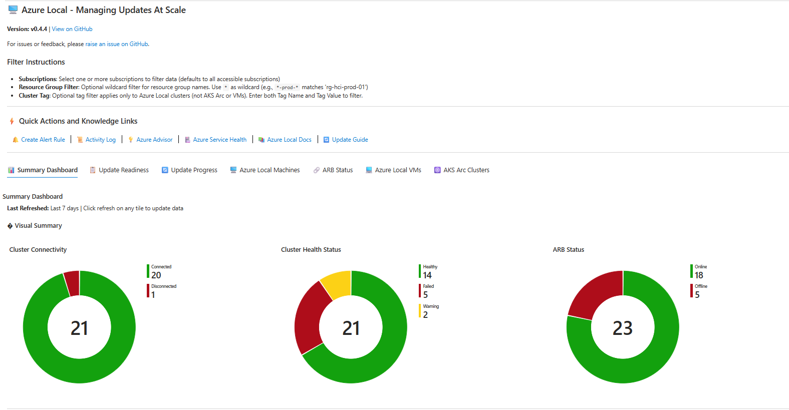
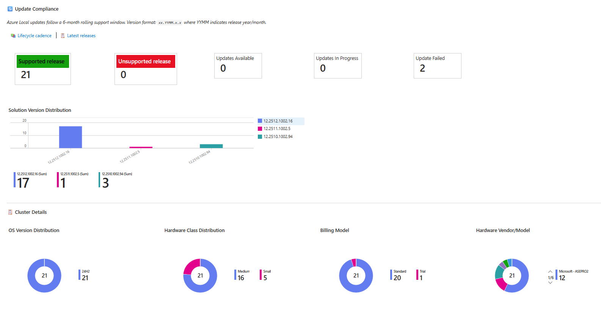
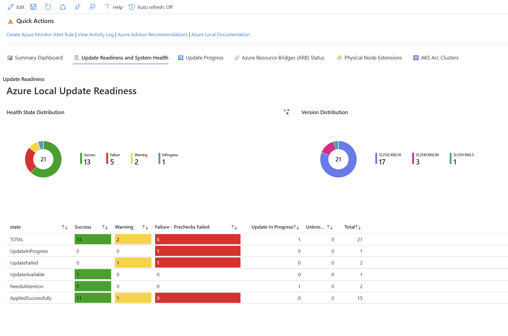
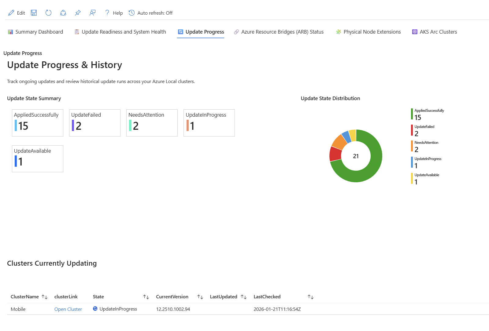
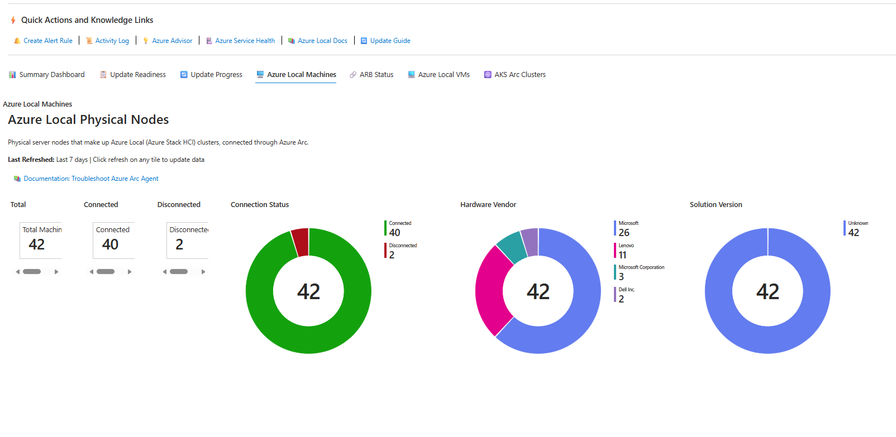
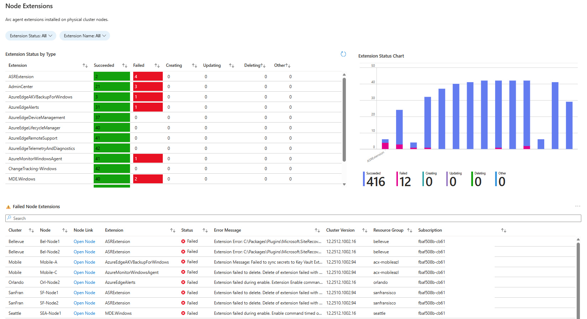
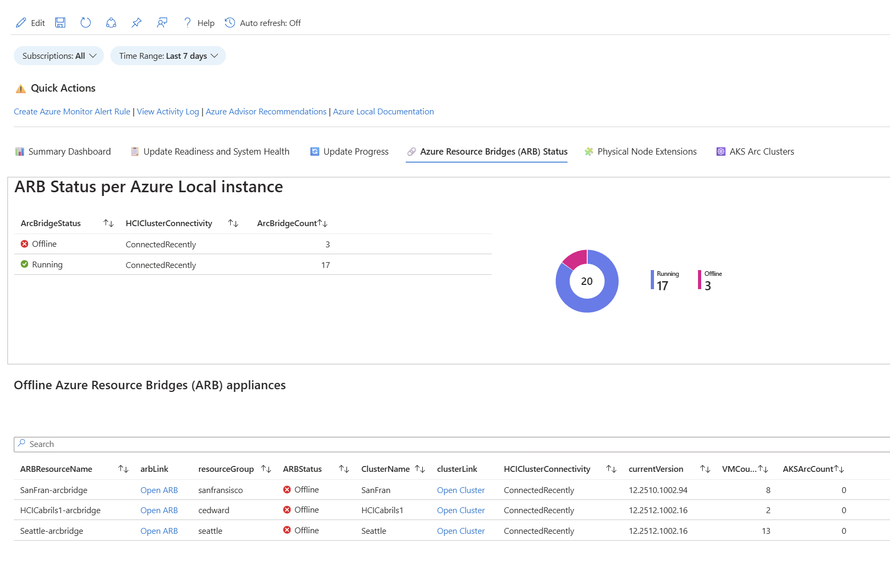
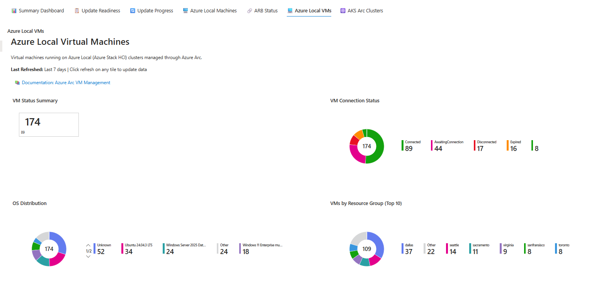
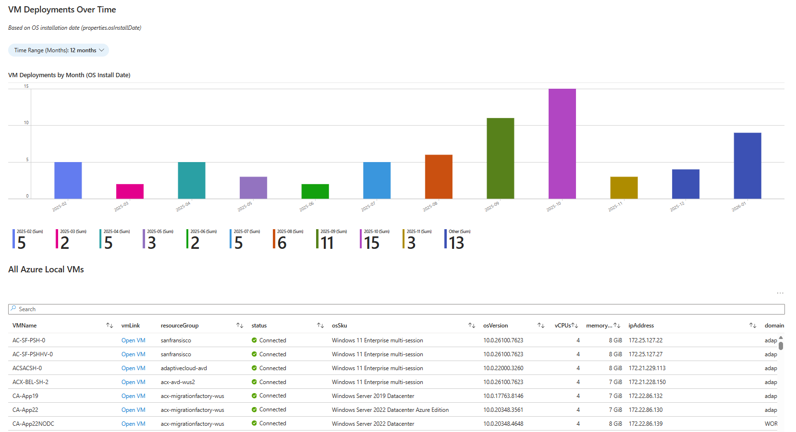
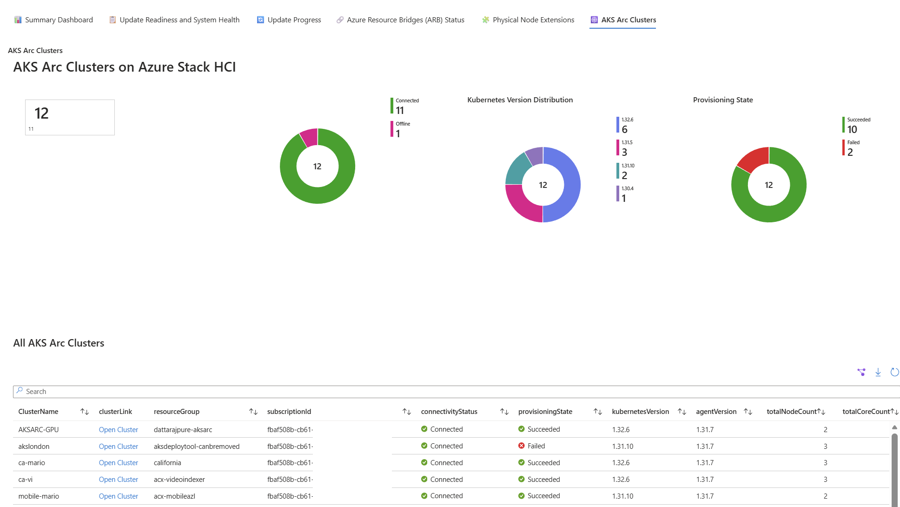

# Azure Local - Managing Updates At Scale Workbook

## Latest Version: v0.6.8

📥 **[Copy / Paste (or download) the latest Workbook JSON](https://raw.githubusercontent.com/NeilBird/Azure-Local/refs/heads/main/Azure-Local-Manage-Updates-At-Scale/Azure-Workbook_AzLocal-Managing-Updates-At-Scale.json)**

An Azure Monitor Workbook for monitoring and managing Azure Local (formerly Azure Stack HCI) clusters at scale. This workbook provides comprehensive visibility into cluster health, update readiness, and workload status across your entire Azure Local fleet.

**Important:** This is a community driven project, (not officially supported by Microsoft), for any issues, requests or feedback, please [raise an Issue](https://github.com/NeilBird/Azure-Local/issues) (note: no time scales or guarantees can be provided for responses to issues.)

## Recent Changes (v0.6.8)

- **Pie Chart Improvements** (consistent auto-sizing and legend placement across all tabs):
  - **Summary Dashboard - Cluster Details**: OS Version, Hardware Class, Billing Model, Hardware Vendor/Model
  - **Azure Local Virtual Machines**: VM Connection Status, OS Distribution, VMs by Resource Group
  - **AKS Arc Clusters**: Connectivity Status, Kubernetes Version Distribution, Provisioning State

- **New Knowledge Links**:
  - **AKS Arc Clusters Tab**: Added [Troubleshoot extension issues for AKS Arc Kubernetes clusters](https://learn.microsoft.com/azure/azure-arc/kubernetes/extensions-troubleshooting) above Failed AKS Extensions table
  - **Summary Dashboard**: Added [Send Diagnostic Logs to Microsoft](https://learn.microsoft.com/azure/azure-local/manage/collect-logs?tabs=azureportal#collect-logs-for-azure-local) below Clusters Not Synced Recently table

> See [Appendix: Previous Version Changes](#appendix-previous-version-changes) for older release notes.

## How to Import the Workbook

1. **Navigate to Azure Monitor Workbooks**
   - Open the [Azure portal](https://portal.azure.com)
   - Search for "Monitor" in the search bar and select **Monitor**
   - In the left navigation, select **Workbooks**

2. **Create a New Workbook**
   - Click **+ New** to create a new workbook
   - In the empty workbook, click the **Advanced Editor** button (</> icon) in the toolbar

3. **Import the JSON Template**
   - In the Advanced Editor, select the **Gallery Template** tab
   - Delete any existing content in the editor
   - Copy the entire contents of the [`Azure-Workbook_AzLocal-Managing-Updates-At-Scale.json`](https://raw.githubusercontent.com/NeilBird/Azure-Local/refs/heads/main/Azure-Local-Manage-Updates-At-Scale/Azure-Workbook_AzLocal-Managing-Updates-At-Scale.json) file
   - Paste the JSON content into the editor
   - Click **Apply**

4. **Save the Workbook**
   - Click **Done Editing** to exit edit mode
   - Click **Save** or **Save As** in the toolbar
   - Provide a name (e.g., "Azure Local - Managing Updates At Scale")
   - Select a subscription, resource group, and location to save the workbook
   - Click **Save**

5. **Pin to Dashboard (Optional)**
   - After saving, you can pin individual tiles or the entire workbook to an Azure dashboard for quick access

### Alternative Import Method

You can also import directly from the Workbooks gallery:

1. Go to **Monitor** > **Workbooks**
2. Click **+ New**
3. Click the **</>** (Advanced Editor) button
4. Select **Gallery Template** tab
5. Paste the JSON content and click **Apply**

## Prerequisites

- Access to Azure subscriptions containing Azure Local clusters
- Reader permissions on the resources you want to monitor
- Azure Monitor Workbooks access in the Azure portal

## Overview

This workbook uses Azure Resource Graph queries to aggregate and display real-time information about your Azure Local infrastructure. It's designed to help administrators and operations teams quickly identify issues, track update progress, and maintain overall cluster health across multiple clusters and subscriptions.

## Features

The workbook is organized into seven tabs:

📊 Summary Dashboard | 📋 Update Readiness | 🔄 Update Progress | 🖥️ Azure Local Machines | 🔗 ARB Status | 💻 Azure Local VMs | ☸️ AKS Arc Clusters

### 📊 Summary Dashboard
A high-level overview of your entire Azure Local estate, including:
- **Visual Summary Charts**: Pie charts showing cluster connectivity, health status, and Azure Resource Bridge (ARB) status
- **Azure Local Totals and Connectivity**: Tile metrics for total clusters, connected/disconnected clusters, connection percentage, total machines, and offline ARBs
- **Health and Patching Status**: Healthy clusters, health warnings, failed prechecks, failed extensions, and health percentage
- **Update Compliance**: 
  - Tiles showing clusters on supported release (green), unsupported release (red), updates available, updates in progress, and update failures
  - Version compliance calculated based on the YYMM component of the cluster version (e.g., `xx.2512.x.x` = December 2025 release) with 6-month rolling support window
  - Links to Lifecycle cadence and Latest releases documentation
  - Solution Version Distribution bar chart showing cluster counts by version
- **Workload Summary**: Total Azure Local VMs and AKS Arc clusters
- **Cluster Details Charts**: 
  - OS version distribution (e.g., 24H2, 23H2)
  - Hardware class distribution (Small, Medium, Large)
  - Billing model breakdown
  - Hardware vendor/model distribution
- **All Clusters Table**: Comprehensive list with solution version, node count, total cores, total memory, OS version, hardware class, manufacturer, model, last sync, and registration date
- **Stale Clusters Warning**: Table showing clusters that haven't synced in 24+ hours with color-coded severity

### 📋 Update Readiness
Detailed view of cluster update readiness:
- Health state distribution chart
- Version distribution across clusters
- Summary of health states by update status
- Failed prechecks analysis with filtering by cluster, health state, and severity
- **Failure By Reason Summary** table with:
  - Filter by cluster to narrow down to specific clusters
  - **Filter by severity** to focus on Critical and Warning issues (defaults to excluding Informational)
  - Sorted by cluster count (highest first) to identify issues affecting the most clusters
  - Detailed failure reason summaries showing affected clusters and occurrence counts
- Link to Microsoft documentation for troubleshooting Azure Local updates

### 🔄 Update Progress
Track the progress of ongoing updates across your clusters with detailed status information:
- **Update Attempts by Day** stacked bar chart showing update attempts per day with status breakdown (Succeeded, Failed, InProgress)
- Update state summary tiles and pie chart distribution
- **Clusters Currently Updating** table with live status
- **Clusters with Updates Available** table with:
  - Direct link to apply One Time Update in Azure Update Manager
  - Link to Azure Local Known Issues documentation
- **All Cluster Update Status** table with information about the 6-month support window
- **Update Run History and Error Details** table showing recent update runs with:
  - Cluster name and update name
  - **Details** column (3rd column) with direct link to view update run details in Azure portal
  - State and status with icons (success/failed/in-progress)
  - Current step description showing what the update is doing
  - **Error Message** column displaying extracted error details for failed updates (click to view full error)
  - Human-readable duration format (e.g., "1h 7m 15s" instead of ISO 8601 format)
  - Start time and last updated timestamps

### 🖥️ Azure Local Machines
Comprehensive view of physical server machines in Azure Local clusters:
- **Last Refreshed timestamp** and documentation links
- **Machine Overview**:
  - Connection status summary tiles (Total, Connected, Disconnected)
  - Connection status pie chart
  - Hardware vendor distribution pie chart
  - OS version distribution pie chart
  - Arc Agent version distribution pie chart
  - License type distribution pie chart
- **All Machines Table** (sorted with Connected first) with details including:
  - Machine name and cluster association
  - Connection status with icons
  - vCPUs (logical core count) and memory (GB)
  - Hardware vendor, model, and processor
  - Solution version, IP address, and OS version
  - Last status change
- **Disconnected Machines** warning table showing:
  - Disconnected nodes with OS version information
  - Time since disconnection
  - Associated cluster and resource group details
- **Machine Extensions**:
  - Filter by extension status (Succeeded, Failed, Creating, Updating, Deleting)
  - Filter by extension name
  - Extension status summary table and bar chart
  - Failed extensions table with error details
- **Network Adapter Details**:
  - Filter by Machine Name and NIC Status (Up/Down)
  - **Note**: Cluster Tag filtering is not supported for this section due to Azure Resource Graph query limitations
  - NIC Status Distribution pie chart showing Up/Down/Disconnected counts (respects filters)
  - NIC information from edge devices including adapter name, type, status, and interface description
  - Machine Name column showing actual host names (joined from hybrid compute machines)
  - Cluster column with link to the Azure Local cluster resource in Azure portal
  - NIC Type (Virtual or Physical) derived from interface description
  - Status with icons (Up = green, Down = red)
  - Driver version for each network adapter
  - IP address, subnet mask, default gateway, and DNS servers
  - MAC address for hardware identification

### 🔗 ARB Status
Monitor the status of Azure Resource Bridge appliances:
- Warning banner about 45-day offline limit (displayed below Offline ARBs section) with link to troubleshooting documentation
- ARB status summary per Azure Local instance with pie chart
  - Shows all ARBs including orphaned ones (where cluster has been deleted)
  - "Unknown" displayed for HCIClusterConnectivity when cluster is missing
  - Sorted with Running status first
- Offline ARB appliances table showing ALL offline ARBs regardless of cluster connection status
- **Last Modified** timestamp and **Days Since Last Modified** with color coding:
  - Green: 0 days
  - Yellow: 1-14 days
  - Red: More than 14 days
- All ARB appliances table with filters for ARB Status and Cluster Name
- Shows "Connected" (green) for Running ARBs or days since last modified (yellow) for Offline ARBs
- Direct links to open ARB and cluster resources in the Azure portal
- **ARB Alert Rules Configuration** (toggle to show/hide):
  - Table with direct links to create Resource Health and Activity Log alerts for each ARB
  - Recommended alert types with severity guidance
  - Step-by-step instructions for manual alert creation
  - Quick links to Action Groups, Alert Rules, and documentation

### 💻 Azure Local VMs
Monitor virtual machines running on Azure Local clusters:
- VM status summary tiles showing total VMs and connection status
- VM connection status distribution pie chart
- OS distribution pie chart showing operating system breakdown
- VMs by resource group distribution
- Bar chart showing VM deployments over time based on OS install date (configurable 1-24 months)
- Complete list of all VMs with details including:
  - OS SKU and version
  - vCPUs and memory (GB)
  - IP address
  - Domain name
  - Agent version
  - OS install date and last status change
- VMs grouped by hosting Azure Local cluster with hardware specs
- VM distribution bar chart by cluster

### ☸️ AKS Arc Clusters
Monitor AKS Arc clusters running on Azure Local:
- Summary tiles showing total clusters, connected/offline, and provisioning state
- Connectivity status distribution pie chart
- Kubernetes version distribution pie chart
- Provisioning state pie chart
- Bar chart showing cluster deployments over time (configurable 3-24 months)
- Complete list of all AKS Arc clusters with details including:
  - Node count and total core count
  - Kubernetes and agent versions
  - Distribution type
  - Last connectivity time
  - Certificate expiration date
  - Cluster creation date
- Certificate expiration warning table showing clusters with certificates expiring within 30 days
- **AKS Arc Cluster Extensions**:
  - Filter by extension status (Succeeded, Failed, Creating, Updating, Deleting)
  - Filter by extension name
  - Extension status summary table and bar chart (similar to Node Extensions)
  - Failed extensions table with error details

## Quick Actions and Knowledge Links

The workbook includes convenient quick action links to:
- 🔔 Create Azure Monitor Alert Rules
- 📜 View Activity Log
- 💡 Azure Advisor Recommendations
- 🏥 Azure Service Health Status
- 📚 Azure Local Documentation
- 🔄 Azure Local Update Guide

## Parameters

The workbook provides several filtering options to help you focus on specific resources:

### Scope Filters
- **Subscriptions**: Filter data by one or more Azure subscriptions (defaults to all accessible subscriptions)

### Resource Group Filter
- **Resource Group Filter**: Optional wildcard filter for resource group names
  - Use `*` as a wildcard character to match any sequence of characters
  - Examples:
    - `*-prod-*` matches resource groups containing "-prod-" (e.g., "rg-hci-prod-01", "azure-prod-cluster")
    - `*hci*` matches any resource group containing "hci"
    - `rg-*` matches resource groups starting with "rg-"
  - Leave empty to show all resource groups

### Cluster Tag Filter
- **Cluster Tag Name**: The name of the tag to filter by (e.g., "Environment", "Team", "CostCenter")
- **Cluster Tag Value**: The value of the tag to match (e.g., "Production", "IT-Ops")
- **Note**: Tag filtering applies **only to Azure Local clusters** - it does not filter AKS Arc clusters or Azure Local VMs
- Both Tag Name and Tag Value must be provided for the filter to take effect

### Time Range
- **Time Range**: Select the time range for time-based queries (1 day to 30 days, or custom)

## Usage Tips

- Use the subscription filter to focus on specific environments (e.g., production vs. development)
- Regularly check the Update Readiness tab before scheduling maintenance windows
- Monitor the ARB Status tab to ensure Azure Arc connectivity is healthy
- Export data to Excel using the export button on grids for reporting purposes
- Set up Azure Monitor alerts based on the queries in this workbook for proactive monitoring

## Contributing

Feel free to submit issues or pull requests to improve this workbook.

## License

See the repository's LICENSE file for details.

---

## Appendix: Previous Version Changes

### v0.6.7

- **Cluster Link Improvements**:
  - Updated cluster links in update-related tables to open the `/updates` view directly:
    - Cluster Update Status table
    - Clusters Currently Updating table
    - Clusters with Updates Available table
  - Link label changed from "Open Cluster" to "View Updates" for clarity

- **Certificate Expiration Warning Improvements**:
  - Added information banner with link to [certificate rotation documentation](https://learn.microsoft.com/azure/aks/hybrid/rotate-certificates)
  - Enhanced **Days Until Expiration** column with color coding:
    - 🟢 Green: More than 14 days remaining
    - 🟡 Yellow: 8-14 days remaining
    - 🔴 Red: 7 days or less remaining
  - Added refresh and export buttons to the table

- **Clusters with Updates Available**:
  - Added column filtering capability for easier searching

- **Update Readiness Tab**:
  - Enlarged pie charts (Health State Distribution, Version Distribution) for better visibility
  - Moved chart legends to bottom position for improved layout
  - Added knowledge link to [Azure Local GitHub Supportability Forum](https://github.com/Azure/AzureLocal-Supportability) for TSGs and known issue mitigations

- **Update Progress Tab**:
  - Moved "Days Since Update" column before "Last Updated" in All Cluster Update Status table
  - Added knowledge link for [Troubleshoot Update failures](https://learn.microsoft.com/azure/azure-local/update/update-troubleshooting-23h2#troubleshoot-update-failures) below Clusters Currently Updating table

### v0.6.6

- **ARB Alert Rules Configuration** (new section in ARB Status tab):
  - Added toggle to show/hide Alert Rules setup panel
  - **ARB Alert Rules Table** listing all Arc Resource Bridges with:
    - Current status with visual indicators (Running/Offline)
    - Days offline tracking with color coding (🟢 Online, 🟡 <14 days, 🔴 >14 days)
    - Direct links to create **Resource Health** alerts in Azure Portal
    - Direct links to create **Activity Log** alerts in Azure Portal
  - **Prerequisites documentation**: Action Groups, permissions, Resource Health support
  - **Recommended alert types** with severity guidance:
    - Offline Status (Sev 1)
    - Resource Health - Unavailable (Sev 1)
    - Resource Health - Degraded (Sev 2)
    - Extended Offline >14 days (Sev 0)
  - **Manual alert rule creation steps** including sample ARG query for bulk monitoring
  - **Quick Links**: Create Action Group, View Alert Rules, Resource Health docs, ARB troubleshooting

### v0.6.5

- **Clusters Currently Updating**:
  - Added **Update Run** column with "View Progress" link to open the update history details page in Azure Portal

- **All Azure Resource Bridges (ARB) appliances**:
  - Updated **Days Since Last Modified** column color coding:
    - 🟢 Green: "Connected" for Running ARBs
    - 🟡 Yellow: 1-45 days since last modified
    - 🔴 Red: More than 45 days since last modified

### v0.6.4

- **Network Adapter Details Improvements**:
  - Added filters for the **NIC Status Distribution** pie chart (Machine Name, Machine Connectivity, NIC Status)
  - Reorganized table filters to appear directly above the table (below the pie chart)
  - Added **IP Address** text filter for partial/complete IP address matching
  - Added **Machine Connectivity** dropdown filter to filter by machine connection status
  - Added **Machine Connectivity** column (2nd column) with status icons:
    - ✅ Green tick for "Connected" machines
    - ❌ Red cross for "Disconnected" machines
  - Fixed **Cluster** link to now open the `/machines` view of the cluster in Azure Portal

- **Update Attempts by Day Improvements**:
  - Added **Time Period** filter with consistent options: 1 week (default), 2 weeks, 1 month, 3 months, 6 months, 9 months, 12 months
  - Added **Update Attempts Details** table below the chart showing:
    - Cluster Name with "Open Cluster" link
    - Update Name
    - State with status icons (Succeeded/Failed/InProgress)
    - Started and Ended timestamps
    - Duration (formatted as hours and minutes)
    - Resource Group
  - Added **Update Attempts by Status Percentages** pie chart showing percentage breakdown of update states (Succeeded/Failed/InProgress)

- **Clusters Currently Updating**:
  - Added **Update Installing** column showing which update is currently being installed

- **AKS Arc Clusters Table Improvements**:
  - Added **Masters** column showing the number of control plane (master) nodes
  - Added **Workers** column showing the total number of worker nodes across all agent pools
  - Renamed "Total Node Count" to **Total Nodes** for consistency
  - New columns appear before "Total Nodes" for easy comparison

- **AKS Arc Cluster Deployments Over Time**:
  - Added additional time range options: 1 month, 2 weeks, 1 week (consistent with Update Attempts filter)

### v0.6.3

- **Added Update Available Column**: "Clusters with Updates Available" table now displays the actual update name (e.g., "Solution12.2601.1002.38") from the updates resource
- **Added Update State Column**: New column showing the state of available updates (e.g., "Ready")

### v0.6.2

- **Improved Error Message Display**: Update Run History table now includes expandable row details showing error messages in a formatted markdown code block for better readability
- **Fixed Apply Update Link**: Corrected the "Apply Update" button URL to properly open the Azure Portal Install Updates blade
- **Enhanced Error Message Formatting**: Preserved line breaks in error messages and increased column width for better visibility
- **Column Naming Consistency**: Added proper labelSettings to all tables across all tabs with consistent capitalization and spacing (e.g., "clusterName" → "Cluster Name")

### v0.6.1

- **System Health Naming Updates**: Renamed "Failed Prechecks" to "System Health Filters" and "Cluster Health Overview" to "System Health Checks Overview" for improved clarity and consistency
