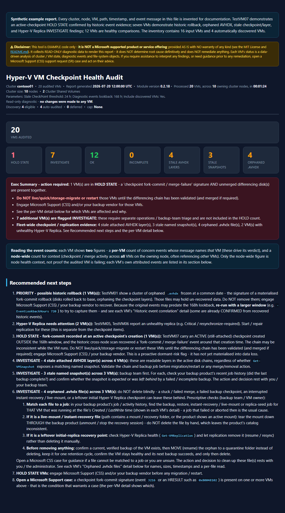
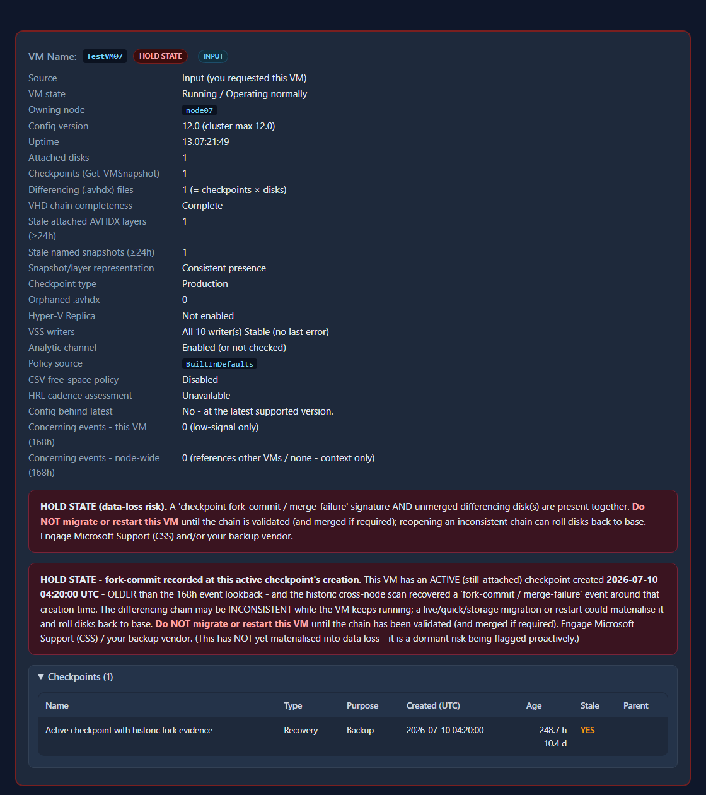
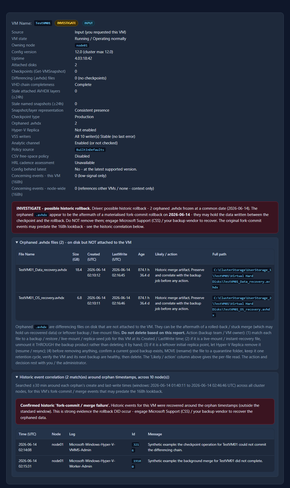
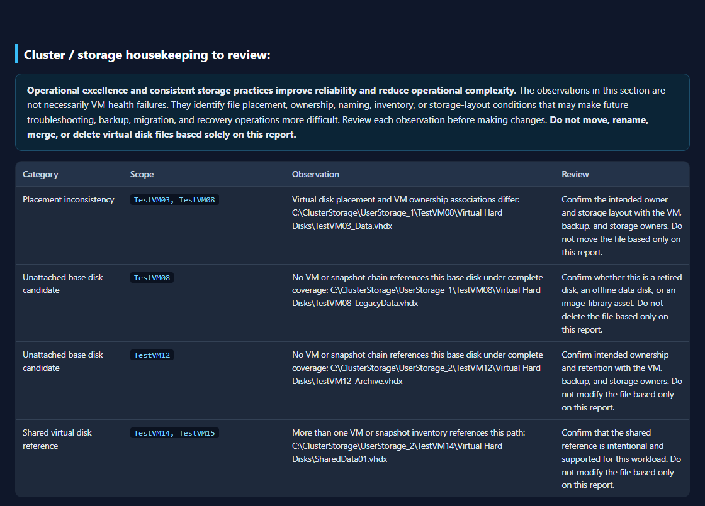

# Get-HyperVVMCheckpointHealth

> **Disclaimer:** This module is NOT a Microsoft supported service offering or product. It is provided as example code only, with no warranty or official support. Refer to the [MIT License](https://github.com/NeilBird/Azure-Local/blob/main/LICENSE) for further information.

## Latest version:

- Module: `Get-HyperVVMCheckpointHealth`
- Updated: 2026-07-29
- Version: 0.2.30

## TL;DR

An example PowerShell module providing the `Get-HyperVVMCheckpointHealth` command, which performs a **read-only** audit of a VM's **checkpoint / differencing-disk chain, Hyper-V replication, and node event logs**. It automates the creation of a portable HTML Summary Report that highlights VMs with aged checkpoints, failing replication, and/or signals of concern that could occur during VM migration.

This module provides insights that should be used as part of an operator investigation. It is NOT intended to troubleshoot active issues, nor does it provide a root-cause analysis (RCA). It is ONLY suitable as a tool to surface existing event data or configuration drift for VM checkpoints and/or replication issues.

- **This module is NOT a supported service or offering from Microsoft. It is provided as example code only.**

> **See an example / fictitious report before running the module:** review the [synthetic Contoso HTML report](./examples/VMCheckpointAudit-contoso01-example.html) and the [screenshots below](#synthetic-example-report). To view the interactive report, download the HTML file and open it locally. It contains only invented `contoso01`, `node01`-`node10`, `TestVM01`-`TestVM20`, event, timestamp, and `C:\ClusterStorage\UserStorage_X\` values.

> **Safety stop:** For a suspected broken or inconsistent VHDX/AVHDX chain, do not modify the files based on this report; open a Microsoft Support (CSS) case before making changes. The informational recovery reference is described [below](#recovery-technical-reference).

## Overview and details of intended use

This example module performs a read-only audit of a Hyper-V VM's **checkpoint / differencing-disk chain, Hyper-V replication, and specific diagnostic event data** on an Azure Local or Windows Server Failover Cluster. It can identify a failure mode in which a checkpoint **fork-commit failure** leaves the VM's on-disk (`.vmcx`) chain metadata inconsistent. The VM may continue to run because the inconsistency has not yet been exposed. A live migration or restart forces Hyper-V to reopen the on-disk chain. This can cause the VM disks to roll back to their base VHDX files and leave data in the AVHDX checkpoint layers inaccessible to the VM.

The module is intended for Azure Local / Windows Server administrators / operators who need to audit the VMs running on a specific cluster — specifically for any anomalies in checkpoint, replication, or storage-related events. It generates automated output in the form of detailed `.txt` reports, `.csv` event-log data, and a portable **HTML summary** file that serves as the at-a-glance audit report.

## Contents

- [Safety — this module makes no changes](#safety--this-module-makes-no-changes)
- [Recovery technical reference](#recovery-technical-reference)
- [Requirements](#requirements)
- [How it connects (no double-hop)](#how-it-connects-no-double-hop)
- [Download and import the module](#download-and-import-the-module)
- [Usage examples](#usage-examples)
- [Parameters, syntax and helpful information](#parameters-syntax-and-helpful-information)
- [What it reports](#what-it-reports)
- [Cluster storage housekeeping](#cluster-storage-housekeeping)
- [Portable HTML report & results bundle](#portable-html-report--results-bundle)
- [Synthetic example report](#synthetic-example-report)
- [Output files](#output-files-only-with--outputpath)
- [VM states (verdicts)](#vm-states-verdicts)
- [Enabling the Analytic channel](#enabling-the-analytic-channel-optional-operators-choice)
- [Return value](#return-value)
- [Anonymized performance observations](#anonymized-performance-observations)
- [Release packaging](#release-packaging-maintainers)
- [What's New](#whats-new)
- [Failure-signature reference](#failure-signature-reference)
- [Related technical reference](#related-technical-reference)

## Safety — this module makes no changes

The module is **read-only** with respect to the VMs, disks, checkpoints, cluster, and event logs. Every data call is a `Get-*` / `Measure-*`, and the owner-context blocks only run read-only commands (`Get-VM`, `Get-VMHostSupportedVersion`, `Get-VHD`, `Get-VMSnapshot`, `Get-VMReplication`, `Get-Item`, `Get-ChildItem`, `Get-WinEvent`, `vssadmin list writers` (which only *enumerates* VSS writer state), and the storage-health snapshot `Get-StorageJob` / `Get-VirtualDisk` / `Get-PhysicalDisk` / `Get-StorageSubSystem` / `Get-HealthFault` / `Get-ClusterSharedVolumeState`).

- It **never** creates/deletes/merges checkpoints, migrates, or changes VM/cluster state.
- The Analytic-channel enable command is **printed only** — never executed.
- The **only** filesystem writes are diagnostic **artifacts**: per-VM `.txt` reports, event `.csv` files, performance-telemetry JSON, and a conditional `_debug_log_*.txt` for unrecovered failures (with `-OutputPath`); a single self-contained **HTML** fleet report (on by default - in the `-OutputPath` run folder, or the current directory if `-OutputPath` is omitted); and a results **`.zip`** containing the run-folder artifacts (on by default when `-OutputPath` is used). Suppress the HTML/ZIP with `-NoHtml` / `-NoZip`. None of these change the VM, disks, checkpoints, or cluster.
- It is **diagnostic only** — it does not determine root cause definitively or remediate anything. For **backup / checkpoint-merge or VSS** findings, engage your **third-party backup vendor first** (their product owns the checkpoint lifecycle); **open a Microsoft Support (CSS) case** for a confirmed fork-commit signature, or when the vendor rules out their product. Act on their advice before taking action.

## Recovery technical reference

The separate [Hyper-V AVHDX Parent-Chain Recovery Technical Reference](./docs/Hyper-V-AVHDX-Chain-Recovery-Reference.md) explains differencing-disk chain evidence, stop conditions, and relevant supported cmdlets for experienced administrators. It is **knowledge and informational guidance only**, not module remediation guidance or an approved customer change procedure. It is not executed or consumed by this module, is not included in the runtime release ZIP, and must not be treated as authorization to remediate a finding from the audit. For any live customer support issue involving a broken or potentially inconsistent VHDX/AVHDX chain, open a **Microsoft Support (CSS) case before making changes**.

### Operational impact

Read-only does not mean zero resource use. The module performs metadata, event-log, RPC/WinRM, and filesystem reads. In particular, virtual-disk housekeeping enumerates VM/snapshot ownership across the cluster and recursively inventories VHD/VHDX/AVHDX/VHDS files on Cluster Shared Volumes. Event-log scans and `vssadmin list writers` can also take time. These operations do not reconfigure workloads, but a broad run can add temporary CPU, storage, network, and management-plane load.

When running with `-ProcessAllVMs`, consider scheduling the audit outside core business hours, particularly on large or busy clusters. Review elapsed time and the performance-telemetry JSON to understand the impact in your environment before making fleet-wide runs part of a regular operating schedule.

## Sensitive data handling

Treat every saved audit artifact as **sensitive operational data**. The `.txt`, `.csv`, `.html`, telemetry JSON, `_debug_log_*.txt`, and `.zip` can contain VM and node names, identifiers, storage paths, event payloads, command context, and application details.

- Write reports only to an access-controlled, operator-owned location. Do not use a broadly writable share or a public synchronization folder.
- Transfer artifacts to backup vendors or Microsoft Support only through your organization's approved secure support channel.
- The generated ZIP is a convenience bundle and is **not encrypted**. The module does not accept a ZIP password because command-line passwords are exposed through process history and logs. Apply your organization's approved encrypted-container or secure-transfer control after generation when required.
- Retain artifacts only for the active investigation and your required audit period, then delete all extracted copies and bundles according to policy.
- `-AnonymizeTelemetry` applies **only** to the performance-telemetry JSON. It does not redact TXT, CSV, HTML, ZIP content, file names, paths, or free-text event messages. Do not describe the report bundle as anonymized.
- Review event messages before wider sharing because free text can contain guest, application, account, or file information that deterministic name replacement would not reliably remove.
- The debug log is **not anonymized**. Review it before sharing and send it only through an approved secure support channel. It intentionally avoids credentials, bound-parameter dumps, and environment-variable dumps, but exact errors, paths, target objects, and source context can still be sensitive.

## Requirements

- **Windows PowerShell 5.1** with the **FailoverClusters** module available locally. This module is written for, and validated against, **Windows PowerShell 5.1 only** — it is **not** intended for PowerShell 7.x. The **Hyper-V** module is required on the cluster nodes, but not on an RSAT management workstation because Hyper-V collection runs on each VM's owning node through a direct WinRM session.
- Run it **on a cluster node** (interactive / SConfig logon), **or** from a **management workstation** using **`-Cluster <name>`** (with the RSAT **Failover Clustering** tools installed).
- On a **management workstation**, install the RSAT **Failover Clustering** tools so `Get-ClusterGroup` / `Get-Cluster` resolve locally (without them you get `Get-ClusterGroup : The term ... is not recognized`):
  ```powershell
  # Windows 10 / 11 client (run elevated)
  Add-WindowsCapability -Online -Name 'Rsat.FailoverCluster.Management.Tools~~~~0.0.1.0'

  # Windows Server (run elevated)
  Install-WindowsFeature -Name RSAT-Clustering-PowerShell
  ```
- Rights to query the cluster, Hyper-V, and the nodes' event logs. When the VM's owning node is not the local node, WinRM to that owning node is used for a **single** hop.

### Internal structure

Version 0.2.30 is distributed as a PowerShell module with a single exported command and manifest-managed private nested modules. Keep the extracted directory intact:

```text
Get-HyperVVMCheckpointHealth\
    Get-HyperVVMCheckpointHealth.psd1   # Import-Module entry point
    Get-HyperVVMCheckpointHealth.psm1   # exported command implementation
    Private\
        Get-HyperVVMCheckpointHealth.Assessment.psm1
        Get-HyperVVMCheckpointHealth.Collection.psm1
        Get-HyperVVMCheckpointHealth.Policy.psm1
        Get-HyperVVMCheckpointHealth.Rendering.psm1
        Get-HyperVVMCheckpointHealth.Storage.psm1
    checkpoint-health-policy.example.yml
    README.md
    LICENSE
```

The manifest exports only `Get-HyperVVMCheckpointHealth` and declares all five private modules under `NestedModules`. The root module owns the public parameter and pipeline contract, run orchestration, retry/diagnostic services, remoting-session coordination, and artifact writes. Event policy, attribution, coverage, recovery, replication, verdict, discovery-selection, and state-comparison decisions live in the assessment module. The compact VM state collector lives in collection; optional operator policy loading and policy assessments live in policy; the self-contained HTML renderer lives in rendering; stateless VHD-chain, staleness, ownership, housekeeping, and storage-health logic lives in storage. The two cluster-wide virtual-disk inventory coordinators remain in the root because they depend on its retry, diagnostics, and pooled-session lifecycle. Import the manifest rather than the root `.psm1`; bare root-module execution is intentionally rejected.

Do not download or move only the `.psm1` or `Private` files. Use the complete release ZIP so relative imports remain valid.

## How it connects (no double-hop)

The module is designed to avoid "double-hop" authentication failures (the `0x8009030e` Kerberos error you get when a remoting session tries to reach a second machine). It:

1. finds the cluster nodes and the VM's **owning node** using the **cluster API** (`Get-ClusterGroup` / `Get-ClusterNode` — RPC, no WinRM), then
2. runs every data-collection command in the **owner context** — **directly (locally)** when the current node owns the VM (zero hops), otherwise through **one** remoting session to the owning node.

Two supported ways to run it, both single-hop:

- **On a cluster node** (interactive / SConfig logon). VMs owned by that node are read locally (zero hops); VMs on other nodes are reached in one hop.
- **From a management workstation** with **`-Cluster <name>`** (RSAT Failover Clustering installed). The cluster queries use RPC and each owning node is reached in one hop from the workstation. If you build the `-VMName` list from a `Get-ClusterGroup` sub-expression, add `-Cluster <name>` to **that** query too — it runs locally and does not inherit the command's `-Cluster` (see the remote example in Usage).

> **Do not** `Enter-PSSession` into a node and then run the command: if the VM is owned by a *different* node, reaching it is a **second (double) hop** and is blocked (`Access is denied` / `0x8009030e`) unless CredSSP/delegation is configured. The module detects this and tells you to run it on a node or use `-Cluster`.

### Download and import the module

Download the versioned ZIP from the repository's [GitHub Releases page](https://github.com/NeilBird/Azure-Local/releases). The supported 0.2.30 release asset is `Get-HyperVVMCheckpointHealth-0.2.30.zip`; it contains the manifest, root module, five private modules, example policy YAML, README, and license. Do not use a raw single-file link because the module requires its manifest and sibling private modules.

The release also publishes [`Setup-Get-HyperVVMCheckpointHealth.ps1`](Setup-Get-HyperVVMCheckpointHealth.ps1) as a separate asset outside the ZIP. The setup script is pinned to the supported version and SHA256 hash and changes files only beneath `<InstallRoot>\Get-HyperVVMCheckpointHealth` (`C:\Temp\Get-HyperVVMCheckpointHealth` by default). When `-ZipPath` is omitted, it looks for the versioned ZIP beside the setup script first and then in `$env:TEMP`. It validates the staged manifest/version before replacing that directory, restores the previous directory if installation validation fails, imports the module, and verifies the command without running an audit. Use `-ZipPath` to select another location, `-InstallRoot` to choose another parent directory, and `-WhatIf` for a no-change preview. Do not use an installation root where the `Get-HyperVVMCheckpointHealth` child directory contains unrelated files.

Download the ZIP, download the setup script, and run the setup script:

```powershell
Invoke-WebRequest 'https://github.com/NeilBird/Azure-Local/releases/download/Get-HyperVVMCheckpointHealth-v0.2.30/Get-HyperVVMCheckpointHealth-0.2.30.zip' -OutFile "$env:TEMP\Get-HyperVVMCheckpointHealth-0.2.30.zip"
Invoke-WebRequest 'https://github.com/NeilBird/Azure-Local/releases/download/Get-HyperVVMCheckpointHealth-v0.2.30/Setup-Get-HyperVVMCheckpointHealth.ps1' -OutFile "$env:TEMP\Setup-Get-HyperVVMCheckpointHealth.ps1"
Unblock-File "$env:TEMP\Setup-Get-HyperVVMCheckpointHealth.ps1"; & "$env:TEMP\Setup-Get-HyperVVMCheckpointHealth.ps1"
```

Then run the audit separately. On a cluster node:

```powershell

# One VM, also writing a per-VM .txt report and events .csv into a folder
Get-HyperVVMCheckpointHealth -VMName 'TestVM01' -OutputPath 'C:\Temp\VM_Checkpoint_Reports'

# Audit all VMs:
Get-HyperVVMCheckpointHealth -ProcessAllVMs -OutputPath 'C:\Temp\VM_Checkpoint_Reports'
```

From a management workstation with the RSAT Failover Clustering tools installed:

```powershell
Get-HyperVVMCheckpointHealth -Cluster 'CLUS01' -ProcessAllVMs -OutputPath 'C:\Temp\VM_Checkpoint_Reports'
```

`-ProcessAllVMs` and `-VMName` are mutually exclusive. Use `-VMName` to audit a subset, with optional `-IncludeDiscoveredVMs` for additional VMs found through high-risk event evidence.

The release tag and all three assets must exist before the `Invoke-WebRequest` example works. Until the GitHub release is published, build or clone the repository and import the local manifest directly.

To install the extracted module into the current user's standard Windows PowerShell module path and import it later by name:

```powershell
$userModuleBase = Join-Path ([Environment]::GetFolderPath('MyDocuments')) `
    'WindowsPowerShell\Modules\Get-HyperVVMCheckpointHealth'
$versionModuleRoot = Join-Path $userModuleBase $version
New-Item -ItemType Directory -Path $versionModuleRoot -Force | Out-Null
Copy-Item -Path (Join-Path $moduleRoot '*') -Destination $versionModuleRoot -Recurse -Force

Import-Module Get-HyperVVMCheckpointHealth -RequiredVersion $version -Force
Get-Module Get-HyperVVMCheckpointHealth | Select-Object Name, Version, Path
```

Install it separately for each operator account that runs the audit, or place the same versioned module directory under an organization-managed all-users module path using your normal software deployment controls.

> **Names or objects:** `-VMName` accepts VM **names** *or* VM **objects** (from `Get-VM`), as an array or via the pipeline. VM objects are normalized to their `.Name` inside the command, so `-VMName $VMs`, `-VMName $VMs.Name`, and `Get-VM | ...` all work. Each VM is audited **independently** - one VM not being found (or erroring) does not stop the rest. An input that resolves to no name, or to a string >100 chars (e.g. a mistakenly joined list), is skipped with a warning.

## Usage examples

```powershell
# Basic audit of one VM (writes the default HTML report to the current directory)
Get-HyperVVMCheckpointHealth -VMName 'TestVM01'

# One VM, also writing a per-VM .txt report and events .csv into a folder
Get-HyperVVMCheckpointHealth -VMName 'TestVM01' -OutputPath 'C:\Temp\VM_Checkpoint_Reports'

# Multiple VMs by name (array) - each gets its own .txt and .csv in the folder
Get-HyperVVMCheckpointHealth -VMName 'TestVM01','TestVM02' -OutputPath 'C:\Temp\VM_Checkpoint_Reports'

# Every clustered VM - ON A NODE.
Get-HyperVVMCheckpointHealth -ProcessAllVMs -OutputPath 'C:\Temp\VM_Checkpoint_Reports'

# A specific list of VM names (piped) - the module resolves each VM's owning node itself
'VM01','VM02','VM03' | Get-HyperVVMCheckpointHealth -OutputPath 'C:\Temp\VM_Checkpoint_Reports'

# REMOTE: from a management workstation (RSAT Failover Clustering) - target a cluster by name.
# STEP 1 - verify the RSAT Failover Clustering tools are present on THIS workstation (see Requirements
# to install if this returns nothing / $false). Get-ClusterGroup and Get-Cluster come from this module.
if (Get-Module -ListAvailable FailoverClusters) { 'FailoverClusters: OK' } else { 'FailoverClusters: MISSING - install RSAT (see Requirements)' }
Get-Command Get-ClusterGroup -ErrorAction SilentlyContinue   # should resolve; blank = tools not installed

# STEP 2 - run it. -ProcessAllVMs enumerates the named cluster, so -Cluster is supplied once.
Get-HyperVVMCheckpointHealth -Cluster 'CLUS01' -ProcessAllVMs -OutputPath 'C:\Temp\VM_Checkpoint_Reports'

# Equivalent remote pipeline form (names gathered from the remote cluster, then piped in)
Get-ClusterGroup -Cluster 'CLUS01' | Where-Object GroupType -eq 'VirtualMachine' |
    Select-Object -ExpandProperty Name |
    Get-HyperVVMCheckpointHealth -Cluster 'CLUS01' -OutputPath 'C:\Temp\VM_Checkpoint_Reports'

# Wider event look-back (14 days, vs the 7-day default) and a lower stale threshold (12h)
Get-HyperVVMCheckpointHealth -VMName 'TestVM01' -EventLookbackHours 336 -StaleHours 12

# Skip the event-log scan and the Analytic-channel check (fastest, disk/checkpoint state only)
Get-HyperVVMCheckpointHealth -VMName 'TestVM01' -SkipWorkerEvents -SkipAnalyticCheck

# -PassThru: also emit one object per VM to the pipeline (for Where-Object / Export-Csv / roll-ups)
$r = Get-HyperVVMCheckpointHealth -VMName 'TestVM01','TestVM02' -OutputPath 'C:\Temp\VM_Checkpoint_Reports' -PassThru
$r | Where-Object HoldState | Format-Table VMName, OwningNode, Recommendation

# HTML fleet report + results .zip are produced BY DEFAULT (into the -OutputPath run folder). The
# console is quiet by default (one-line verdict per VM); the .txt and HTML still hold the full detail.
Get-HyperVVMCheckpointHealth -VMName 'VM01','VM02' -OutputPath 'C:\Temp\VM_Checkpoint_Reports'

# Full per-VM report on the console as well as the files
Get-HyperVVMCheckpointHealth -VMName 'VM01' -OutputPath 'C:\Temp\VM_Checkpoint_Reports' -Quiet:$false

# Also audit high-risk VMs DISCOVERED in the event data (uncapped unless -MaxDiscoveredVMs is supplied)
Get-HyperVVMCheckpointHealth -VMName 'VM01' -OutputPath 'C:\Temp\VM_Checkpoint_Reports' -IncludeDiscoveredVMs

# Audit every clustered VM EXCEPT those named in an exclusion CSV (single 'VMName' column, case-insensitive)
Get-HyperVVMCheckpointHealth -ProcessAllVMs -ExcludedVMListCsv '.\CheckPointAudit_Excluded_VMs.csv' -OutputPath 'C:\Temp\VM_Checkpoint_Reports'

# Apply an optional schema-versioned policy for image/live-mount paths, CSV free space, and HRL cadence.
# Policy parsing is built in; no additional PowerShell module is required.
Get-HyperVVMCheckpointHealth -VMName 'VM01' -PolicyPath '.\checkpoint-health-policy.yml' -OutputPath 'C:\Temp\VM_Checkpoint_Reports'

# Choose the HTML location explicitly (folder or full .html path); suppress the zip and/or HTML
Get-HyperVVMCheckpointHealth -VMName 'VM01' -OutputPath 'C:\Temp\VM_Checkpoint_Reports' -HtmlReportPath 'C:\Reports\audit.html' -NoZip
```

### Optional policy file

`checkpoint-health-policy.example.yml` is an operator template, not an automatically discovered configuration file. Downloading, extracting, renaming, or editing it does **not** change command behavior. The module reads YAML only when that exact file path is supplied with `-PolicyPath`:

```powershell
Get-HyperVVMCheckpointHealth -VMName 'VM01' `
    -PolicyPath 'C:\Temp\Get-HyperVVMCheckpointHealth\checkpoint-health-policy.example.yml' `
    -OutputPath 'C:\Temp\VM_Checkpoint_Reports'
```

Without `-PolicyPath`, the command does not search the current directory, module directory, or `-OutputPath`; it uses the built-in policy below. Policy parsing has no external module dependency.

| Policy setting | Built-in value | Effect |
|---|---|---|
| `schemaVersion` | `1` | Identifies the supported YAML contract. A supplied policy must contain `schemaVersion: 1`. |
| `storage.imageLibraryPathPatterns` | `(?i)[\\/](?:image|images|imagestore|template|templates|library|gallery|golden)(?:[\\/]|$)` | Excludes matching VHD, VHDX, and AVHDX paths from cluster/storage housekeeping findings. Exact `ImageStore` path segments and versioned `linux-cblmariner-x.x.x.x.vhdx` ARB appliance images are always excluded, including when a supplied policy uses `[]`; add patterns for other known image repositories. This affects housekeeping observations only and never changes VM health verdicts. |
| `orphan.liveMountPathPatterns` | `(?i)rubriklivemount`, `(?i)_temp_` | Classifies matching orphan AVHDX paths as backup live-mount/instant-recovery evidence. |
| `orphan.classifyZeroByteAsLiveMount` | `true` | Also classifies a zero-byte orphan AVHDX as live-mount evidence. |
| `csvFreeSpace.enabled` | `false` | CSV free-space policy does not affect the verdict unless explicitly enabled. |
| `csvFreeSpace.minimumFreePercent` | `15` | When CSV policy is enabled, free space below 15% is a breach. |
| `csvFreeSpace.minimumFreeGB` | `100` | When CSV policy is enabled, free space below 100 GB is a breach. Either CSV threshold breach drives `INVESTIGATE`, never `HOLD STATE`. |
| `replication.hrl.enabled` | `true` | Enables cadence-aware HRL assessment. |
| `replication.hrl.cadenceMultiplier` | `10` | Multiplies the Replica frequency when calculating the HRL age threshold. |
| `replication.hrl.minimumStaleMinutes` | `15` | Sets the minimum HRL age threshold. Effective threshold: `max(15 minutes, FrequencySec / 60 x 10)`. |
| `replication.hrl.requireReplicationConcern` | `true` | Prevents HRL age alone from escalating a healthy or idle Replica relationship. Typed Replica health or measurement concern must corroborate it. |

When `-PolicyPath` is supplied, the loader starts with these built-in values and overlays only the keys present in the YAML file. Omitted sections and properties retain their built-in values. A supplied `imageLibraryPathPatterns` or `liveMountPathPatterns` array replaces the complete configurable built-in array; it is not appended. Use `[]` to intentionally configure no additional patterns for that category. Exact `ImageStore` segments and versioned `linux-cblmariner-x.x.x.x.vhdx` ARB appliance image names remain automatic housekeeping exclusions even when `imageLibraryPathPatterns: []` is supplied.

The **Cluster / storage housekeeping to review** table omits virtual disks whose full paths match the automatic `ImageStore` exclusion, whose file name matches the versioned ARB appliance image form `linux-cblmariner-x.x.x.x.vhdx` (numeric components), or whose path matches a configured `storage.imageLibraryPathPatterns` expression. For another known image repository, create a policy file and pass it explicitly:

```yaml
schemaVersion: 1
storage:
    imageLibraryPathPatterns:
        - '(?i)[\\/]MyImageRepository(?:[\\/]|$)'
```

```powershell
Get-HyperVVMCheckpointHealth -VMName 'VM01' `
        -PolicyPath '.\checkpoint-health-policy.yml' `
        -OutputPath 'C:\Temp\VM_Checkpoint_Reports'
```

Patterns are evaluated against the complete path and should identify an intentional repository directory, not a broad incidental substring. Exclusion only removes that file from housekeeping observations; it does not authorize file modification or deletion.

#### Export VM image exclusions from the HTML report

For a file-backed **Unattached base disk candidate**, the HTML provides a **Filter out as VM image** checkbox. It is available only for `.vhd` and `.vhdx` base-disk candidates; it is never offered for `.avhdx` checkpoint/differencing files. Selecting one or more candidates hides those rows from the open report and recalculates its visible totals and charts. The checkbox is report-local and does not modify a policy file or affect a future audit.

When at least one candidate is selected, a **Persistent VM image policy settings** section appears below the housekeeping table:

1. Review the selected full paths. For a new policy, choose **Download checkpoint-health-policy.yml**; the report creates a ready-to-use YAML file containing the complete generated `schemaVersion`, `storage`, and `imageLibraryPathPatterns` block.
2. For an existing policy, choose **Copy policy settings**, then copy only the generated `- '(?i)^...$'` entries into its existing `storage.imageLibraryPathPatterns` array. Preserve its current entries and do not create duplicate `schemaVersion`, `storage`, or `imageLibraryPathPatterns` keys.
3. Save the YAML file and repeat the original audit command with `-PolicyPath '.\checkpoint-health-policy.yml'`. Confirm that the new report omits the selected files and shows the expected policy source.

`storage.imageLibraryPathPatterns` is a replacement array. A supplied array replaces the configurable built-in repository regex rather than appending to it. If a new policy should retain that general repository matching as well as the generated exact paths, include the built-in expression from the policy table above as another array entry. Automatic exact `ImageStore` segment and versioned ARB appliance-image exclusions remain active regardless.

The policy is loaded once before cluster collection using the module's strict built-in parser; no gallery download or additional PowerShell module is required. The parser accepts the documented schema's nested mappings, comments, booleans, numbers, empty arrays, and single-quoted regex list entries. It stops the run for unsupported YAML syntax or properties, a missing/empty file, unsupported schema version, invalid regex, `minimumFreePercent` outside `0..100`, negative `minimumFreeGB`, `cadenceMultiplier` below `1`, or `minimumStaleMinutes` below `1`. The HTML and `-PassThru` `ReportData.PolicySource` value show `BuiltInDefaults` or the full loaded policy path so an operator can confirm which source was active.

These YAML settings are separate from normal command parameters such as `-StaleHours`, the absolute Replica limits, and the cadence-aware Replica limits; those parameter defaults remain documented in the table below and are not changed by the YAML policy.

## Parameters, syntax and helpful information

| Parameter | Type | Default | Description |
|---|---|---|---|
| `-VMName` | object[] (mandatory in `ByName`) | — | One or more VM **names** or VM **objects** (from `Get-VM`). Accepts an array and pipeline input (aliases `Name`, `VM`). Objects are normalized to `.Name`; names >100 chars are skipped with a warning. Mutually exclusive with `-ProcessAllVMs`. |
| `-ProcessAllVMs` | switch (mandatory in `AllVMs`) | off | Audit every clustered VM on the local cluster, or on the cluster named by `-Cluster`. Mutually exclusive with `-VMName`; `-ExcludedVMListCsv` still applies. |
| `-Cluster` | string | — | Optional. Target a cluster **by name** so the module can run from a **management workstation** (RSAT Failover Clustering) instead of on a node — cluster queries use RPC and each owning node is reached in a **single** hop. When omitted, the command targets the **local** cluster and a `Get-Cluster` guard rail requires you to be **on a cluster node** (it fails clearly if not). |
| `-OutputPath` | string | — | Optional **base folder** for reports. Each run creates a timestamped sub-folder containing per-VM `.txt` transcripts, event `.csv` files, telemetry JSON, and the default HTML report; the ZIP is written beside that folder. If omitted, no run folder, TXT, CSV, telemetry JSON, or ZIP is created, but the default HTML report is still written to the current directory unless `-NoHtml` is supplied. |
| `-StaleHours` | int | `24` | Age (hours) at/beyond which a checkpoint or differencing disk is flagged `Stale = YES`. If your backup product legitimately keeps checkpoints for longer (e.g. a 48-hour retention window), raise this (e.g. `-StaleHours 48`) so expected long-lived checkpoints are not flagged. |
| `-MaxReplicationAgeMinutes` | int | `60` | Absolute age guardrail. The effective age limit is the larger of this value and `FrequencySec x MaxReplicationAgeCycles`. |
| `-MaxReplicationAgeCycles` | int | `12` | Cadence-aware age allowance, measured in relationship replication cycles. |
| `-MaxPendingReplicationMB` | long | `1024` | Absolute pending-backlog guardrail. The effective backlog limit is the larger of this value and average replication bytes x `MaxPendingReplicationCycles`. |
| `-MaxPendingReplicationCycles` | int | `2` | Workload-relative pending-backlog allowance, measured in average replication batches. |
| `-MaxReplicationLatencySeconds` | int | `300` | Absolute latency guardrail. The effective latency limit is the larger of this value and `FrequencySec x MaxReplicationLatencyCycles`. |
| `-MaxReplicationLatencyCycles` | int | `2` | Cadence-aware latency allowance, measured in relationship replication cycles. |
| `-MaxMissedReplicationCount` | int | `0` | Absolute missed-cycle advisory threshold. A breach becomes a material concern only when the minimum count and missed-rate guardrails are also met. |
| `-MaxMissedReplicationRatePercent` | int | `10` | Maximum missed-cycle percentage across the available Replica monitoring window. |
| `-MinMissedReplicationCountForConcern` | int | `3` | Minimum missed count required before missed-cycle evidence becomes a material concern. An isolated miss remains advisory when product health/state is Normal. |
| `-SkipWorkerEvents` | switch | off | Skip all Hyper-V Worker/VMMS event collection, including the standard lookback and targeted historic scans around orphan timestamps or old active-checkpoint creation times. |
| `-EventLookbackHours` | int | `168` (7 days) | How far back the event scan looks (1–720). |
| `-WorkerEventIds` | int[] | see below | Event IDs that indicate a genuine **problem** and drive the `Concern = YES` flag (node-wide match). |
| `-ContextEventIds` | int[] | see below | **Informational** lifecycle event IDs. These are still **surfaced** for the timeline but are **never** flagged as a concern (e.g. VM started, checkpoint completed, merge started / finished OK). |
| `-ErrorCodePatterns` | string[] | see below | HRESULT strings flagged as a concern when present in an event message. |
| `-SkipAnalyticCheck` | switch | off | Skip the per-node `Hyper-V-VMMS/Analytic` channel state check. |
| `-PassThru` | switch | off | Emit **one `[pscustomobject]` per VM** to the pipeline (for `Where-Object` / `Export-Csv` / fleet roll-ups). Without it, **nothing** is written to the pipeline; HTML remains the primary report and `-OutputPath` also creates `.txt`/`.csv` files. See [Return value](#return-value). |
| `-Quiet` | bool | `$true` | Console verbosity. **Quiet by default**: the full per-VM report still goes to the `.txt` and HTML, while the console shows only a concise one-line verdict per VM plus the final HTML/zip pointers. Pass `-Quiet:$false` to stream the complete per-VM report to the console too. |
| `-HtmlReportPath` | string | — | Where to write the portable HTML fleet report. Accepts a **folder** (auto-named `VMCheckpointAudit-<Cluster>-yyyy-MM-dd.html`) or a full path ending in `.html`. Defaults to the `-OutputPath` run folder; if `-OutputPath` is omitted too, the current directory. |
| `-NoHtml` | switch | off | Suppress the HTML fleet report (generated by default). |
| `-NoZip` | switch | off | Suppress the results `.zip` bundle (created by default when `-OutputPath` is supplied). |
| `-IncludeDiscoveredVMs` | switch | off | Also audit VMs **discovered** in the owning node's event data with a **high-risk** signal (merge interrupted/failed, sharing violation `0x80070020`, or cannot-load-config) but not in the audit list. Such VMs are **always surfaced** (console + HTML); this switch additionally audits all validated discoveries, non-recursively. |
| `-MaxDiscoveredVMs` | nullable int | — | Optional explicit cap for `-IncludeDiscoveredVMs`. When omitted, every validated discovery is audited. When supplied, strongest evidence is selected first and deferred VMs remain visible in output. |
| `-ExcludedVMListCsv` | string | — | Optional path to a CSV listing VM names to **exclude** from the audit. Single column with a `VMName` header (a headerless single-column file also works). Read **once** at start; any requested / piped VM whose name matches (**case-insensitive**) is skipped **before** it is audited, and excluded VMs are **not** auto-audited via `-IncludeDiscoveredVMs` either. A relative path (e.g. `.\CheckPointAudit_Excluded_VMs.csv`, in the module folder) resolves against the current directory. There is **no** `Test-Path` parameter validation — a missing / unreadable file is a non-fatal warning (the run proceeds with no exclusions). Handy to permanently omit known-noisy or intentionally long-checkpointed VMs from a fleet run. |
| `-PolicyPath` | string | — | Optional path to a `schemaVersion: 1` YAML policy. It can replace full-path regex lists used for image-library and backup live-mount classification, enable CSV percentage/absolute free-space thresholds, and tune cadence-aware HRL assessment. The file is loaded once before cluster collection by the built-in parser; no additional module is required. Invalid schemas, unsupported YAML, values, or regexes stop the run. Start from `checkpoint-health-policy.example.yml`. |
| `-SkipStorageHealth` | switch | off | Skip the read-only cluster storage-health snapshot (S2D storage jobs, CSV state, virtual/physical disk health). On by default; gathered once per run. |
| `-AnonymizeTelemetry` | switch | off | Anonymise the internal per-step performance-telemetry JSON (v0.2.15). When set, the cluster / node / VM names in the telemetry file **and** its file name (which becomes `code_execution_perf_telemetry_anon_<stamp>.json`) are replaced with stable pseudonyms (`CLUSTER`, `NODE-01`, `VM-001`) so the timing data can be shared for performance analysis without exposing customer identifiers. Affects **only** the telemetry JSON — the `.txt` / `.csv` / `.html` are unchanged. |
| `-NoColour` (`-NoColor`) | switch | off | Colour is **on by default** for interactive consoles (headings + RESULT/WARNING/HOLD STATE). It auto-disables when output is redirected (`> file`, `Out-File`, `$x = Get-HyperVVMCheckpointHealth ...`) so captured text stays readable; the `-OutputPath` transcript captures the lines as plain text either way. Pass `-NoColour` to force plain output. |

## What it reports

All displayed absolute timestamps are normalized to **UTC/Zulu** and use a trailing `Z` (for example, `2026-07-24 10:54:04Z`). This applies consistently across TXT reports, event CSVs, the HTML report, and generated report metadata so evidence collected from nodes in different local time zones can be compared directly. Relative durations and ages remain expressed in their documented units.

1. **Header** — cluster, VM name, VM Id (GUID), owning node, status/state, **VM config version** and the **latest version supported by the cluster** (via `Get-VMHostSupportedVersion`), uptime, then two checkpoint-config fields, the stale threshold and run time (UTC). When the VM's config version is older than the latest, a separate low **VM Configuration Version** section notes this as *migration / start* context — with the exact wording from the Microsoft guide and the `Update-VMVersion` remediation — and states explicitly that it is **not** a cause of the checkpoint/merge failure being investigated.
   - **Auto Checkpoints** (`AutomaticCheckpointsEnabled`) — when `True`, Hyper-V takes a checkpoint **automatically every time the VM starts** (a Client Hyper-V default; normally `False` on servers/clusters). A `True` here explains "unexpected" `.avhdx` layers appearing on boot.
   - **Checkpoint Type** (`CheckpointType`) — the style of checkpoint the VM is configured to take, which governs how each checkpoint's fork is committed: `Production` = app-consistent via in-guest VSS (falls back to Standard if VSS is unavailable); `ProductionOnly` = same but fails with no fallback; `Standard` = captures saved memory/running state (dev/test); `Disabled` = checkpoints not allowed. The value is annotated inline in the output.
2. **VM configuration (`.vmcx`)** — the config file path plus its last-write time and age (the failure mode hinges on stale on-disk chain metadata living here).
3. **Disk chain** — presented in three parts: an **overview table** (one row per attached disk: type, size, chain depth, checkpoint count, stale), a **per-disk detail block** (labelled `Disk File Name` / `Disk Full Path` plus type, size, created/last-write (UTC), age, stale — full path never truncated), and **differencing-chain detail shown only for disks that actually have a checkpoint layer** (depth > 1).
4. **Checkpoints** (`Get-VMSnapshot`) — name, type, a derived **Purpose** (backup vs Replica vs manual), age, stale flag, parent.
5. **Orphaned `.avhdx`** — files on disk in the VM's VHD folders that are **not** part of any attached chain (a stuck / failed merge or a leftover replica recovery point can leave these behind). Each is listed with its **size, created (UTC) and last-write (UTC)** timestamps and full path. Finding **any** orphan flags the VM **INVESTIGATE** (confirm with your backup team before removing — the module never deletes anything). In the HTML report each orphan is given a neutral evidence class: **RollbackFingerprintCandidate**, **StuckMerge**, **TransientDeleteLockObserved**, **LiveMount**, or **Leftover**. `-PolicyPath` can replace the full-path regular expressions used for live-mount/instant-recovery classification. The report never treats a pattern match as proof that removal is safe.
6. **Replica change logs (`.hrl`)** — per-VHD replication logs assessed against Replica cadence: `max(minimumStaleMinutes, FrequencySec x cadenceMultiplier)`. By default, age escalates only when typed Replica health or measurements independently indicate a concern, avoiding false alarms for idle but healthy relationships.
7. **Cluster Shared Volume free space** — scoped to the volume(s) hosting this VM's disks (falls back to all cluster volumes if it cannot match). The optional YAML policy can enable both minimum-free-percent and minimum-free-GB thresholds; either breach drives `INVESTIGATE` as storage capacity evidence, never as fork-commit proof.
8. **Cluster role** (`Get-ClusterGroup`) — clustered role state and current owner, projected from the once-per-run cluster-group cache.
9. **Hyper-V Replica** - `Get-VMReplication` product health/state remains authoritative, while `Measure-VMReplication` supplies throughput, backlog, latency, successful cycles, and missed cycles. The assessment uses each relationship's actual `FrequencySec`, average replication size, and the host's read-only `Get-VMReplicationServer` monitoring window. Absolute parameters remain guardrails. A measurement can be **Advisory** without changing the VM verdict; only product Warning/Critical/Unknown evidence or a material measurement concern drives `INVESTIGATE`. Replica ages of at least one day are displayed as days plus exact minutes in the VM summary and per-VM details. Each Replica-enabled per-VM card retains a concise summary and adds a relationship/measurement details table. The table is collapsed when healthy and opens automatically for advisory, concern, abnormal product health/state, or unavailable measurement evidence. **Hyper-V Replica is NOT a backup:** it provides asynchronous disaster-recovery replication and can replicate corruption, deletion, encryption, or unwanted changes. Replica recovery points do not replace a separately protected, application-consistent, tested backup.
10. **Worker/VMMS event scan** — recent events matching the VM (name **or** GUID), any listed HRESULT, or any listed event ID. The compatibility `Concern` field and adjacent Boolean `CollectedAsConcern` record the broad collection/catalog decision; `VerdictDriver`, classification, and disposition remain authoritative for verdict impact. Per-VM TXT tables list only events attributable to that VM, then summarize unrelated node-wide volume and point to the shared node CSV. Repeated attributable rows for the same event ID are collapsed in TXT; the per-VM CSV retains every attributable row with full text.
11. **Analytic channel (per node)** — whether `Hyper-V-VMMS/Analytic` is enabled; prints the enable command where it is not. The cluster-wide state is queried once per run and reused for every VM. This channel is optional diagnostic context only: its enabled, disabled, or empty state never drives **CANNOT CONFIRM**, `INVESTIGATE`, or assessment confidence.
12. **VSS writer health** (`vssadmin list writers` — read-only) — flags any VSS writer whose state is not `Stable` or that reports a last error. Failed / timed-out VSS writers are a leading cause of Hyper-V checkpoint / backup failures (per the Microsoft troubleshooting guide).
13. **Summary** — checkpoint count, stale-checkpoint + backup-check guidance, event-concern warning, and a **severity assessment**: **HOLD STATE (data-loss risk)** when a confirmed fork-commit / merge signature accompanies unmerged differencing disk(s), or **INVESTIGATE** when only symptom-level signals (e.g. an aged backup checkpoint, an orphaned `.avhdx`, an unhealthy replica, or an unhealthy VSS writer) are present. Each includes a plain-language "why flagged" line and links the Microsoft Learn troubleshooting article.
14. **Problem Statement (for a Microsoft Support / CSS case)** — a copy/paste-ready block: cluster/owner/VM, plain-language findings, concerning events grouped by ID with first/last timestamps, the severity assessment, any unhealthy VSS writers, the requested action, the artifacts to attach (the `.txt` report and events `.csv`, by path), and the Microsoft Learn reference. It always closes with a reminder that the report is diagnostic only and that interpretation / remediation should go through a Microsoft Support (CSS) case.

> **Progress:** while running, the command shows a parent progress bar (`VM X of Y`) with a per-VM sub-bar that updates through each section (resolving the VM, cluster role, disks, checkpoints, the event-log scan, etc.) — useful on a busy or large cluster where operations like the event-log scan can take time. Progress uses the PowerShell progress stream, so it never appears in the transcript, redirected output, or the returned value.

15. **Cluster storage health (Storage Spaces Direct / CSV)** — a read-only, cluster-wide snapshot (gathered **once** per run on one selected owning node, locally or through one direct remoting call): active `Get-StorageJob` repair/resync jobs, CSVs in redirected/paused state, unhealthy storage subsystems and virtual/physical disks, plus observed storage Health Service fault evidence from `Get-HealthFault` when that command is available. The storage cmdlets are intentionally queried without `Get-PhysicalDisk -PhysicallyConnected` because this is one cluster-visible snapshot rather than a per-node physical inventory. Only Microsoft StorHealth entity types are included, so unrelated cluster faults such as update availability are excluded. The HTML surfaces degraded storage in the Executive Summary and lists each accepted fault's severity, reason, affected-object description, location, and fault-specific `RecommendedActions`. ReFS CSV redirection with only `FileSystemReFs` remains normal; when `IncompatibleFileSystemFilter` is also reported, the HTML explains the distinction and provides copyable read-only commands to confirm current CSV flags, compare `fltmc` filters and instances across cluster nodes, inspect a selected filter's `Win32_SystemDriver` and service-registration evidence, and review recent Failover Clustering events `5120` and `5142`. `SupportedFeatures` is shown as evidence rather than interpreted as proof of compatibility. The report does not collect the broader third-party software inventory automatically or instruct the operator to unload a filter. It distinguishes a successful query returning zero active faults from a failed collection and retains typed operation, source-node, category, exception, and sanitized-message evidence. Either state remains separate from independently observed subsystem health. Microsoft's CSS **Storage Diagnostic** (`Install-Module -Name Microsoft.AzLocal.CSSTools`; then `Start-AzsSupportStorageDiagnostic`) remains the general follow-up for deep S2D / SBL analysis. Storage-layer disruption is a plausible contributing factor for the merge / `0x80070020` / `16300` symptoms (files transiently locked or unavailable). Skip with `-SkipStorageHealth`.
16. **Discovered high-risk VMs** — VMs referenced in the node's **high-risk** event signals (merge interrupted / failed, `0x80070020`, cannot-load-config) but **not** in the audit list, cross-checked against real clustered VMs. Always **surfaced** (console + HTML) with a ready-to-run command; audited automatically only with `-IncludeDiscoveredVMs` (non-recursive and uncapped unless `-MaxDiscoveredVMs` is supplied).
17. **Historic cross-node event correlation** (v0.2.15) — shown **only** for a VM that has orphaned `.avhdx` files. The original fork-commit / merge events that produced the orphans can be far older than `-EventLookbackHours` (a rollback that happened days or weeks ago), so this targeted scan looks for **this VM's** fork-commit / merge events in windows around **both** each orphan's **creation** time (the checkpoint / fork-commit moment) **and** its **last-write** time (when a later migration / restart froze it — the two can be days apart), across **every** cluster node (single hop each — the VM may have been owned by a different node at the time). Overlapping / adjacent windows are merged into contiguous ranges (so one `Get-WinEvent` query covers them, correctly spanning midnight / month-end). It checks enablement and reads the oldest available event in each required `Hyper-V-Worker/Admin` and `Hyper-V-VMMS/Admin` log. An enabled channel with zero records is classified `EnabledEmpty` and is valid negative evidence; it is common on a node that has not emitted Worker events. A disabled or unqueryable required Admin channel is incomplete, while retained history newer than the search window is `Wrapped`. A recovered fork-commit event here is treated as **CONFIRMED** evidence a past rollback occurred.
18. **Active-checkpoint historic look-back + required-channel coverage check** (v0.2.17 / v0.2.18) — the same shared cross-node scan is now **also** run **proactively** for a VM that carries an **active (still-attached) checkpoint whose creation time predates `-EventLookbackHours`**. Because the standard node scan cannot reach back to when such a checkpoint was created, a fork-commit at that moment would otherwise be invisible while the VM keeps running with a dormant, inconsistent chain. A later live migration or restart could expose that inconsistency and roll the disks back to their base disks. If a **confirming fork-commit** event is recovered at the checkpoint's creation time, the still-attached chain is classified **HOLD STATE** with clear "do not migrate/restart until the chain is validated" steps. If **no** event is found and any required Worker/VMMS Admin scope is `Wrapped`, `Disabled`, or `Unavailable` (including a failed query), the VM remains **INVESTIGATE / CANNOT CONFIRM**. Incomplete logs cannot verify that migration or restart is safe. The report identifies the incomplete node/channel scopes; a `Wrapped` scope also shows the **checkpoint created** vs **oldest available event** timestamps. An enabled required Admin channel with zero records is `EnabledEmpty`, which is sufficient coverage and does **not** cause **CANNOT CONFIRM**. This scan is cluster-wide by design (a long-lived checkpoint may have survived migrations across nodes) and cheap (a few narrow windows). The optional VMMS Analytic channel is excluded from this coverage decision.
19. **VHD Set-aware virtual-disk housekeeping** (v0.2.19) — recursively inventories `.vhds` alongside VHD/VHDX/AVHDX, preserves every VM attached to the same VHD Set, and reports the relationship as a review-only **Shared VHD Set reference**. Ownerless companion AVHDX files in the exact directory of an attached `.vhds` are treated as Hyper-V-managed VHD Set assets rather than orphan or placement anomalies; sibling and nested directories remain subject to normal classification. Attached VHD Sets are labelled explicitly in disk-chain output and never counted as differencing/checkpoint layers.

## Cluster storage housekeeping

The HTML report's **Cluster / storage housekeeping to review** section is a read-only storage-layout audit. Its findings are operational observations, not VM-health verdicts and not instructions to move, merge, rename, or delete files. Confirm every finding with the VM, backup, and storage owners before taking action.

| Finding | What it means | Operator review |
|---|---|---|
| **Placement inconsistency** | Complete inventory found an authoritative VM or snapshot reference, but none of the VMs associated with the containing folder is that authoritative owner. The report names the authoritative owner(s), associated-folder VM(s), and exact trigger. Filename tokens are never treated as ownership evidence. An attached disk outside all detected VM folders is allowed because dedicated/shared disk directories and separate CSV layouts can be intentional. A shared directory associated with multiple VMs, including the disk's authoritative owner, is also allowed; this covers layouts such as an AKS Arc RP workload directory shared by its control-plane and worker VMs. | Confirm whether the authoritative VM reference and different folder association are deliberate. Do not move or rename the file based only on this report. |
| **Unattached base disk candidate** | Complete inventory found no VM or snapshot-chain reference to the VHD/VHDX. This classification is unchanged when the parent is a generated Azure Local Storage Path shared by one or more VMs; folder association does not imply ownership. It may be an orphaned workload disk, a deliberately retained disk, or a reusable VM image. | Confirm ownership. Only known image assets should be filtered or persisted under `storage.imageLibraryPathPatterns`. |
| **Unattached differencing disk candidate** | Complete inventory found no VM or snapshot-chain reference to the AVHDX. It may contain required recovery data. | Correlate with VM, checkpoint, and backup history. Do not merge or delete it based only on this report. |
| **Unattached VHD Set candidate** | Complete inventory found no VM or snapshot reference to the VHDS. | Confirm whether a guest cluster still requires it. Do not modify the VHDS or Hyper-V-managed companion files based only on this report. |
| **Shared virtual disk reference** | More than one VM or snapshot inventory references the same non-VHD-Set path. | Confirm that the shared reference is intentional and supported for the workload. |
| **Shared VHD Set reference** | Multiple VMs reference the same VHD Set, which can be expected for guest clustering. | Confirm that the listed VMs are the intended guest-cluster nodes. |
| **Inventory coverage finding** | A node, CSV root, or folder could not be inventoried completely. | Restore read-only access and rerun. Missing references are not conclusive while coverage is incomplete. |

Housekeeping row totals count observations, so one physical file can appear in more than one category. Storage totals deduplicate files by case-insensitive full path. The report opens with every category selected, sorts the table by **Size** from largest to smallest, and provides search, root, extension, minimum-size, and category filters. **Download all findings (CSV)** exports every original finding, independent of active display filters.

The **Scope** column shows the immediate parent folder when complete inventory finds no authoritative owner for a disk. This is especially important for Azure Local deployments where multiple VMs can place disks directly in the same generated Storage Path folder, such as `C:\ClusterStorage\UserStorage_2\e583f17a6eccbef`; that shared path is not a VM-owned folder. Folder-associated VM names remain explicit in **Observation** as contextual evidence and do not imply ownership. When an authoritative owner exists, Scope lists the owner and relevant folder-associated VM context.

The report-local **Filter out as VM image** control is intentionally available only for file-backed **Unattached base disk candidate** `.vhd` and `.vhdx` rows. It is never offered for placement inconsistencies, attached disks, AVHDX files, or VHD Sets. See [Optional policy file](#optional-policy-file) for persistent `storage.imageLibraryPathPatterns` configuration.

## Portable HTML report & results bundle

When sustained cluster-level low-signal events are observed, the Executive Summary adds a conditional link to **Cluster-level low-signal event observation**. The detailed event-driven observation appears at the bottom of **Cluster storage health**, immediately before deeper-analysis guidance; it remains separate from VM verdicts and storage-snapshot health.

Version 0.2.22 expands the responsive report canvas from 1120 to 1440 pixels, giving the VM-summary Verdict column and every section table more desktop room while retaining contained horizontal scrolling on narrow viewports. The Executive Summary distinguishes all processed result rows from VMs that were fully assessed and incomplete `NOT FOUND` / `ERROR` rows.

By default the run produces a single **self-contained HTML fleet report** (`VMCheckpointAudit-<Cluster>-<yyyy-MM-dd>.html`) — dark-themed, no external assets, safe to email or open on any device with a browser. The header states the cluster, module version, and (from v0.2.14) a run summary line: **`Processed <N> VMs, across <M> cluster nodes, in hh:mm:ss`** — the end-to-end wall-clock time to audit the fleet and render the report. Its summary starts with a full-width **VM(s) audited** card, followed on desktop by one seven-card metric row: **Hold state**, **Investigate**, **OK**, **Incomplete**, **Stale attached AVHDX layers**, **Stale snapshots**, and **Orphaned .avhdx** (the last card sits at the far right). The grid responsively reduces to four, two, then one column on narrower screens. The report also contains: a **Recommended next steps** list (see below); a **VM summary table** with a **VM Source** column (Input vs auto-**Discovered**), distinct **Checkpoints** (`Get-VMSnapshot` count) and **AVHDX files** (differencing layers = Checkpoints × Disks) columns, an **Oldest ckpt age** shown in **both hours and days** — and (v0.2.15) each VM name is an **anchor link** that jumps to that VM's detail card; a **Discovered high-risk VMs** section; **per-VM detailed information** (including a per-VM **Checkpoints** table whose **Age** column shows each checkpoint's age in **hours and days**, a per-VM **Orphaned .avhdx files** table — name, size, created + last-write timestamps, per-orphan **class** and **Likely / action** read, full path — a **Historic event correlation** section when the VM has orphans, and, for HOLD STATE VMs, a copy/paste **Support Case summary**); a **Cluster storage health** section; and (v0.2.16) an **Appendix - Knowledge and Information** section whose two reference blocks are **collapsed by default** behind a clear **&#9654; Show / &#9660; Hide** button - a **Diagnostic event IDs - severity classification** table (how the tool grades each ID / HRESULT into the HOLD STATE / INVESTIGATE / low-signal / informational tiers) and the anonymised **technical background** explaining the fork-commit signature and the exact Event IDs / HRESULTs that indicate it. The Microsoft Learn troubleshooting reference sits at the top of the Appendix (always visible).

**Actionable per-VM evidence (updated in v0.2.30):** whenever a differencing layer is present, the VM card includes an open **Attached VHD chain evidence** table. Each chain is identified once, and each child-to-parent row shows its actual layer filename and role: **Active (top)**, zero or more intermediate **Checkpoint** layers, then the terminal **Base** VHDX. **AVHDX file age** is measured from AVHDX creation and controls attached-layer `-StaleHours`; **Snapshot object age** is measured independently from `Get-VMSnapshot.CreationTime` and controls named-snapshot staleness. The report compares the oldest timestamp in each representation and warns when they differ by more than one hour, but does not assume one snapshot object per AVHDX on multi-disk VMs. **Last activity** is measured separately from `LastWrite` and can remain near zero while an old active checkpoint is continuously written. Base VHDX rows are not checkpoints: their creation interval is labelled **Disk age**, and **Checkpoint stale = n/a (base)**. The compact table keeps type, size, creation, age, last activity, and stale status visible; full and parent paths remain available in the collapsed **Full path and parent-path evidence** table. This substantiates stale-layer and snapshot/layer findings even when `Get-VMSnapshot` exposes no matching named checkpoint. `INVESTIGATE` guidance follows the finding that caused the verdict: checkpoint/storage findings retain chain-validation context, while Replica-only findings direct the operator to the Replica evidence and breached effective limits rather than displaying an unrelated fork-commit disclaimer.

**Readability - sparing, semantic colour (v0.2.21):** the report uses colour only where it aids triage, drawn from the dark theme so it stays legible. Verdict pills use **HOLD STATE** red / **INVESTIGATE** amber / **OK** green. Within tables and per-VM key/value summaries, **dark orange identifies the observed value that supports a concern**; it does not introduce another verdict or severity level. Examples include an abnormal Replica observed value and its assessment, a stale checkpoint or attached AVHDX `YES` and the checkpoint creation age that breached `-StaleHours`, every orphan age and non-zero orphan count, non-zero stale counts, an incomplete VHD chain, snapshot/layer mismatch, unhealthy or unavailable VSS evidence, a breached CSV/HRL policy, high-signal VM event counts, and inconclusive collection state. Last activity remains neutral because recent writes do not make an old checkpoint young; base VHDX rows show `n/a (base)`. Healthy/context values stay neutral, while a **muted grey `0`** in the fleet table lets clean rows recede. **Bold soft-red** remains reserved for the single most important imperative (*"Do NOT migrate or restart this VM"* / *"Do NOT live/quick/storage-migrate or restart"*) inside a HOLD STATE / pre-migration callout. Always interpret a highlighted value with its row label, effective threshold/guardrail, assessment, and the VM's final verdict; colour alone is not a remediation instruction.

### Synthetic example report

The source-controlled [synthetic HTML report](./examples/VMCheckpointAudit-contoso01-example.html) is generated by the current production renderer, not hand-authored HTML. It models a 10-node `contoso01` cluster with 20 VMs: 16 input VMs, 4 automatically discovered VMs, 1 active-checkpoint **HOLD STATE**, 7 **INVESTIGATE**, and 12 **OK**. Its invented findings include a confirmed historic rollback recovery case, orphaned AVHDX files, stale named checkpoints and attached layers, unhealthy Hyper-V Replica states, and review-only virtual-disk housekeeping observations. All 20 synthetic VMs have healthy VSS writers.

GitHub displays repository HTML as source rather than running it. To use the interactive report, download [VMCheckpointAudit-contoso01-example.html](./examples/VMCheckpointAudit-contoso01-example.html), then open that self-contained file in a browser. Maintainers can reproduce it with [New-SyntheticExampleReport.ps1](./examples/New-SyntheticExampleReport.ps1); the generator parses `ConvertTo-VMCheckpointAuditHtml` from the module and fails if its approved synthetic identity or storage-path rules are violated.

**Fleet summary and mixed verdicts**



**Active-checkpoint HOLD STATE confirmed by the all-node historic event look-back**



**Confirmed historic rollback recovery case**



**Cluster and storage housekeeping review**



The housekeeping findings deliberately include `.vhdx` files that are not referenced by a VM or snapshot chain, a disk stored beneath another VM's folder, and a shared-reference candidate. These are **review observations, not deletion instructions**. One file can appear in more than one category, so category and row totals may overlap and must not be interpreted as unique-file counts. A base `.vhdx` candidate is not an orphaned checkpoint AVHDX and does not change a VM health verdict; confirm ownership, image-library intent, backup retention, and storage layout before moving or deleting anything.

VHD Sets are recognized by their genuine `.vhds` attachment path. When two or more VMs reference the same `.vhds`, housekeeping reports a **Shared VHD Set reference** advisory listing those VMs; this is expected for guest-cluster shared storage and does not affect VM health. Hyper-V manages the companion files behind the `.vhds` abstraction, so ownerless `.avhdx` files in that exact attached-VHDS directory are classified as VHD Set-managed and are not presented as orphan or placement anomalies. Protection does not extend to sibling or nested directories. See [Create Hyper-V VHD Set files](https://learn.microsoft.com/windows-server/virtualization/hyper-v/manage/create-vhdset-file).

CSV inventory skips the exact Windows metadata folder `System Volume Information`; it cannot contain workload virtual disks and its normal access restrictions do not make coverage incomplete. If another folder beneath a readable CSV cannot be enumerated, readable branches are retained but coverage remains incomplete and the report adds **CSV folder path inaccessible** with the exact failed path. A CSV root that cannot be opened remains **CSV root incomplete**.

The self-contained HTML retains each finding's exact byte length, extension, full path, parent path, CSV root, and timestamps. It shows human-readable and exact-byte totals, deduplicated case-insensitively by full path. All category checkboxes are enabled by default; unchecking a category removes its rows and updates the visible count, unique-file bytes, storage-by-category chart, and top-parent-path chart. Search, CSV-root, extension, minimum-size, and sortable-column controls require no network connection or external JavaScript. Sortable housekeeping columns show persistent up/down arrows; the active arrow and `aria-sort` state identify the current direction without changing the table width.

Every HTML Executive Summary includes a persistent **Report scope** notice stating the processed, fully assessed, and incomplete VM counts plus the UTC generation time. It clarifies that the findings form part of a wider cluster, storage, backup, workload, and operational-history assessment rather than a complete cluster health assessment. When discoveries remain unaudited, an additional **Audit coverage** sentence states their count and excludes them explicitly from the findings and summary totals.

### Recommended next steps (context-gated)

Near the top of the report, a **Recommended next steps** list shows only the advice that is **actually actionable for this run** — each bullet is gated on what the audit found across the fleet, so a clean run stays short and a problem run surfaces exactly the relevant guidance:

- **Backup team first** / **Confirm expected vs abandoned** — shown when ≥ 1 **stale** checkpoint was found across the fleet.
- **INVESTIGATE — backup checkpoint / merge appears to be failing** — shown when ≥ 1 VM is **INVESTIGATE** driven **only** by its own high-signal checkpoint/merge failure events that **did not self-resolve** (no following successful merge `19080`, and no orphan / stale layer left behind). This is a strong indication the backup product's checkpoint or post-backup merge is repeatedly failing for those VMs; triage with the backup team/vendor first (Microsoft Support only if a `3216` / fork-commit HRESULT is among them). As of v0.2.17 this bullet is **no longer suppressed** just because stale checkpoints also exist elsewhere in the fleet. A failure that **was** followed by a successful merge with no leftover layer is treated as benign self-healing backup activity and reported **OK with a note**, not INVESTIGATE.
- **HOLD STATE — fork-commit at an active checkpoint's creation** / **INVESTIGATE — cannot confirm (required coverage incomplete)** — shown when a VM carries an active checkpoint created outside the lookback window and the historic look-back either recovered a confirming fork-commit event at that creation time (HOLD; do not migrate/restart until the chain is validated) or found at least one required Worker/VMMS Admin scope to be wrapped, disabled, unavailable, or failed (INVESTIGATE / CANNOT CONFIRM). The report names each incomplete scope; wrapped scopes also show the checkpoint-created vs oldest-available-event timestamps. Enabled-but-empty required Admin logs are sufficient and do not trigger this warning. The optional Analytic channel never participates in this decision.
- **Orphaned `.avhdx` file(s)** — shown when ≥ 1 orphaned `.avhdx` was found in any VM's disk folder(s) (not attached to any chain). As of v0.2.17 the guidance is **prescriptive** rather than a bare "confirm with the backup team": (1) **match each file to a job** — find the backup / restore / instant-recovery (live-mount) / replica-seed job for **that** VM in your backup product's history at the file's Created / LastWrite time (a job that failed or aborted then is the usual cause); (2) if it is a **live-mount / instant-recovery** file, unmount it **through the backup product** (do NOT delete it by hand — that leaves the product's catalog inconsistent); (3) if it is a **leftover initial-replica** point, let Hyper-V Replica remove it (resume / resync); (4) **before removing anything**, confirm a current verified backup exists, **quarantine** (move / rename) the file first, keep it one retention cycle, confirm the VM and its next backup are healthy, then delete. The per-VM **Orphaned .avhdx files** table lists names, sizes, timestamps and a per-file **Likely / action** read (Rollback / StuckMerge / SafeToDelete / LiveMount / Leftover).
- **Enable the Analytic channel** — shown only when a node still has the `Hyper-V-VMMS/Analytic` channel disabled (and the check was not skipped).
- **Rule out storage-layer disruption** — shown only when the storage-health snapshot is **Degraded** / has active storage jobs.
- **HOLD STATE VMs** and **Open a Microsoft Support case** — shown **only** when ≥ 1 VM is in **HOLD STATE** (a fork-commit signature is present somewhere in the fleet). On INVESTIGATE-only / clean runs the Microsoft-case line is deliberately omitted, because with no fork-commit signature the next step is backup-team / vendor triage, not a support case.

When none of the above apply, a single **"No action required from this audit"** line is shown instead.

When `-OutputPath` is used, a results **`.zip`** bundling the run folder's `.txt`, `.csv`, `.html`, telemetry `.json`, and any conditional `_debug_log_*.txt` artifact is also created (suppress with `-NoZip`), and the console prints guidance to **copy the zip to a device with a browser, unzip, and open the HTML**. The console itself is **quiet by default** (one-line verdict per VM); use `-Quiet:$false` for the full report on screen.

## Output files (only with `-OutputPath`)

`-OutputPath` is an **optional base folder**. If omitted, no run folder is created, although the default HTML report is still written to the current directory unless `-NoHtml` is supplied. When provided, each run creates a timestamped **sub-folder** inside it, and one set of files is written **per VM** in that sub-folder:

```
<OutputPath>\
  VMCheckpointAudit-<ClusterName>-<yyyy-MM-dd>.zip        <- results bundle (default; suppress with -NoZip)
  CheckpointAudit_<yyyy-MM-dd_HHmmssZ>\                   <- one sub-folder per run
    <VMName>_VMAudit_<yyyyMMdd-HHmmss>.txt               <- full report for that VM
    <VMName>_Events_<yyyy-MM-dd>.csv                     <- that VM's own events (VM-attributed), full untruncated text
    _NodeEvents_<node>_<yyyy-MM-dd>.csv                  <- node-wide events, written ONCE per node (shared context)
    VMCheckpointAudit-<ClusterName>-<yyyy-MM-dd>.html    <- portable fleet report (default; suppress with -NoHtml)
    code_execution_perf_telemetry_<ClusterName>_<stamp>.json  <- internal per-step timing telemetry (see note below)
    _debug_log_<stamp>.txt                              <- only when an operation fails after recovery/retries
```

- **`<VMName>_VMAudit_<yyyyMMdd-HHmmss>.txt`** — the full per-VM report (written from the captured output buffer; complete regardless of `-Quiet`).
- **`<VMName>_Events_<yyyy-MM-dd>.csv`** — that VM's **VM-attributed** standard-lookback and historic-correlation events with complete, untruncated messages (newlines flattened to ` | `). Typed columns preserve source node, attribution method/confidence, `EvidenceScope`, correlation anchor/window, classification, verdict-driver status, confirming-fork status, and recovery disposition. Historic rows used by a verdict are deduplicated and appended to this same artifact. The `.txt` collapses repeated display rows, so use the CSV for the complete structured record. A `NOT FOUND` VM still receives the same schema with one informational marker row explaining that event collection was not attempted.
- **`_NodeEvents_<node>_<yyyy-MM-dd>.csv`** — (v0.2.14) the **node-wide** event scan for each owning node, written **once per node** rather than duplicated into every VM's CSV. Node-wide events (e.g. a repeated `15268` flood that references many VMs) are shared context, so keeping them in one per-node file — and each VM's CSV to just its own attributed rows — dramatically shrinks large fleet runs. Each per-VM report points to the relevant node CSV for the node-wide detail.
- **`VMCheckpointAudit-<ClusterName>-<yyyy-MM-dd>.html`** — the single portable fleet report covering all audited VMs (see [Portable HTML report](#portable-html-report--results-bundle)).
- **`VMCheckpointAudit-<ClusterName>-<yyyy-MM-dd>.zip`** — a bundle of the run folder (`.txt` + `.csv` + `.html` + telemetry `.json` + conditional debug log), for copying to a browser device / attaching to a support case in one file.
- **`code_execution_perf_telemetry_<ClusterName>_<stamp>.json`** — (v0.2.15, expanded in v0.2.18) an **internal** per-step performance-telemetry file with hierarchical step numbers and accurate start/end times. It includes parent sections for every major report phase plus focused nested timings for chain validation, all four virtual-disk housekeeping stages, replication/HRL, event scan/attribution/recovery, Analytic state, VSS, staleness, historic correlation, state consistency, per-VM TXT writes, discovery, storage health, and HTML rendering. Parent and child durations overlap and must not be summed. Run outcome fields such as `VMsProcessed`, `VMsFullyAssessed`, `OutcomeHoldState`, `OutcomeInvestigate`, `OutcomeOk`, `OutcomeNotFound`, and `OutcomeError` are top-level telemetry properties, not a nested `RunData` object. It is written into the run folder and bundled into the `.zip`, but is not referenced by the HTML report. Add `-AnonymizeTelemetry` to replace cluster/node/VM names in this file and its file name with stable pseudonyms.
- **`_debug_log_<stamp>.txt`** — (v0.2.18) written only when an operation remains failed after retries/recovery or a report artifact cannot be written. It records UTC time, operation/scope, active telemetry phase, retry count, exception type/message/HResult, inner exceptions, category and error ID, safely truncated target context, command/script/line/column/position, stack trace, and basic PowerShell/OS/module context. The console prints its exact path. Review it for sensitive data before sharing it securely, then use [feedback / GitHub issues](https://aka.ms/Get-HyperVVMCheckpointHealth-Feedback) for a reproducible module failure.

File names lead with the **VM name** so per-VM reports sort together for easy reading. Running against many VMs produces one `.txt` + one `.csv` per VM, all grouped in a single per-run sub-folder so repeated runs never intermix. The run-folder path is printed at the start of the run.

## VM states (verdicts)

Every audited VM is assigned exactly **one** state (the `Recommendation` property). The state is decided **per VM**, from that VM's own checkpoint chain plus only the Hyper-V events **attributable to that VM** (a concerning event counts toward a VM only when its message names that VM or its VM ID). Node-wide events that reference *other* VMs are reported as **context** and never, on their own, change a VM's verdict.

### State matrix

| State | When it is assigned (precise logic) | Typical example | What to do |
|---|---|---|---|
| **HOLD STATE** &nbsp;(data-loss risk) | A **fork-commit / merge-failure signature for this VM** is present **AND** the VM has unmerged differencing disk(s). The confirming event may be in the normal lookback or recovered by the cross-node historic scan around a still-attached checkpoint's creation time. Signature = a concern event **attributable to this VM** whose ID is `3216` **or** whose message contains one of the HRESULTs `0x80048102`, `0x800480BD`, `0x800480BC`, `0x800703EE`. "Unmerged disk(s)" = `HasAttachedCheckpoints` **or** `StaleCheckpointCount > 0`. | VM is running on 2 active `.avhdx` layers **and** a current or historically recovered `3216` (or `0x80048102`) event names this VM. | **Do not** live/quick/storage-migrate or restart the VM until the chain is validated/merged. **Engage Microsoft Support (CSS)** to confirm the safe path. |
| **INVESTIGATE** | **Not** HOLD STATE, and at least one VM-scoped driver: an incomplete/unreadable VHD chain; stale attached AVHDX or named snapshot; snapshot/layer mismatch; orphaned `.avhdx`; unhealthy VSS; Replica product/measurement or corroborated HRL-cadence concern; hosting-CSV free-space policy breach; unresolved high-signal VM event (`3216`, `18012`, `19100`, `16300`, or fork HRESULT); required event evidence unavailable; active-checkpoint creation-time coverage incomplete; or final collection state Changed/Unavailable. A bounded `19080` can recover merge failure `19100`, but never proves recovery from `18012` or `16300`. Low-signal chatter alone (`3280`, `12240`, `15268`, `19090`, `32510`) does not trigger INVESTIGATE. | A checkpoint is stale, an orphan exists, Replica is Critical, the VHD chain is unreadable, the VM's own checkpoint request repeatedly fails, required logs are unavailable, or the VM changed state during collection - without the HOLD STATE combination. | Follow the report's typed driver list: route checkpoint/artifact evidence to backup/storage, event recurrence to the checkpoint-job owner, Replica/HRL to the Replica owner, VSS to the workload/backup owner, CSV capacity to storage, and inconclusive state/evidence to a settled rerun. Open a CSS case for a confirming fork signature, unresolved durable artifact/persistent merge failure, or after the responsible owner rules out their component. |
| **OK** | None of the INVESTIGATE drivers above. Low-signal per-VM chatter remains visible but does not change the verdict. A merge failure `19100` may also be reported OK-with-note when a bounded later `19080` provides recovery evidence and no stale checkpoint, attached layer, mismatch, or orphan remains. | VM has no health/evidence concern, or only low-signal events; alternatively, a merge-eligible failure has bounded recovery evidence and leaves no durable artifact. Node events for other VMs remain context only. | No VM-health action required. Review the note/event CSV if a recovered or low-signal pattern recurs. |
| **NOT FOUND** | The named VM was not found on any node of the cluster (collection outcome, not a health verdict). `ReportData` is `$null`; see `Detail`. | `-VMName 'Typo01'` where no such VM exists on the cluster. | Check the VM name / cluster; re-run. |
| **ERROR** | The audit could not complete for this VM - e.g. the cluster name could not be resolved, or an unexpected exception occurred (collection outcome). `ReportData` is `$null`; see `Detail` and the console. | `-Cluster 'BadName'` cannot be resolved, or remoting to the owning node failed. | Fix the underlying access/name/remoting issue (see [How it connects](#how-it-connects-no-double-hop)) and re-run. |

### Evaluation order (precedence)

The states are mutually exclusive and decided in this order:

1. **ERROR / NOT FOUND** - if data collection could not complete or the VM does not exist, that is the state (no health verdict is attempted).
2. **HOLD STATE** - fork-commit signature **for this VM** *and* unmerged differencing disk(s).
3. **INVESTIGATE** - not HOLD STATE, but at least one typed driver from the matrix above: chain/artifact/staleness/mismatch, VSS, Replica/HRL, CSV capacity, unresolved high-signal VM event, required evidence/coverage, or inconclusive collection state. Low-signal-only chatter does not trigger INVESTIGATE.
4. **OK** - none of the above (a low-signal-only VM lands here with a note).

> **Why a checkpoint-free, healthy VM is `OK`, not `INVESTIGATE`:** the verdict only consumes events **attributable to the VM being audited**. A busy node can log many checkpoint/merge events for *other* VMs; those are surfaced as a node-context note but do not escalate a VM that has no checkpoints of its own and no concern events naming it. (This VM-scoping was introduced in v0.2.12; earlier versions counted node-wide events against every VM.)

Do not treat a **HOLD STATE** or **INVESTIGATE** verdict as permission to continue operating the VM without review. Follow the guidance for the specific finding. For a dormant checkpoint-chain risk, do not perform a live migration, quick migration, storage migration, or restart until the chain is validated. Both levels, and the report's Problem Statement, link the Microsoft Learn troubleshooting guide:

> [Troubleshoot Hyper-V Virtual Machine Backup, Checkpoint, and Storage Failures](https://learn.microsoft.com/troubleshoot/windows-server/virtualization/hyper-v-virtual-machine-backup-checkpoint-storage)

## Enabling the Analytic channel (optional, operator's choice)

The internal per-disk `.vmcx` revert failure is traced only to `Hyper-V-VMMS/Analytic`, which is disabled by default. This optional channel supplements future incident detail but is not part of required Worker/VMMS Admin coverage and never causes **CANNOT CONFIRM** or changes the verdict. To capture it for future incidents, run **elevated on each node**:

```cmd
wevtutil sl Microsoft-Windows-Hyper-V-VMMS-Analytic /e:true /q:true
```

## Return value

By **default the command writes nothing to the pipeline**. The HTML file is the primary human-readable report; the console shows concise status, and `-OutputPath` also creates the per-VM `.txt` transcript and events `.csv`. This keeps `$x = Get-HyperVVMCheckpointHealth ...` clean.

Add **`-PassThru`** to emit **one `[pscustomobject]` per VM** after all VM audits, run-level collection, and artifact writes complete. Every row has the same property set and references the same non-circular `RunData` snapshot:

| Property | Type | Meaning |
|---|---|---|
| `VMName` | string | Canonical VM name returned by Hyper-V for successful resolutions; unresolved rows retain the supplied input name. |
| `Cluster` | string | Cluster name. |
| `OwningNode` | string | Node that owns/runs the VM. |
| `Source` | string | `Input` when requested by the caller or `Discovered` when auto-added through `-IncludeDiscoveredVMs`. |
| `Recommendation` | string | `HOLD STATE` / `INVESTIGATE` / `OK` / `NOT FOUND` / `ERROR`. |
| `HoldState` | bool | Fork-commit / merge-failure signature **and** unmerged differencing disk(s) present together (data-loss risk). |
| `HasAttachedCheckpoints` | bool | One or more active differencing (`.avhdx`) layers attached. |
| `HasStaleCheckpoints` | bool | One or more checkpoints ≥ `-StaleHours` old. |
| `HasOrphanedCheckpoints` | bool | Orphaned `.avhdx` present on disk (not part of any attached chain). |
| `AttachedCheckpointCount` | int | Count of active differencing layers across attached disks. |
| `StaleCheckpointCount` | int | Count of checkpoints ≥ `-StaleHours` old. |
| `StaleAttachedLayerCount` | int | Count of attached differencing layers at/beyond `-StaleHours`, independent of named snapshot metadata. |
| `SnapshotLayerMismatch` | bool | Snapshot and attached-layer representations disagree; treated as inconclusive evidence requiring investigation. |
| `ConcernEventCount` | int | Count of `Concern = YES` Hyper-V events **attributable to this VM** (the message names this VM or its VM ID). Node-wide concern events that reference other VMs are reported as context and are **not** counted here. |
| `AssessmentConfidence` | string | Top-level automation field: `Complete` only when required chain, inventory, event, historic, state-consistency, and VSS evidence is complete; otherwise `Incomplete`. It remains present for `NOT FOUND` and `ERROR`. |
| `CollectionStatus` | object | Top-level, consistently shaped status for outcome, chain, virtual-disk, event, historic, state-consistency, and VSS collection. Sources that were not reached on `NOT FOUND` / `ERROR` rows report `NotCollected`. |
| `ReportFile` | string | Path to this VM's `.txt` report (`$null` when `-OutputPath` omitted). |
| `Detail` | string | Concise outcome context. For `INVESTIGATE`, this is the same driver-specific assessment text used by the TXT/HTML findings; for `NOT FOUND` / `ERROR`, it describes the collection outcome. It is normally empty for `OK` / `HOLD STATE`, whose complete evidence remains in `ReportData`. |
| `ReportData` | object | Complete per-VM evidence: typed investigation drivers/actions, checkpoints and attached layers, orphan details, Replica/HRL, VSS, CSV capacity, state consistency, collection coverage, historic correlation, full VM-attributed `VmEvents`, event summaries, artifact paths, and — for HOLD STATE — the Support Case summary. `$null` for `NOT FOUND` / `ERROR`. |
| `RunData` | object | Shared final run snapshot containing housekeeping findings, storage health, discovery candidates/summary, complete node event context, exclusions, parameters, outcomes, metadata, and artifact paths. It deliberately omits the result rows to avoid a circular graph. |

Negative evidence is reassuring only when its required collection status is complete. An enabled required Admin channel with zero records is a valid no-event result; a missing query, wrapped history, disabled required channel, changed VM state, or skipped source is retained as incomplete evidence and cannot silently produce an unqualified clean verdict. The optional Analytic channel is excluded from this confidence decision. Orphan labels are evidence classifications only; they never authorize deletion or remediation.

A row is emitted for **every** VM — including `NOT FOUND` / `ERROR` cases — so a fleet sweep always yields one object per VM:

```powershell
$r = Get-HyperVVMCheckpointHealth -Cluster 'CLUS01' `
        -VMName (Get-ClusterGroup -Cluster 'CLUS01' | Where-Object GroupType -eq 'VirtualMachine').Name `
        -OutputPath 'C:\Temp\VM_Checkpoint_Reports' -PassThru

$r | Where-Object HoldState | Format-Table VMName, OwningNode, Recommendation
$r | Export-Csv 'C:\Temp\VM_Checkpoint_Reports\fleet-summary.csv' -NoTypeInformation
```

### Drilling into `ReportData`

The flat top-level properties are ideal for quick `Where-Object` / `Export-Csv` roll-ups. `ReportData` contains per-VM evidence and `RunData` contains the run-level evidence that is not owned by one VM:

```powershell
$r = Get-HyperVVMCheckpointHealth -Cluster 'CLUS01' `
        -VMName (Get-ClusterGroup -Cluster 'CLUS01' | Where-Object GroupType -eq 'VirtualMachine').Name `
        -OutputPath 'C:\Temp\VM_Checkpoint_Reports' -PassThru

# Drill into the rich detail for any VM carrying the fork-commit signature
$r | Where-Object { $_.ReportData.HasForkSignature } |
    ForEach-Object { $_.ReportData.Checkpoints } |
    Format-Table Name, AgeHrs, Stale

# Every stale checkpoint across the whole fleet
$r | ForEach-Object {
    $vmResult = $_
    $vmResult.ReportData.Checkpoints | Where-Object Stale |
        Select-Object @{n='VM';e={ $vmResult.VMName }}, Name, AgeHrs
}

# Hyper-V Replica health (ReportData.Replication is a nested object, not a flat string)
$r | Where-Object { $_.ReportData.Replication.Enabled } |
    Select-Object VMName, @{n='ReplState';e={ $_.ReportData.Replication.State }},
                          @{n='ReplHealth';e={ $_.ReportData.Replication.Health }}

# Typed reason and action data used by the TXT and HTML findings
$r | Where-Object Recommendation -ne 'OK' |
    Select-Object VMName, Recommendation,
        @{n='Drivers';e={$_.ReportData.InvestigationDrivers.Labels -join '; '}},
        @{n='Actions';e={$_.ReportData.InvestigationDrivers.ActionLines -join '; '}}

# Full VM-attributed event records; no CSV parsing is required
$r | ForEach-Object {
    $vmResult = $_
    $vmResult.ReportData.VmEvents |
        Select-Object @{n='VM';e={$vmResult.VMName}}, TimeUtc, Id, SignalRole, FullMessage
}

# RunData is the same object on every row; read it once
$run = $r[0].RunData
$run.HousekeepingFindings | Export-Csv '.\housekeeping.csv' -NoTypeInformation
$run.StorageHealth
$run.StorageHealth.CsvRedirected |
    Select-Object Volume, Nodes, State, BlockReason, FsReason
$run.Discovery.NotAuditedCandidates
$run.NodeEventContext | ForEach-Object Events
$run.Artifacts
```

`RunData.StorageHealth.CsvRedirected` contains the abnormal CSV rows shown in the HTML storage section. Each row preserves `BlockReason` and `FsReason`; for example, `FsReason` can contain `IncompatibleFileSystemFilter, FileSystemReFs`. `FileSystemReFs` by itself is the expected Azure Local / S2D ReFS state and is omitted from this abnormal collection.

`RunData` is shared by reference across rows in the live PowerShell session, so use `$r[0].RunData` rather than exporting the same run snapshot once per VM. `Export-Csv` flattens nested objects to type names; use `ConvertTo-Json -Depth 12`, `Export-Clixml`, or select/expand the nested collection being exported. Both `ReportData.VmEvents` and `RunData.NodeEventContext.Events` can contain sensitive full event messages.

`RunData.OutcomeSummary.Processed` counts all result rows; `FullyAssessed` excludes `NOT FOUND` and `ERROR`. The legacy `Audited` property remains available in 0.2.x and is equivalent to `Processed` for backward compatibility. Performance telemetry exposes the same distinction as `VMsProcessed` and `VMsFullyAssessed`, while retaining legacy `VMsAudited`.

Array members of `ReportData` and `RunData` display as `System.Object[]` in a default list view; enumerate them to see their elements. `ReportData` is `$null` for `NOT FOUND` / `ERROR`, so guard it before drilling in. Top-level `AssessmentConfidence`, `CollectionStatus`, and `RunData` remain available on those rows.

## Anonymized performance observations

These observations describe two anonymized v0.2.22 field runs and are historical measurements, not benchmark guarantees. Version 0.2.21 had introduced bounded cross-node overlap for cluster virtual-disk ownership inventory when the command runs on a verified target-cluster node. Both runs completed that phase with no failed ownership workers and materially lower coordinator wall time than aggregate worker time:

| Aggregate observation | ~20-VM run | ~60-VM run |
|---|---:|---:|
| Total audit runtime | 1,563.7 s | 2,215.1 s |
| Owning nodes scanned for events and VSS | 5 | 7 |
| Ownership worker time, summed across nodes | 714.4 s | 669.7 s |
| Ownership coordinator wall time | 268.7 s | approximately 216 s |
| Event and VSS work in these v0.2.22 runs (before diagnostic prefetch) | 940.0 s | 1,210.8 s |

The larger run audited roughly three times as many VMs but took approximately 1.4 times as long. In these observations, runtime correlated more strongly with owning-node count and cluster inventory cardinality than with VM count alone.

Since v0.2.23, bounded diagnostic prefetch overlaps collection across up to four independent owner nodes; event collection and VSS collection remain sequential within each node to limit node-local pressure. Transient reads are retried up to three times, missing fan-out results retry sequentially, coordinator setup failures fall back to lazy per-node collection, and partial failures remain explicit. Version 0.2.24 retains this scheduling model.

Applying the v0.2.23 schedule to the earlier component timings modeled opportunities of approximately 12.0 minutes for the ~20-VM run and 16.5 minutes for the ~60-VM run. Those figures are historical estimates, not measured post-change savings. Actual runtime depends on owner-node count, cluster inventory cardinality, event volume, WinRM startup, event-log service contention, CPU, storage, and VSS latency. Use the performance-telemetry JSON from representative runs in your own environment when evaluating operational impact or scheduling recurring audits; parent and child durations overlap and must not be summed.

## Release packaging (maintainers)

Every release from 0.2.18 onward must publish the module as a ZIP. Publishing only the root `.psm1` is unsupported because it requires the manifest and five private modules. `Build-Release.ps1` uses an explicit allow-list, validates manifest/module version parity, stages the runtime files, validates the staged manifest, and writes both a versioned ZIP and SHA256 checksum file:

```powershell
Set-Location .\Get-HyperVVMCheckpointHealth
.\Build-Release.ps1
```

Generated assets are written to the ignored `release` directory:

```text
release\Get-HyperVVMCheckpointHealth-0.2.30.zip
release\Get-HyperVVMCheckpointHealth-0.2.30.zip.sha256
```

Create the GitHub release with tag `Get-HyperVVMCheckpointHealth-v0.2.30` and upload the generated ZIP, its SHA256 file, and `Setup-Get-HyperVVMCheckpointHealth.ps1` as three separate assets. The setup script remains outside the ZIP. Before publishing a future version:

1. Update the version in the root module, manifest, README, release notes, and the setup script's `$version` value.
2. Run the redirected Windows PowerShell 5.1 Pester suite.
3. After every file included in the ZIP is final, run `Build-Release.ps1`; use `-Force` only when intentionally replacing a local build for the same version. Copy the resulting SHA256 into the setup script's `$expectedSha256` value. Any later change to an in-ZIP file requires rebuilding the ZIP and repinning this hash again.
4. Extract the ZIP into a clean directory, import its manifest under Windows PowerShell 5.1, and verify `Get-Command Get-HyperVVMCheckpointHealth`.
5. Publish the ZIP and checksum as release assets using the tag and asset naming convention above.

## What's New

### Version 0.2.30

- Corrects TXT Replica evidence wording without changing verdict logic: material measurement concerns now name their typed breached measurements instead of repeating product-health prose.
- Distinguishes HRL-only investigations from material Replica measurement breaches, so advisory measurements below their effective limits are no longer described as exceeding those limits.
- Clarifies whether the per-VM Events CSV contains verdict-driving event evidence or non-driving context.
- Distinguishes zero attributed events from low-signal events and reports whether the optional VMMS Analytic channel was enabled or deliberately skipped.
- Labels the empty parent-path cell for each terminal base VHD as `n/a (base)` in expanded chain evidence.
- Classifies ownerless `.avhdx` files as **Unattached differencing disk candidate** even when they reside inside a VM-associated folder; genuine referenced-owner/folder mismatches remain **Placement inconsistency**.
- Identifies authoritative **VM owner(s)** and **Folder-associated VM(s)** directly in placement observations, with an explicit mismatch example in the synthetic report.
- Uses the immediate parent Storage Path as **Scope** for ownerless housekeeping findings, avoiding implied VM ownership when Azure Local VMs share a generated storage folder.
- Keeps ownerless VHD/VHDX files classified as **Unattached base disk candidate** inside shared generated Azure Local Storage Paths; folder association alone is not a placement inconsistency.
- Lets the standalone setup script find the versioned release ZIP beside itself before falling back to `$env:TEMP`.
- Documents and tests `RunData.StorageHealth.CsvRedirected[].FsReason`, including the combined `IncompatibleFileSystemFilter, FileSystemReFs` evidence value.

### Version 0.2.29

- Adds conditional guidance when a CSV reports `IncompatibleFileSystemFilter`: distinguishes the additional filter flag from normal `FileSystemReFs`, provides read-only CSV-state, minifilter, and recent cluster-event commands, and preserves a vendor-approved maintenance boundary.
- Labels base VHDX creation age as **Disk age** while retaining **Checkpoint age** only for differencing layers, and scopes the fleet metric to **Stale attached AVHDX layers**.
- Keeps per-VM TXT event tables focused on VM-attributed evidence, summarizes unrelated node-wide volume separately, and adds the unambiguous Boolean `CollectedAsConcern` CSV field while retaining `Concern` compatibility.
- Preserves non-verdict Replica measurement advisories in OK prose and removes unsupported causal attribution for timestamp-only VM configuration changes.
- Moves sustained cluster-level `15268` detail to the bottom of **Cluster storage health**, with a conditional Executive Summary link that identifies it as event-driven context only.
- Distinguishes unreferenced disks inside VM-associated folders from referenced-owner/folder mismatches, names both evidence sets, and states that filename text is not ownership evidence; attached disks outside detected VM folders remain valid.

### Version 0.2.28

- Appends deduplicated historic cross-node correlation events to each VM's structured event CSV, including source node, attribution, evidence scope, correlation window, event classification, verdict-driver, confirming-fork, and recovery-disposition fields.
- Makes confirmed historic rollback evidence explicit in TXT and HTML, including the event/disk correlation, former-owner source-node validity, current-owner distinction, structured CSV location, and artifact-preservation action.
- Adds fleet-only sustained `15268` observations by node without changing individual VM verdicts, and preserves the compatibility `Concern` field while exposing typed classifications and dispositions.
- Clarifies report timestamps, fleet-finalization time, input/discovered/processed arithmetic, and collection-state Advisory semantics; narrows safety language to checkpoint-related virtual-disk artifacts.
- Distinguishes successful Health Service collection with zero active faults from collection failure, retaining typed operation, scope, category, exception, and sanitized-message evidence without overriding independently observed subsystem health.
- Displays Replica ages of at least one day as days plus exact minutes in both VM summary cells and per-VM details.
- Keeps remote storage fault filtering self-contained while retaining one cluster-visible storage snapshot per run, records historic-query failures as incomplete evidence, makes `-SkipWorkerEvents` suppress targeted historic scans, and preserves real node names in run-level event context.

### Version 0.2.27

- Adds a **Download checkpoint-health-policy.yml** action to the HTML housekeeping VM-image exclusion workflow. Generated exact-path expressions can be used directly with `-PolicyPath`; copying remains available for merging entries into an existing policy.
- Parses the documented policy schema internally, removing the `powershell-yaml` installation requirement from cluster nodes and offline management systems.
- Adds a typed **Hyper-V Replica Effective Limit Assessment** table to each Replica-enabled TXT report, matching the HTML signals, observed values, relationship-aware guardrails, and assessment states.
- Appends `EventClassification`, `VerdictDriver`, `RecoveryDisposition`, and `DispositionReason` to per-VM event CSVs while preserving the existing columns and their order.
- Makes `NOT FOUND` TXT reports self-contained with cluster identity, an incomplete-assessment warning, marker CSV location, verification steps, a ready-to-edit rerun command, and explicit evidence boundaries.
- Displays named-checkpoint parent state as **n/a (root)** or **Unavailable** instead of an ambiguous blank, and tightens TXT escalation guidance around the actual checkpoint, event, Replica, HRL, or collection driver.

### Version 0.2.26

- Calculates attached AVHDX checkpoint staleness from the layer's creation time instead of its `LastWrite` activity. An old active checkpoint is now highlighted even when the VM is continuously writing to its top AVHDX layer.
- Separates **Checkpoint age** from **Last activity** in TXT and HTML chain evidence. Base VHDX rows always report **Checkpoint stale = n/a (base)**.
- Labels child-to-parent chain roles as **Active (top)**, **Checkpoint**, and **Base**, and displays each row's actual layer filename rather than repeating the attached top AVHDX name on parent rows.
- Groups each attached chain in a compact nine-column table and moves full and parent paths into collapsed evidence, preventing long VM and disk names from making the primary table excessively tall.

### Version 0.2.25

- Uses **CONFIRMED** wording in the executive summary and primary per-VM callout when recovered historic fork-commit / merge-failure events confirm the scenario; fingerprint-only cases remain **possible**.
- Normalizes all displayed absolute timestamps to UTC/Zulu with a trailing `Z`, including Hyper-V Replica relationship times.
- Writes a schema-consistent informational event CSV for `NOT FOUND` VMs, preserving the one-TXT-plus-one-CSV per-VM artifact contract.
- Orders events with identical second-resolution timestamps deterministically using their channel and native event record identity while keeping the public CSV columns unchanged.
- Wraps long generated node/channel scope tokens in mobile callouts instead of clipping them.
- Expands the housekeeping executive-summary action to include required VM images, inconsistent VM VHD paths, and unrequired orphaned objects.

### Version 0.2.24

- Separates Hyper-V Replica product health from measurement evidence in investigation reasons, recommended actions, summary cells, and per-VM cards. A measurement-only concern no longer reads as a product-health failure, while actual product, measurement, and queued-HRL concerns use the same dark-orange evidence convention.
- Reports a missed replication rate of `0.00%` when measured cycles exist and none were missed, instead of showing the rate as unavailable.
- Aligns TXT and HTML findings with the final verdict: checkpoint output is labeled as evidence, verdict-driving zero-checkpoint/event findings use concern styling, incomplete-only reports do not claim the assessed VMs are healthy, and NOT FOUND guidance names the affected VMs with a ready-to-edit rerun command. Debug-log guidance is shown only when a debug log was actually created.
- Refines recurring event `18012` guidance around the observed backup/checkpoint job pattern, managed cleanup or merge operations, backup-vendor triage, and Microsoft Support escalation after the backup/checkpoint owner rules out their component. Verdict-driving event details open automatically; low-signal-only details remain collapsed.
- Improves report usability and evidence framing: every per-VM card includes a copyable VM name, VM-source badges stay beneath names in the summary table, high-signal summary counts use dark orange, orphan wording is clearer for non-fork cases, and storage evidence includes explicit provenance, action boundaries, and relevant Microsoft Learn links.
- Improves and simplifies the language used in next-step guidance, recommendations, and evidence-based output to increase clarity.

### Version 0.2.23

- Adds read-only storage fault evidence from `Get-HealthFault` to degraded cluster-storage reporting, surfaces the reason in the Executive Summary, and preserves an explicit no-detail fallback when an unhealthy subsystem returns no active storage fault rows. Only Microsoft StorHealth entity types are included; unrelated cluster faults such as update availability are excluded. Fault-specific `RecommendedActions` are displayed for accepted storage faults, while the existing CSS Storage Diagnostic block remains the general deep-analysis follow-up.
- Adds persistent up/down arrows and accessible active-direction state to sortable housekeeping columns.
- Clarifies that housekeeping rows and category totals can overlap and are not unique-file counts; the section remains review-only and never authorizes moving, renaming, merging, or deleting virtual disks.
- Adds bounded cross-node event/VSS diagnostic prefetch for the owners of input and selected discovered VMs. Up to four nodes overlap while event and VSS remain sequential within each node. Three-attempt read retries, missing-result sequential recovery, coordinator fallback, deterministic cache/CSV merging, explicit partial failures, cleanup, and dedicated worker/coordinator telemetry preserve the existing evidence and failure contracts.

### Version 0.2.22

- Distinguishes processed, fully assessed, and incomplete VM counts throughout the HTML report. Adds explicit `Processed` / `FullyAssessed` values to `RunData.OutcomeSummary` and `VMsProcessed` / `VMsFullyAssessed` to performance telemetry while retaining the legacy `Audited` fields for 0.2.x compatibility.
- Expands the responsive HTML report canvas from 1120 to 1440 pixels so the VM-summary Verdict column and per-VM evidence tables have more desktop room; narrow viewports retain contained horizontal scrolling.
- Adds an orange second line to the VM-summary **Hyper-V Replica** cell when cadence-breaching queued HRL files are independently corroborated and contribute to an `INVESTIGATE` verdict. Healthy and advisory-only Replica rows remain neutral.
- Uses the canonical VM-name casing returned by Hyper-V for successful results, HTML rows, telemetry, and artifacts. `NOT FOUND` and early `ERROR` rows preserve the supplied input for traceability.

### Version 0.2.21

- Makes `-PassThru` a stable, tested automation contract. Rows are emitted after run completion with top-level confidence/collection status, driver-specific `Detail` text for `INVESTIGATE`, full per-VM event evidence in `ReportData.VmEvents`, and shared `RunData` containing housekeeping, storage health, discovery, node event context, metadata, outcomes, exclusions, and artifact paths. Field comparison with and without `-PassThru` confirms identical findings/artifacts and no material runtime regression.
- Treats a sole `.vmcx` last-write change as advisory when Hyper-V Replica remains actively `Replicating / Normal`, while preserving the factual state-change evidence and continuing to escalate owner, power-state, checkpoint-count, disk-path, unavailable-token, and mixed changes.
- Includes Replica product health, Replica measurement, and cadence-breaching HRL evidence in the ordinary INVESTIGATE executive summary, and adds a dedicated HRL action with affected VM names.
- Builds event-driver counts and event-ID breakdowns from the same escalating event subset, preventing low-signal context events from appearing in an unresolved-event label.
- Makes every per-VM card independently collapsible and open by default, and keeps only the wide VM summary table inside a horizontal overflow boundary aligned with the report. Applies one consistent dark-orange warning-value convention to abnormal Replica observations/assessments and the specific per-VM values that support concern: stale checkpoint/layer ages and flags, orphan ages/counts, incomplete chains, representation mismatch, unhealthy VSS, breached CSV/HRL policy, high-signal VM events, and inconclusive collection state.
- Adds a browser-side **Download all findings (CSV)** action for the complete, unfiltered housekeeping dataset. The filename is derived from the cluster name and report generation time embedded in the report, so renaming the HTML file does not alter it.
- Reduces the cluster virtual-disk ownership preflight when run on a verified target-cluster node by starting one bounded Windows PowerShell 5.1 remote fan-out job (up to eight remote nodes) before collecting the local node, permitting local and remote ownership reads to overlap even on a two-node cluster when remote startup timing allows it. A single-node cluster remains local and sequential; management-workstation mode remains sequential; failed fan-out preparation or execution falls back to the existing sequential path. Telemetry records execution mode, throttle, monotonic worker durations/counts, remote-clock adjustment, aggregate coordinator-observed node elapsed time, failures, and coordinator wall time.
- Preserves successful empty node-event results as typed empty arrays under Windows PowerShell 5.1, so event-attribution telemetry records `Rows=0` rather than the misleading scalar/null fallback `Rows=1`; the per-VM CSV still contains its informational no-events marker row.

### Version 0.2.20

- Uses one typed investigation-driver model for TXT and HTML output so the assessment, reason list, and recommended actions remain aligned.
- Adds collection-state inconsistency, Hyper-V Replica, event, VSS, CSV free-space, HRL cadence, required event evidence, incomplete chain, stale checkpoint/layer, mismatch, and orphan causes to the final `Why flagged` output.
- Gives event-only findings checkpoint-job reliability guidance without implying that an AVHDX merge or removal is required; gives state-only findings rerun guidance; and keeps Replica-only findings focused on replication health and recovery.
- Retains the conservative operation-recovery policy: a later merge completion can correlate with merge failure `19100`, but does not prove recovery from checkpoint-request failure `18012` or configuration-load failure `16300`.
- Makes the **Per-VM detailed information** and **Cluster / storage housekeeping to review** sections matching, accessible disclosure panels that are open by default and can be collapsed from their heading arrows.

### Version 0.2.19

- Consolidates private helper ownership into five manifest-managed modules for assessment, collection, policy, rendering, and storage. Package-integrity checks reject bare root-module execution and incomplete release bundles with actionable guidance.
- Makes Hyper-V Replica assessment cadence- and workload-aware. Product health/state remains authoritative; relationship frequency, average replication size, monitoring-window success/miss counts, backlog, and latency provide measurement context. Advisory drift is reported separately from material concerns, and each Replica-enabled VM card includes a detailed relationship/measurement table that is collapsed when healthy and open when attention is needed.
- Corrects operation-recovery correlation so a later successful merge does not incorrectly mark checkpoint-request failure `18012` or configuration-load failure `16300` as recovered.
- Expands cluster/storage housekeeping with exact file metadata, deduplicated storage totals using adaptive MB/GB/TB units without duplicate raw-byte text, default-enabled category filters, search, root/extension/minimum-size filters, sortable columns, and synchronized category/CSV-volume storage charts in the self-contained HTML report.
- Adds explicit VHD Set (`.vhds`) inventory and shared-owner reporting, while preventing Hyper-V-managed companion AVHDX files in the exact attached-VHDS directory from being mislabeled as orphan or placement anomalies.
- Excludes the non-workload `System Volume Information` directory from CSV traversal and distinguishes an inaccessible CSV root from a lower **CSV folder path inaccessible** finding while retaining files collected from readable branches.
- Adds a persistent point-in-time scope and audit-coverage notice to every HTML Executive Summary, including the audited VM count, generation time, and any additional discovered VMs not audited in that run.
- Adds per-VM attached VHD chain evidence whenever a differencing layer is present, so stale-layer and snapshot/layer-mismatch findings remain actionable even when no named checkpoint is exposed. `INVESTIGATE` guidance is now selected by the actual driver, preventing Replica-only findings from receiving an unrelated unconfirmed fork-commit disclaimer.
- Prewarms cluster-wide virtual-disk ownership and file inventories before per-VM auditing, caches repeated VHD metadata reads, and records total, per-node, and per-root performance timings.
- Extends retry and diagnostics coverage to the new Replica monitoring and inventory paths. Terminal read failures are written to the conditional `_debug_log_*.txt` with operation, scope, retry, exception, command, source, and stack context.
- Enforces the read-only target-cluster invariant with an AST-based regression gate and adds release/package integrity coverage.
- Adds a report-local **Filter out as VM image** control for unattached VHD/VHDX candidates, with recalculated housekeeping totals/charts and a conditional copyable YAML section below the findings table for persistent `storage.imageLibraryPathPatterns` exclusions.

### Version 0.2.18

- Added hierarchical performance telemetry for major collection and report phases, including virtual-disk housekeeping and historic event correlation.
- Added the conditional `_debug_log_*.txt` for operations that remain failed after retries, capturing exact exception, command/source context, stack trace, active phase, and retry count.

### Version 0.2.17

- Added proactive cross-node historic event look-back for active checkpoints older than the normal event window, with explicit warnings when required Worker/VMMS Admin history is wrapped or unavailable.
- Distinguished critical fork-commit evidence from operation failures that later self-resolved, and improved orphan guidance, next-step gating, and semantic HTML readability.

### Version 0.2.16

- Reclassified transient merge-interrupted event `19090` as low-signal and cached VSS writer state once per node to reduce noise and repeated collection.
- Added historic correlation to console/TXT output, timed final rendering and ZIP creation, and moved technical reference material into a collapsed HTML appendix.

### Version 0.2.15

- Added hierarchical JSON performance telemetry with optional anonymization, transient-read retries, and source labels for input and event-discovered VMs.
- Added targeted cross-node historic event correlation around orphan AVHDX creation and last-write windows, with per-orphan classification/action context and HTML navigation anchors.

### Version 0.2.14

- Added fleet-scale cluster, node, VM-owner, session, supported-version, CSV, and event caches so shared data is collected once and reused across VM audits.
- Added one node-wide events CSV per node, high- versus low-signal event handling, per-orphan guidance, and end-to-end run timing in the HTML summary.

### Version 0.2.13

- Added orphaned AVHDX discovery with creation timestamps, per-VM HTML detail, a fleet summary card, and an `INVESTIGATE` prompt for files not attached to a VM disk chain.

### Version 0.2.12

- Scoped checkpoint verdicts to events attributable to the audited VM, preventing node-wide events for other VMs from escalating a healthy VM.
- Documented the VM state model and stopped treating bare event ID `18590` as a fork-commit signature without a confirming HRESULT.

For complete historical details, see the repository history and versioned GitHub release notes. Report reproducible failures through [feedback / GitHub issues](https://aka.ms/Get-HyperVVMCheckpointHealth-Feedback).

## Failure-signature reference

The defaults target the checkpoint fork-commit / merge failure mode.

### Concerning event IDs (`-WorkerEventIds`)

These indicate a genuine problem and are flagged **`Concern = YES`**:

| Log | ID | Meaning |
|---|---|---|
| Worker | `3216` | Failed to switch to new differencing disks during checkpoint (`0x800703EE`) |
| Worker | `3280` | Related checkpoint/disk error |
| VMMS | `18590` | Checkpoint operation reported a failure. When it carries a fork-commit HRESULT (e.g. `0x80048102`), **that HRESULT** is the fork-commit signature (see note below). |
| Worker | `18590` | Guest OS bugcheck / fatal error — **same ID, different channel** (the VM crashed, e.g. after a migration reopened a rolled-back chain). Check the `Log` column to tell them apart. |
| VMMS | `18012` | Checkpoint operation failed |
| VMMS | `12240` | Attachment (`.avhdx`) not found |
| VMMS | `15268` | Failed to get disk information |
| VMMS | `16300` | Cannot load a virtual machine configuration |
| VMMS | `19090` | Background disk merge **interrupted** |
| VMMS | `19100` | Background disk merge **failed** to complete (e.g. `0x80070020` sharing violation) |

> **Fork-commit signature (drives `HOLD STATE`)** = a concern event **attributable to the VM** whose ID is `3216` **or** whose message contains one of the HRESULTs listed below (`0x80048102`, `0x800480BD`, `0x800480BC`, `0x800703EE`). **As of v0.2.12, event ID `18590` on its own is NOT treated as the signature** — the Worker-channel `18590` is a guest-OS bugcheck (e.g. Stop `0x7E`), not a checkpoint failure, so counting the bare ID produced false positives. A genuine VMMS checkpoint fork-commit is still caught by its `0x80048102` HRESULT. All the IDs above are still collected and flagged `Concern = YES` for the timeline; they just don't, by ID alone, force a HOLD STATE.
>
> **Low-signal vs high-signal for the per-VM verdict (v0.2.14 / v0.2.16 / v0.2.17):** only **high-signal** per-VM events - `3216`, `18012`, `19100`, `16300`, or a fork-commit HRESULT - can escalate an otherwise-clean VM to **INVESTIGATE**. The remaining concern IDs (`3280`, `12240`, `15268`, and - **as of v0.2.16** - `19090` *background disk merge interrupted*) are **low-signal**: still collected, still flagged `Concern = YES`, and still used for **discovery**, but they do **not**, on their own, change a VM's verdict. `19090` was reclassified because an interrupted merge is transient and normally completes later; a merge that genuinely never finished leaves an orphaned `.avhdx`, which is caught independently by the orphan scan.
>
> **CRITICAL vs HIGH-operation split + recovery correlation (v0.2.17 / v0.2.19):** the high-signal set is refined into a **CRITICAL** class (`3216` + fork-commit HRESULTs - the on-disk chain / data-loss signature, never demoted) and a **HIGH operation-failure** class (`18012` checkpoint-op-failed, `19100` merge-failed, `16300` cannot-load-config). Recovery correlation is deliberately operation-specific. A bounded later merge completion (`19080`) can provide apparent recovery for merge failure `19100`, or confirmed recovery when both events share exact disk/operation evidence and no durable artifact remains. It does **not** prove recovery from checkpoint-request failure `18012` or configuration-load failure `16300`; those remain **INVESTIGATE** concerns even when no AVHDX residue remains. For `18012`, review recurrence and the corresponding backup/checkpoint job rather than inferring chain corruption or a required merge/removal action.

### Informational context event IDs (`-ContextEventIds`)

These are **surfaced for the timeline** but are **never** flagged as a concern (on their own they are normal, healthy operations). Previously these were incorrectly stamped `Concern = YES`:

| Log | ID | Meaning |
|---|---|---|
| VMMS | `18500` | VM started successfully |
| VMMS | `18510` | Checkpoint completed |
| VMMS | `19070` | Background disk merge started |
| VMMS | `19080` | Background disk merge finished **successfully** |

> Event **collection** is intentionally **node-wide** — some of these events carry a blank or a different VM GUID, so scoping the *query* strictly to one VM would miss them. The per-VM **verdict**, however, only counts events **attributable to that VM** (the message names the VM or its VM ID); node-wide events that reference *other* VMs are surfaced as a node-context note and do not change a VM's state (v0.2.12). See [VM states (verdicts)](#vm-states-verdicts).

### HRESULTs (`-ErrorCodePatterns`)

| Code | Meaning | Role |
|---|---|---|
| `0x80048102` | `VM_E_COMMIT_FORKS_ERROR` | Checkpoint fork-commit failed — root-cause trigger |
| `0x800480BD` | `VM_E_FR_CHANGE_TRACKING_FAILED` | Replica change-tracking failure — leading indicator |
| `0x800480BC` | `VM_E_FR_RESYNC_REQUIRED` | Replica relationship broken — leading indicator |
| `0x80070020` | `ERROR_SHARING_VIOLATION` | Backup product cannot open the disk — symptom |
| `0x800703EE` | `ERROR_FILE_INVALID` | A volume changed underneath an open file |
| `0x80070002` | `ERROR_FILE_NOT_FOUND` | The `.avhdx` / VM config file is missing |

## Related technical reference

For knowledge and informational guidance about parent-chain evidence, mandatory stop conditions, and the Hyper-V cmdlets relevant to a possible repair, see the [Hyper-V AVHDX Parent-Chain Recovery Technical Reference](./docs/Hyper-V-AVHDX-Chain-Recovery-Reference.md). It is not module remediation guidance or an approved customer change procedure. For any live customer support issue involving a broken or potentially inconsistent VHDX/AVHDX chain, open a **Microsoft Support (CSS) case before making changes**.
